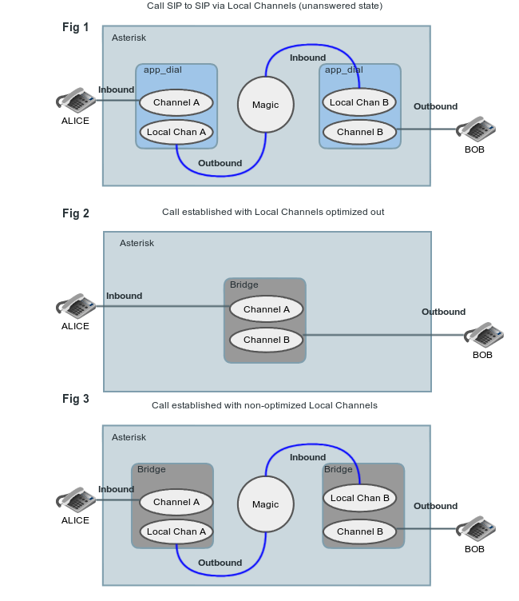

## Default Channel Optimization

By default, the [Local channel](/Local-Channel) will try to optimize itself out of the call path. This means that once the Local channel has established the call between the destination and Asterisk, the Local channel will get out of the way and let Asterisk and the end point talk directly, instead of flowing through the Local channel.

This can have some adverse effects when you're expecting information to be available during the call that gets associated with the Local channel. When the Local channel is optimized out of the call path, any Dial() flags, or channel variables associated with the Local channel are also destroyed and are no longer available to Asterisk.

Diagrams really help to show what is going on:

### Figure 1

This is a call in an unanswered (ringing) state - from SIP to SIP using Local Channels in between.

### Figure 2

By default, after the callee answers this is what the call would look like with the Local Channels optimizing out.

### Figure 3

This is what the call would look like when established if you called the Local Channel with "/n". You can see the Local Channels get pushed into bridges with channels they were connected with through app\_dial previously.



## Disabling Local Channel Optimization

You may have read about the /n modifier in [Local Channel Modifiers](/Configuration/Channel-Drivers/Local-Channel/Local-Channel-Modifiers). We can force the Local channel to remain in the call path by utilizing the /n directive. By adding /n to the end of the channel dial-string, we can keep the Local channel in the call path, along with any channel variables, or other channel specific information.

### When to disable optimization

Lets take a look at an example that demonstrates when the use of the /n directive is necessary. If we spawn a Local channel which does a Dial() to a SIP channel, but we use the L() option (which is used to limit the amount of time a call can be active, along with warning tones when the time is nearly up), it will be associated with the Local channel, which is then optimized out of the call path, and thus won't perform as expected.

This following dialplan will not perform as expected.

```
[services]
exten => 2,1,Dial(SIP/PHONE_B,,L(60000:45000:15000))

[internal]
exten => 4,1,Dial(Local/2@services) 
```

In order to make this behave as we expect (limiting the call), we would change:

```
[internal]
exten => 4,1,Dial(Local/2@services) 
```

...into the following:

```
[internal]
exten => 4,1,Dial(Local/2@services/n) 
```

By adding **/n** to the end of the dial-string, our Local channel will now stay in the call path and not go away.

## Detailed walk-through of example call-flow

Why does adding the **/n** option all of a sudden make the 'L' option work? First we need to show an overview of the call flow that doesn't work properly, and discuss the information associated with the channels:

1. SIP device PHONE\_A calls Asterisk via a SIP INVITE.
2. Asterisk accepts the INVITE and then starts processing dialplan logic in the [internal] context.
3. Our dialplan calls Dial(Local/2@services) - notice the lack of the "/n".
4. The Local channel then executes dialplan at extension 2 within the [services] context.
5. Extension 2 within [services] then performs Dial() to PHONE\_B with the line: Dial(SIP/PHONE\_B,,L(60000:45000:15000))
6. SIP/PHONE\_B then answers the call.
7. Even though the L option was given when dialing the SIP device, the L information is stored in the channel that is doing the Dial() which is the Local channel, and not the endpoint SIP channel.
8. The Local channel in the middle, containing the information for tracking the time allowance of the call, is then optimized out of the call path, losing all information about when to terminate the call.
9. SIP/PHONE\_A and SIP/PHONE\_B then continue talking indefinitely.

Now, if we were to add /n to our dialplan at step three (3) then we would force the Local channel to stay in the call path, and the L() option associated with the Dial() from the Local channel would remain, and our warning sounds and timing would work as expected.   

1. Use what we just described, Dial(Local/2@services/n) to cause the Local channel to remain in the call path so that the L() option used inside the Local channel is not discarded when optimization is performed.
2. Place the L() option at the outermost part of the path so that when the middle is optimized out of the call path, the information required to make L() work is associated with the outside channel. The L information will then be stored on the calling channel, which is PHONE\_A. For example:

```
[services]
exten => 2,1,Dial(SIP/PHONE_B)

[internal]
exten => 4,1,Dial(Local/2@services,,L(60000:45000:15000));
```

