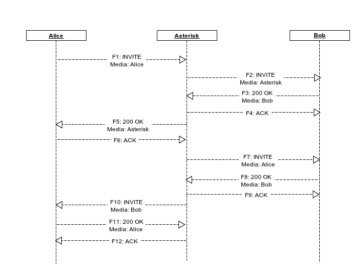
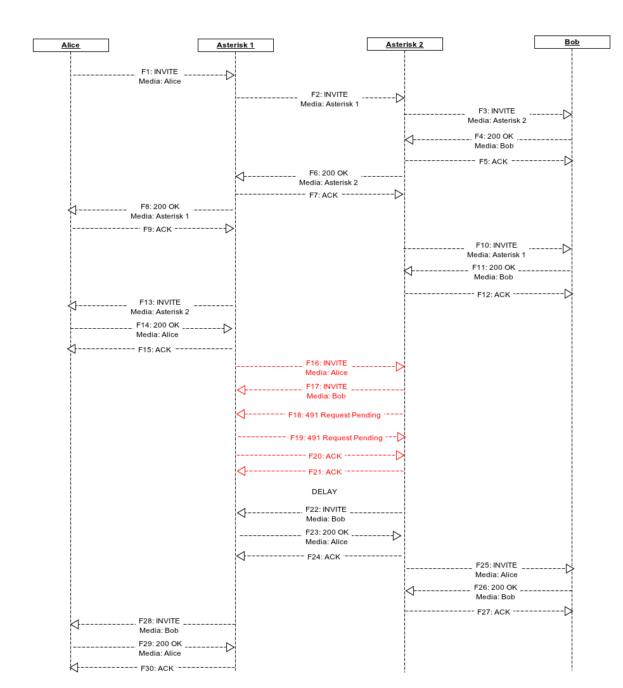
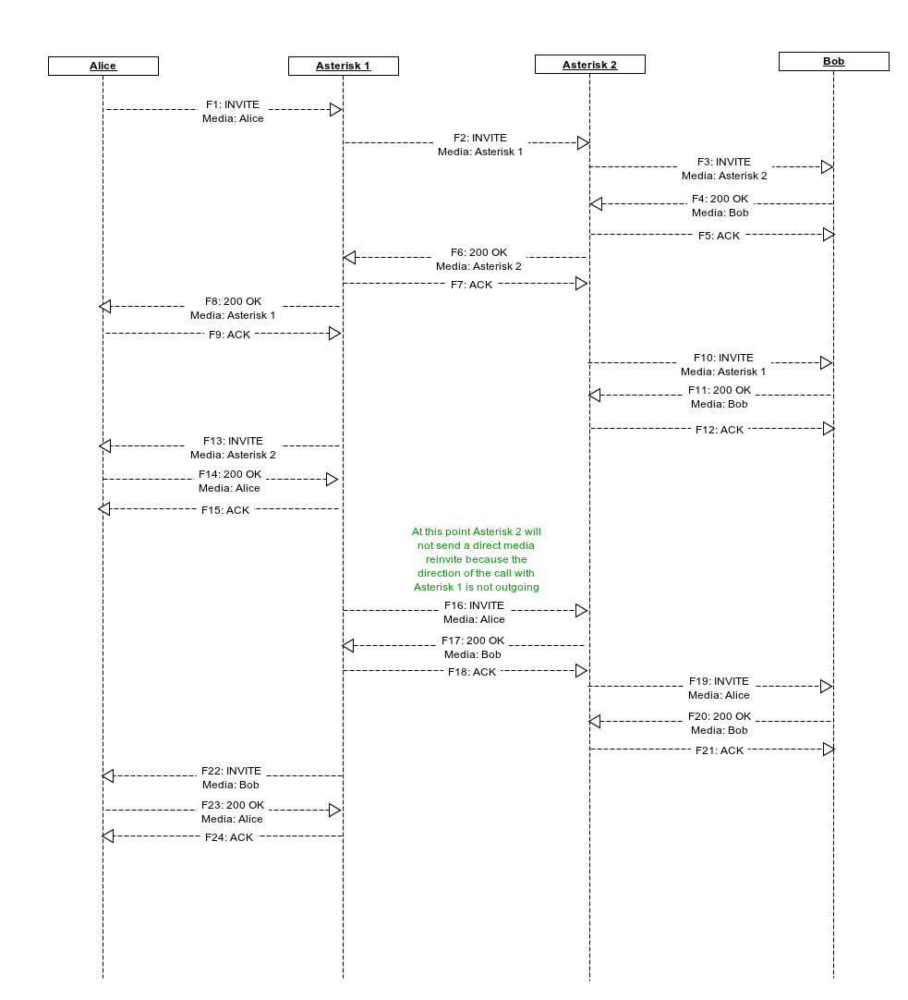

# SIP Direct Media Reinvite Glare Avoidance

!!! note
    While this page has not yet been updated for chan_pjsip, the
    concepts are the same.
[//]: # (end-note)

## Overview

When SIP endpoints communicate by way of Asterisk, Asterisk will
attempt to send SIP re-INVITEs in order to allow the endpoints to
communicate directly. This allows for the computational load on the
Asterisk server to be decreased while also lessening the latency of
the media streams between the endpoints. Typical SIP traffic for a
call might look like this:

When multiple Asterisk servers are in the path between the endpoints,
then both Asterisk servers will attempt to send direct media
re-INVITEs. If it happens to be that the two Asterisk servers direct
their re-INVITEs to each other at the same time, then each of the
Asterisk servers will respond to the re-INVITEs with 491
responses. After a delay, the downstream Asterisk server will attempt
its re-INVITE again and succeed. A diagram of this situation looks
like this:

The problematic area is higlighted in red. While this eventually
results in direct media flowing between the endpoints, the delay
between the 491 responses and the re-attempt at reinviting the media
may be noticeable to the end users. If more than two Asterisk servers
are in the path between callers, this delay can be longer. In Asterisk
11, a new option has been added to chan_sip in an attempt to address
this.

### directmedia = outgoing

The problem in the second diagram was that both Asterisk servers
assumed control of the path between them. In reality, it is only
required that one of the Asterisk servers does this. The outgoing
setting for the directmedia option addresses this problem.

The way this option works is when the SIP channel driver is told by
the RTP layer to send a direct media re-INVITE out, we check to see if
the directmedia setting is set to outgoing for the dialog. If it is,
and the call direction is not outgoing, then the SIP channel driver
will refrain from sending a re-INVITE. After this first denial to send
the direct media re-INVITE, the SIP channel driver will no longer
refuse to send if the RTP layer requests it again. Here is a diagram
showing how this works if Asterisk 2 has directmedia = outgoing set:

If Asterisk 1 also has `directmedia` set to `outgoing` then calls from
Asterisk 2 to Asterisk 1 will also avoid re-INVITE glares.

#### Caveats

Since this option is a new value accepted for the `directmedia`
setting in `sip.conf`, this setting can be applied globally. This is
almost assuredly not what you want to do. You should only ever set
`directmedia` to `outgoing` on individual peers.

When choosing which peers to set this option on, you should be
careful. It is best to only set this option on peers that are also
under your control and that will also have this option set. For
instance, if your setup has multiple peered Asterisk servers, then it
is a great idea to use this option for those peers. If, on the other
hand, you have had SIP re-INVITE glare issues with a SIP provider,
then you should be hesitant to set this option without thoroughly
testing with your provider first.

When setting `directmedia` to `outgoing` on your peered Asterisk
servers, it is a good idea to set the option in the `sip.conf` file
(or realtime storage) of all the Asterisk servers in question. This
way calls can go from any Asterisk server to any other Asterisk server
and glares will be prevented.
