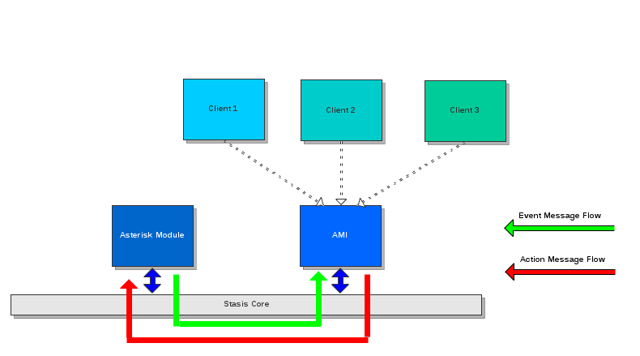

# AMI v2 Specification

## Introduction

This Asterisk Manager Interface (AMI) specification describes the relationship between Asterisk and an external entity wishing to communicate with Asterisk over the AMI protocol. It describes:

* An overview of the AMI protocol
* The operations AMI provides external entities wishing to control Asterisk
* Basic formatting of AMI message structures
* Guaranteed operations, configuration control, and other information provided by Asterisk in AMI v2.x and greater.

### Scope

This specification describes AMI versions starting at 2.0.0 which was implemented by Asterisk 12.  This specification provides details on the functional, operational and design requirements for AMI. Note that this does not include a comprehensive listing of the AMI configuration file parameters or messages that a system interfacing over AMI will send/receive.  Those are documented in the [AMI Actions](/Latest_API/API_Documentation/AMI_Actions/) and [AMI Events](/Latest_API/API_Documentation/AMI_Events/) sections of the [API Documentation](/Latest_API/API_Documentation/) for the latest Asterisk release.

In addition, this specification provides interface requirements levied on AMI by Stasis, a message bus internal to Asterisk. It conveys sufficient detail to understand how AMI attaches to the Stasis message bus and interacts with other entities on Stasis.

This specification is intended for all parties requiring such information, including software developers, system designers and testers responsible for implementing the interface.

### Versioning

Starting in Asterisk 12, AMI now follows semantic versioning. The initial release of Asterisk 12 had an AMI version of 2.0.0.

A full description of semantic versionining can be found at <http://semver.org/>.

## Terminology

| Term | Definition |
| --- | --- |
| Action | A command issued to Asterisk from an external entity via AMI |
| Client | An external entity communicating with Asterisk via AMI over some transport mechanism |
| Event | A message sent from Asterisk to an external entity via AMI |
| Field | A key/value pair that exists in either an action or event |
| Stasis | The internal framework that AMI is built on top of |

## Protocol Overview

Asterisk provides a number of interfaces that serve different purposes. Say, for example, we wanted to manipulate a call between Alice and Bob via some external mechanism. Depending on what we wanted to do with the call, we may use one or more interfaces to manipulate the channels that make up the call between Alice and Bob.

| Alice calls Bob and... | Interface |
| --- | --- |
| ... we want to use a local script to execute some logic on Alice's channel | AGI |
| ... we want to execute a script on a remote machine on Bob's channel | FastAGI |
| ... we want to put Alice into an IVR with fine grained media control, where the IVR is written outside of `extensions.conf` | ExternalIVR |
| ... we want to control Alice and Bob's underlying channel objects at some asynchronous time | AMI (possibly with AsyncAGI) |
| ... we want to write our own Dialling application to control both Alice and Bob | ARI |

In general, AMI is used to manage Asterisk and its channels. It does not determine what actions are executed on a particular channel - the dialplan and/or an AGI interface does that - but it does allow a client to control call generation, aspects of call flow, and other internals of Asterisk.

At its heart, AMI is an asynchronous message bus: it spills **events** that contain information about the Asterisk system over some transport. In response, clients may request that Asterisk takes some **action**. These two concepts - actions and events - make up the core of what is AMI. As AMI is asynchronous, as events occur in Asterisk they are immediately sent to the clients. This means that actions issued by entities happen without any synchronization with the events being received, even if those events occur in response to an action. It is the responsibility of entities to associate event responses back to actions.

Clients wishing to use AMI act as clients and connect to Asterisk's AMI server over a supported transport mechanism. Authentication may or may not be enabled, depending on the configuration. Once connected, events can be automatically spilled to the connected clients, or limited in a variety of fashions. A connected client can send an action to the AMI server at any time. Depending on the allowed authorizations, the action may be allowed or disallowed.

More information on the various ways a client can be configured can be seen in AMI Configuration.

/// note|Nomenclature
Sometimes, the term **command** may be used instead of the term **action**. With respect to AMI actions, command is synonymous with action, and the two can be treated the same. For the sake of consistency, we've attempted to use the term **action** where possible.
///

Historically, AMI has existed in Asterisk as its own core component `manager`. AMI events were raised throughout Asterisk encoded in an AMI specific format, and AMI actions were processed and passed to the functions that implemented the logic. In Asterisk 12, AMI has been refactored to sit on top of Stasis, a generic, protocol independent message bus internal to Asterisk. From the perspective of clients wishing to communicate with Asterisk over AMI very little has changed; internally, the Stasis representation affords a much higher degree of flexibility with how messages move through Asterisk. It also provides a degree of uniformity for information that is propagated to interested parties.

 
AMI High Level Diagram:



Stasis acts as a generic publish/subscribe message bus inside of Asterisk. While AMI often directly interacts with constructs in Asterisk through actions, it receives its events through messages published over Stasis-Core. It translates the generic Stasis messages into an AMI event, and sends those to the appropriate AMI clients.

## Semantics and Syntax

### Message Sending and Receiving

By default, AMI is an asynchronous protocol that sends events immediately to clients when those events are available. Likewise, clients are free to send actions to AMI at any time, which may or may not trigger additional events. The exception to this is when the connection is over HTTP; in that scenario, events are only transmitted as part of the response to an HTTP POST.

Various options for configuration of clients can control which events are sent to a client. Events can be whitelisted/blacklisted explicitly via event filters, or implicitly by class authorizations.

### Message Layout

AMI is an ASCII protocol that provides bidirectional communication with clients. An AMI message – action or event – is composed of fields delineated by the '\r\n' characters. Within a message, each field is a key value pair delineated by a ':'. A single space MUST follow the ':' and precede the value. Fields with the same key may be repeated within an AMI message. An action or event is terminated by an additional '\r\n' character.

```
Event: Newchannel
Privilege: call,all
Channel: PJSIP/misspiggy-00000001
Uniqueid: 1368479157.3
ChannelState: 3
ChannelStateDesc: Up
CallerIDNum: 657-5309
CallerIDName: Miss Piggy
ConnectedLineName:
ConnectedLineNum:
AccountCode: Pork
Priority: 1
Exten: 31337
Context: inbound
```

This is syntantically equivalent to the following ASCII string:

```
Event: Newchannel\r\nPrivilege: call,all\r\nChannel: PJSIP/misspiggy-00000001\r\nUniqueid: 1368479157.3\r\nChannelState: 3\r\nChannelStateDesc: Up\r\nCallerIDNum: 657-5309\r\nCallerIDName: Miss Piggy\r\nConnectedLineName:\r\nConnectedLineNum:\r\nAccountCode: Pork\r\nPriority:\r\nExten: 31337\r\nContext: inbound\r\n\r\n
```

Actions are specified in a similar manner. Note that depending on the message, some keys can be repeated.

```
Action: Originate
ActionId: SDY4-12837-123878782
Channel: PJSIP/kermit-00000002
Context: outbound
Exten: s
Priority: 1
CallerID: "Kermit the Frog" <123-4567>
Account: FrogLegs
Variable: MY_VAR=frogs
Variable: HIDE_FROM_CHEF=true
```

In addition, no ordering is implied on message specific keys. Hence, the following two messages are semantically the same.

```
Action: Originate
ActionId: SDY4-12837-123878782
Channel: PJSIP/kermit-00000002
Context: outbound
Exten: s
Priority: 1
CallerID: "Kermit the Frog" <123-4567>
Account: FrogLegs
Variable: MY_VAR=frogs
Variable: HIDE_FROM_CHEF=true50%ActionId: SDY4-12837-123878782
```

```
Action: Originate
ActionId: SDY4-12837-123878782
Variable: HIDE_FROM_CHEF=true
Variable: MY_VAR=frogs
Channel: PJSIP/kermit-00000002
Account: FrogLegs
Context: outbound
Exten: s
CallerID: "Kermit the Frog" <123-4567>
Priority: 1
```

This is also true for events, although by convention, the `Event` key is the first key in the event. If an action or event contains duplicate keys, such as `Variable`, the order in which Asterisk processes said keys is the order in which they occur within the action or event.

Keys are case insensitive. Hence, the following keys are equivalent:

```
Action: Originate
ACTION: Originate
action: Originate
```

The case sensitivity for values is left up to the context in which they are interpreted.

#### Common Fields

##### Actions

###### General Fields

This section lists fields that apply generally to all actions.

/// define
Action

- Specifies the action to execute within Asterisk. Each value corresponds to a unique action to execute within Asterisk. The value of the **Action** field determines the allowed fields within the rest of the message. By convention, the first field in any action is the **Action** field.

ActionId

- Is a universal unique identifier that can optionally be provided with an action. If provided in an action, events that are related to that action will contain the same **ActionId** value, allowing a client to associate actions with events that were caused by that action.  It is recommended that clients always provide an **ActionId** for each action they submit.

///

It is up to the client to ensure that the **ActionId** provided with an **Action** is unique.

###### Channels

This section lists fields that apply generally to all actions that interact upon an Asterisk channel. Note that an Action that interacts with a channel \*must\* supply the \*Channel\* field.

Upgrading In the past, AMI clients would have to contend with channel rename events. As Asterisk will now no longer change the name of a channel during its lifetime, this is no longer necessary.

/// define
Channel

- The Asterisk channel name. A channel name is provided by AMI to clients during a **Newchannel** event. A channel name can be viewed as the handle to a channel.

Uniqueid

- A universal unique identifier for the channel. In systems with multiple Asterisk instances, this field can be used to construct a globally unique identifier for a channel, as a channel name may occur multiple times across Asterisk instances.

///

##### Events

###### General Fields

This section lists fields that apply generally to all events.

/// define
Event

- The unique name of the event being raised. The value of the **Event** field determines the rest of the contents of the message. By convention, the **Event** field is the first field in an AMI message.

ActionId

- If present, the Action's corresponding ActionId that caused this event to be created. If an Action contained an **ActionId**, any event relating the success or failure of that action MUST contain an **ActionId** field with the same value.

Privilege

- The class authorizations associated with this particular event. The class authorizations for a particular event are in a comma-delineated list. For more information, see class authorizations.

///

Event responses to an Action only occur if the Action was executed, which means the user had the appropriate class authorization. Therefore they will not have a Privilege field.

###### Channels

This section lists fields that apply generally to all events that occur due to interactions upon an Asterisk channel.

Events that relate multiple channels will prefix these fields with an event specific role specifier. For example, a **DialBegin** or a **DialEnd** event will prefix the outbound channel's fields with **Dest**. So, the **Channel** field is the **DestChannel** field; the **Uniqueid** field is the **DestUniqueid** field, etc.

/// define
Channel

- The current Asterisk channel name. This corresponds to the Channel field in actions.

Uniqueid

- A universal unique identifier for the channel. This corresponds to the Uniqueid field in actions.

ChannelState

- The current state of the channel, represented as an integer value. The valid values are:
| Value | State | Description |
| --- | --- | --- |
| 0 | Down | Channel is down and available. |
| 1 | Rsrvd | Channel is down, but reserved. |
| 2 | OffHook | Channel is off hook. |
| 3 | Dialing | The channel is in the midst of a dialing operation. |
| 4 | Ring | The channel is ringing. |
| 5 | Ringing | The remote endpoint is ringing. Note that for many channel technologies, this is the same as Ring. |
| 6 | Up | A communication path is established between the endpoint and Asterisk. |
| 7 | Busy | A busy indication has occurred on the channel. |
| 8 | Dialing Offhook | Digits (or equivalent) have been dialed while offhook. |
| 9 | Pre-ring | The channel technology has detected an incoming call and is waiting for a ringing indication. |
| 10 | Unknown | The channel is an unknown state. |

Depending on the underlying channel technology, not all states will be used. Channels typically begin in either the Down or Up states.

ChannelStateDesc

- The text description of the channel state. This will be one of the State descriptions in the table in ChannelState.

CallerIDNum

- The current caller ID number. If the caller ID number is not known, the string "<unknown>" is returned instead.

CallerIDName

- The current caller ID name. If the caller ID name is not known, the string "<unknown>" is returned instead.

ConnectedLineNum

- The current connected line number. If the connected line number is not known, the string "<unknown>" is returned instead.

ConnectedLineName

- The current connected line name. If the connected line name is not known, the string "<unknown>" is returned instead.

AccountCode

- The channel's accountcode.

Context

- The current context in the dialplan that the channel is executing in.

Exten

- The current extension in the dialplan that the channel is executing in.

Priority

- The current priority of the current context, extension in the dialplan that the channel is executing in.

ChanVariable

- Channel variables specific to a channel can be conveyed in each AMI event related to that channel. When this occurs, each variable is referenced in a **ChanVariable** field. The value of a **ChanVariable** field will always be of the form `key=value`, where `key` is the name of the channel variable and `value` is its value.

///

###### Bridges

/// define
BridgeUniqueid

- A unique identifier for the bridge, which provides a handle to actions that manipulate bridges.

BridgeType

- The type of the bridge. Bridge types determine how a participant in a bridge can behave. For example, a 'base' bridge is a bridge that has few inherent properties or features associated with it, while a 'parking' bridge is one used for a parking application. Specific modules within Asterisk will determine the type of bridge that is created.

- Note that this is not the same as how media within a bridge is mixed. How media is mixed between participants in a bridge is determined by the **BridgeTechnology**.

BridgeTechnology

- How the media can be mixed within a bridge. Specific modules in Asterisk provide different bridge technologies that can be used by Asterisk to alter how media passes between the participants. For a given bridge, the **BridgeTechnology**\* can also change as the number and type of participants change. The most common bridge technologies are:
* `holding_bridge` – normal participants joining the bridge may receive audio, but audio sent from a normal participant is dropped. Special participants, known as announcers, may broadcast their audio to all normal participants.
* `native_dahdi` – a native bridge between DAHDI channels. Media is passed directly between all participants.
* `native_rtp` – a native bridge between channels that use RTP for media. Media is passed directly between all participants.
* `simple_bridge` – a two-party bridge between any two channels. Media is passed through the Asterisk core between the two participants.
* `softmix` – a multi-party bridge between one or more participants. All media from all participants is mixed together and sent to all participants.

BridgeCreator

- Some bridges are created as the result of a particular application or action. If so, the bridge will specify who created it. If the bridge was not created as a result of any particular application or action, the field will have the value `<unknown>`.

BridgeName

- Some bridges are created with a names as a result of their application. If so, the bridge will specify the name given to it. If the bridge was created without a name, the field will have the value `<unknown>`.

BridgeNumChannels

- The number of channels currently in the bridge.

Action Responses

- When an Action is submitted to AMI, the success or failure of the action is communicated in subsequent events.

Response

- Contains whether or not the action succeeded or failed. Valid values are "Success" or "Error". Events that are in response to an action MUST include this field.

///

##### EventList

Some actions will cause a chain of events to be created. Events that are a response to an action that causes such a sequence will contain the EventList field with a value of "start". When all generated events have been sent, a final event will be sent containing the EventList field with the value "complete".

If, for some reason, an error occurs and the events cannot be sent, an event will be sent with an EventList field that contains the value "cancelled".

Note that the events that mark the completion or cancellation of an event list are not technically action responses, and have their own specific event types.

##### Message

An optional text message that provides additional contextual information regarding the success or failure of the action.

### Actions

The supported actions for the latest version of Asterisk are listed here:
[AMI Actions](/Latest_API/API_Documentation/AMI_Actions/)

While new AMI Actions may be added over the lifetime of an Asterisk major version, existing AMI Actions may only be deprecated and removed in later Asterisk major versions.

Optional fields may be added to an existing AMI action with altering the AMI version number, but required fields will **not** be added or removed.

### Events

The supported events for Asterisk 12 are listed here:
[AMI Events](/Latest_API/API_Documentation/AMI_Events/)

While new AMI Events may be added over the lifetime of an Asterisk major version, existing AMI Events may only be deprecated or removed in later Asterisk major versions.

Fields may be added to an existing AMI event without altering the AMI version number, but existing fields will **not** be removed.

## Channel Interaction/Lifetime

While channels are independent of AMI, they have a large implication on the events sent out over AMI. Many of the events in AMI correspond to changes in channel state. While AMI is an asynchronous protocol, there is some ordering with respect to the events that are relayed for a particular channel. This section provides the basic event relationships that are guaranteed through AMI.

#### Basic Channel Lifetime

All channels begin with a **Newchannel** event. A **Newchannel** will always contain the following fields:

* The current Channel name that acts as a handle to the channel for that channel's lifetime for a single Asterisk system.
* The Uniqueid for the channel, that allows systems to have a globally unique identifier for the channel.

Changes in the state of the channel, i.e., the ChannelState field, are conveyed via **Newstate** events.

Notification of a Channel being disposed of occurs via a **Hangup** event. A **Hangup** signals the termination of the channel associated with the Uniqueid. After the **Hangup** event, no further events will be raised in relation to the channel with that Uniqueid, and the communication between the endpoint and Asterisk via that channel is terminated.

The examples in this specification do not show all of the fields in every event. For a full listing of all of the fields, see the documentation for the specific event in [AMI Events](/Latest_API/API_Documentation/AMI_Events/).

Example:

```
Event: Newchannel
Privilege: dialplan,all
Channel: PJSIP/kermit-00000001
Uniqueid: asterisk-1368479157.1
ChannelState: 0
ChannelStateDesc: Down
```

* Kermit the Frog's SIP channel is created. The is the first event for `PJSIP/kermit-00000001` and indicates a path of communication being opened up between Asterisk and Kermit's SIP device.

```
Event: Newstate
Privilege: dialplan,all
Channel: PJSIP/kermit-00000001
Uniqueid: asterisk-1368479157.1
ChannelState: 6
ChannelStateDesc: Up
```

* Kermit the Frog's PJSIP channel's state changes from Down to Up

```
Event: Hangup
Privilege: dialplan,all
Channel: PJSIP/kermit-00000001
Uniqueid: asterisk-1368479157.1
ChannelState: 6
ChannelStateDesc: Up
Cause: 16
Cause-txt: Normal Clearing
```

* Kermit the Frog's PJSIP channel is hung up. At this point, no further events for `PJSIP/kermit-00000001` will be sent.

#### Channel Variables

For each channel variable that is changed, a **VarSet** event is sent to the client. The **VarSet** event contains the new value of the appropriate channel variable. Note that channel variables can also be conveyed in ChanVariable fields.

#### DTMF

DTMF is indicated via a **DTMFBegin**/**DTMFEnd** events. A **DTMFEnd** event MUST convey the duration of the DTMF tone in milliseconds.

/// warning|Behavior Change
The combination of **DTMFBegin**/**DTMFEnd** events replaces the removed **DTMF** event.
///

#### Dialplan Execution

As a channel executes operations in the dialplan, those operations are conveyed via a **NewExten** event. Each transition to a new combination of context, extension, and priority will trigger a **NewExten** event.

Example:

```
Event: Newexten
Privilege: dialplan,all
Channel: PJSIP/kermit-00000001
Uniqueid: asterisk-1368479157.1
Context: default
Extension: h
Priority: 1
Application: NoOp
AppData: Ah Snap
```

* Kermit the Frog's PJSIP channel has been hung up, and he's been tossed rudely into the *h* extension. This event informs the clients that Kermit's channel is in context *default*, extension *h*, priority *1*, and is about to execute the *NoOp* application with application data *"Ah Snap"*.

Note that even though Kermit has been hungup, we will not receive the **Hangup** event until Kermit's PJSIP channel is done executing dialplan.

#### Dialing and Origination

Dial operations always result in two events: a **DialBegin** event that signals the beginning of the dial to a particular destination, and a **DialEnd** event that signals the end of the dialing. In parallel dialing situations, **DialBegin**/**DialEnd** events MUST be sent for each channel dialed. For each **DialBegin** event sent, there MUST be a corresponding **DialEnd** event.

In dialing situations with a caller and a called party, the **DialBegin** and **DialEnd** events convey information about both channels. The calling channel uses the standard channel field names, while the called party's field names are prefixed with "Dest". In dialing situations where there is no caller, such as when Asterisk originates an outbound call via a call file, only the called channel is represented in the events. The channel field names are still prefixed with "Dest" in this case; the standard channel field names are **not** present in the event in this case.

A **DialEnd** occurs whenever Asterisk knows the final state of the channel that it was attempting to establish. The status is communicated in the DialStatus field.

Behavior Change The **DialBegin**/**DialEnd** events replace the **Dial** event. Note that the **Dial** event signaling the end of dialing would not normally be sent until after bridging was complete; this operation will now occur when the dial operation has determined the status of a particular called channel.

Simple Successful Dial:

```
Event: Newchannel
Channel: PJSIP/animal-00000002
Uniqueid: asterisk-1368479160.5
...
Event: DialBegin
Channel: PJSIP/kermit-00000001
Uniqueid: asterisk-1368479155.1
DestChannel: PJSIP/animal-00000002
DestUniqueid: asterisk-1368479160.5
...
Event: DialEnd
Channel: PJSIP/kermit-00000001
Uniqueid: asterisk-1368479155.1
DestChannel: PJSIP/animal-00000002
DestUniqueid: asterisk-1368479160.5
DialStatus: ANSWER
... 
```

In this example, Kermit decides to dial Animal. A new channel between Asterisk and Animal's SIP device is created and conveyed via a **Newchannel** event, and then a dial operation is begun. Note that in the **DialBegin** event, Kermit's SIP device is the caller as he initiated the dial operation, while Animal's SIP device is the destination. As such, the fields referring to Animal's PJSIP channel are prefixed with "Dest".

When Animal eats his handset (causing the device to think he merely took it off the hook), the SIP device answers and the dial operation completes. This indicated by a **DialEnd** event. At this point, the channel is ready for something - it can execute in the dialplan, or be immediately bridged with the calling channel.

Simple Failed Dial:

```
Event: Newchannel
Channel: PJSIP/animal-00000003
Uniqueid: asterisk-1368479199.1
...
Event: DialBegin
Channel: PJSIP/kermit-00000001
Uniqueid: asterisk-1368479150.1
DestChannel: PJSIP/animal-00000003
DestUniqueid: asterisk-1368479199.1
...
Event: DialEnd
Channel: PJSIP/kermit-00000001
Uniqueid: asterisk-1368479150.1
DestChannel: PJSIP/animal-00000003
DestUniqueid: asterisk-1368479199.1
DialStatus: TIMEDOUT
...
Event: Hangup
Channel: PJSIP/animal-00000003
Uniqueid: asterisk-1368479199.1
```

In this example, Kermit decides to dial Animal again. Unfortunately, Animal ate his handset, so Asterisk's attempts to reach him inevitably time out. When it does, a **DialEnd** event indicates the failure condition in the DialStatus field.

Parallel Dial:

```
Event: Newchannel
Channel: PJSIP/animal-00000003
Uniqueid: asterisk-1368479150.3
...
Event: Newchannel
Channel: PJSIP/drteeth-00000004
Uniqueid: asterisk-1368479150.4
...
Event: DialBegin
Channel: PJSIP/kermit-00000001
Uniqueid: asterisk-1368479150.0
DestChannel: PJSIP/animal-00000003
DestUniqueid: asterisk-1368479150.3
...
Event: DialBegin
Channel: PJSIP/kermit-00000001
Uniqueid: asterisk-1368479150.0
DestChannel: PJSIP/drteeth-00000004
DestUniqueid: asterisk-1368479150.4
...
Event: DialEnd
Channel: PJSIP/kermit-00000001
Uniqueid: asterisk-1368479150.0
DestChannel: PJSIP/drteeth-00000004
DestUniqueid: asterisk-1368479150.4
DialStatus: ANSWER
...
Event: DialEnd
Channel: PJSIP/kermit-00000001
Uniqueid: asterisk-1368479150.0
DestChannel: PJSIP/animal-00000003
DestUniqueid: asterisk-1368479150.3
DialStatus: CANCEL
…
Event: Hangup
Channel: PJSIP/animal-00000003
Uniqueid: asterisk-1368479150.3
```

In this example, Kermit decides to dial Animal and Dr. Teeth. Dr. Teeth immediately answers, and so Asterisk cancels the dial to Animal. Asterisk can now do something with Dr. Teeth's channel (such as bridge him with his dentist) - however, Animal's channel is destroyed, as his device never answered.

### Bridging

A bridge contains 0 or more channels. When a channel is in a bridge, it has the potential to communicate with other channels within the bridge. Before channels enter a bridge, a **BridgeCreate** event is sent, indicating that a bridge has been created. When a bridge is destroyed, a **BridgeDestroy** event is sent. All channels within a bridge MUST leave a bridge prior to the **BridgeDestroy** event being sent.

When a channel enters a bridge, a **BridgeEnter** event is raised. When a channel is put into a bridge, it is implied that the channel can pass media between other channels in the bridge. This is not guaranteed, as other properties on the channel or bridge may restrict media flow. For example, bridges with a BridgeTechnology type of *holding**\_bridge* implicitly restrict the media flow between channels. Likewise, media may be restricted in multi-party conference bridges based on user role permissions, such as when a conference leader mutes all participants in a conference. The **BridgeEnter** event does indicate, however, that a potential relationship between channels in a bridge exists.

When a channel leaves a bridge, a corresponding **BridgeLeave** event is raised. A **BridgeLeave** event MUST mean that the channel that left the bridge can no longer pass media to other channels still in the bridge. This does not necessarily mean that the channel is being hung up; rather, that it is no longer in a communication path with some other set of channels.

In all cases, if a channel has a **BridgeEnter** event, it MUST have a corresponding **BridgeLeave** event. If a channel is hung up and it is in a bridge, a **BridgeLeave** event MUST precede the **Hangup** event.

If a transfer operation is performed, a transfer event of some type MUST be raised for the channels involved in the transfer when the success or failure of the transfer is determined. Similarly, if a channel enters a parking lot, a **ParkedCall** event MUST be raised for the channel prior to it entering the bridge that represents the parking lot.

If a property of a bridge is changed, such as the BridgeTechnology changing from a simple two-party bridge to a multi-party bridge, then the **BridgeUpdate** event is sent with the updated parameters.

#### Two Party Bridging

Parties are bridged by virtue of them entering a bridge, as indicated by a **BridgeEnter**. When parties are no longer talking, a **BridgeLeave** event is sent for each channel that leaves the bridge.

Example - Two Party Bridge:

```
Event: BridgeCreate
BridgeType: basic
BridgeTechnology: simple_bridge
BridgeUniqueid: 1234
BridgeNumChannels: 0
...
Event: BridgeEnter
BridgeType: basic
BridgeTechnology: simple_bridge
BridgeUniqueid: 1234
BridgeNumChannels: 1
Channel: PJSIP/kermit-00000001
Uniqueid: asterisk-1368479150.0
```

Kermit the Frog's PJSIP channel enters into Bridge 1234. As a result, the bridge is first created (denoted by the **BridgeCreate** event), and then Kermit's channel enters the bridge (the **BridgeEnter** event)

```
Event: BridgeEnter
BridgeType: basic
BridgeTechnology: simple_bridge
BridgeUniqueid: 1234
BridgeNumChannels: 2
Channel: PJSIP/gonzo-00000002
Uniqueid: asterisk-1368479150.1
```

Gonzo the Great enters the bridge and talks with Kermit. Note that the bridge Gonzo entered is Bridge 1234; by virtue of this being the same bridge Kermit entered, we know that the two can talk.

```
Event: BridgeLeave
BridgeType: basic
BridgeTechnology: simple_bridge
BridgeUniqueid: 1234
BridgeNumChannels: 1
Channel: PJSIP/kermit-00000001
Uniqueid: asterisk-1368479150.0
...
Event: Hangup
Channel: PJSIP/kermit-00000001
Uniqueid: asterisk-1368479150.0
```

Kermit realizes that he has to leave to avoid Miss Piggy, so he hangs up on Gonzo. We are first alerted that Kermit has left the bridge; quickly thereafter, we receive the **Hangup** event indicating that Kermit's channel is dead.

```
Event: BridgeLeave
BridgeType: basic
BridgeTechnology: simple_bridge
BridgeUniqueid: 1234
BridgeNumChannels: 0
Channel: PJSIP/gonzo-00000002
Uniqueid: asterisk-1368479150.1
...
Event: Hangup
Channel: PJSIP/gonzo-00000002
Uniqueid: asterisk-1368479150.1
...
Event: BridgeDestroy
BridgeType: basic
BridgeTechnology: simple_bridge
BridgeUniqueid: 1234
BridgeNumChannels: 0
```

Asterisk is configured to not let Gonzo continue on in the dialplan once his bridge is broken. As such, Gonzo is forcibly ejected from the bridge, and is hung up on after. Because no channels are left in the bridge, the bridge is destroyed.

In this scenario, it was perfectly acceptable for either Kermit or Gonzo's channels to continue after the bridge was broken. Since this represents the most basic two-party call scenario, once one party decided to hang up, the other party was also hung up on.

#### Transfers

Transfer information is conveyed with either a **BlindTransfer** or **AttendedTransfer** event, which indicates information about the transfer that took place. **BridgeLeave**/**BridgeEnter** events are used to indicate which channels are talking in which bridges at different stages during the transfer.

Transfers do a LotDepending on the type of transfer and the actions taken, channels will move in and out of a lot of bridges. The purpose of the two transfer events is to convey to the AMI client the overall completed status of the transfer after the users have completed their actions. With Blind Transfers, this typically happens very quickly: Asterisk simply has to determine that the destination of the transfer is a valid extension in the dialplan.

Attended transfers, on the other hand, can involve a lot more steps. Parties can consult, toggle back and forth between consultations, and merge bridges together. Channels can be transferred to a dialplan application directly, and not to another party! As such, Asterisk will send the **AttendedTransfer** event when it knows whether or not the Attended Transfer has completed successfully, and will attempt to convey as much information as possible about the final status of the transfer.

For more information on these events, see BlindTransfer and AttendedTransfer.

Example - Blind Transfer

```
Event: BridgeCreate
BridgeType: basic
BridgeTechnology: simple_bridge
BridgeUniqueid: 1234
...
Event: BridgeEnter
BridgeType: basic
BridgeTechnology: simple_bridge
BridgeUniqueid: 1234
Channel: PJSIP/kermit-00000001
Uniqueid: asterisk-1368479150.0
```

Kermit the Frog's PJSIP channel enters into Bridge 1234

```
Event: BridgeEnter
BridgeType: basic
BridgeTechnology: simple_bridge
BridgeUniqueid: 1234
Channel: PJSIP/fozzie-00000002
Uniqueid: asterisk-1368479150.2
```

Fozzie Bear's PJSIP channel enters into Bridge 1234. At this point, Fozzie and Kermit can talk to each other.

```
Event: DTMFBegin
Channel: PJSIP/fozzie-00000002
Uniqueid: asterisk-1368479150.2
Digit: #
Direction: Received
...
Event: DTMFEnd
Channel: PJSIP/fozzie-00000002
Uniqueid: asterisk-1368479150.2
Digit: #
DurationMS: 150
Direction: Received
...
Event: DTMFBegin
Channel: PJSIP/fozzie-00000002
Uniqueid: asterisk-1368479150.2
Digit: 1
Direction: Received
...
Event: DTMFEnd
Channel: PJSIP/fozzie-00000002
Uniqueid: asterisk-1368479150.2
Digit: 1
DurationMS: 150
Direction: Received
...
Event: Hold
Channel: PJSIP/fozzie-00000002
Uniqueid: asterisk-1368479150.2
...
Event: MusicOnHoldStart
Channel: PJSIP/kermit-00000001
Uniqueid: asterisk-1368479150.0
...
Event: Unhold
Channel: PJSIP/fozzie-00000002
Uniqueid: asterisk-1368479150.2
...
Event: BlindTransfer
Result: Success
TransfererChannel: PJSIP/fozzie-00000002
TransfererUniqueid: asterisk-1368479150.2
BridgeUniqueid: 1234
BridgeType: basic
BridgeTechnology: simple_bridge
Context: default
Extension: 2000
```

Fozzie decides he's tired of telling Kermit jokes and blind transfers him off to Miss Piggy via the dialplan extension `2000`. The following actions take place:

* Fozzie hits #1 on his phone to initiate a blind transfer (shown by the two pairs of **DTMFBegin**/**DTMFEnd** events).
* A **Hold** event is processed for Fozzie, indicating that he's attempting to put the participants of the bridge he is in with on hold.
* A **StartMusicOnHold** event occurs for Kermit, as he is now entertained with music while Fozzie dials Miss Piggy's extension.
* Fozzie would then dial Miss Piggy's extension. Note that we didn't bother showing the DTMF events for this.  
When Asterisk determines that 2000 is a valid extension, a **BlindTransfer** event is raised indicating that a successful transfer is occurring.

When a transfer occurs, we often think of a transferrer channel transferring some target channel. This is actually not the case: a transferrer transfers the bridge they are currently in to some other location. This is why the **BlindTransfer** (and **AttendedTransfer**) events show the bridge that is being transferred, and not a destination channel. It is possible to transfer multi-party bridges to new extensions in this manner.

At this point, the order of the events that affect Fozzie versus Kermit are not defined. Fozzie and Kermit are about to be no longer bridged together, and their respective events may arrive in any order.

```
Event: MusicOnHoldStart
Channel: PJSIP/kermit-00000001
Uniqueid: asterisk-1368479150.0
...
Event: BridgeLeave
BridgeUniqueid: 1234
BridgeType: basic
BridgeTechnology: simple_bridge
Channel: PJSIP/kermit-00000001
Uniqueid: asterisk-1368479150.0
```

Kermit leaves the bridge with Fozzie. Asterisk politely turns off the hold music to him before it ejects him from the bridge.

```
Event: BridgeLeave
BridgeUniqueid: 1234
BridgeType: basic
BridgeTechnology: simple_bridge
Channel: PJSIP/fozzie-00000002
Uniqueid: asterisk-1368479150.2
...
Event: BridgeDestroy
BridgeUniqueid: 1234
BridgeType: basic
BridgeTechnology: simple_bridge
```

Because Fozzie isn't talking to anyone anymore, he leaves the bridge as well. At this point Asterisk could hang up Fozzie's channel, or, if configured, he could continue on in the dialplan (say, perhaps, to talk to his rubber chicken).

```
Event: NewExten
Channel: PJSIP/kermit-00000001
Uniqueid: asterisk-1368479150.0
Context: default
Exten: 2000
Priority: 1
```

Kermit enters into dialplan extension 2000. Presumably, he'll begin calling Miss Piggy, although given her violent temperament, he'd probably be better off hanging up immediately.

### Local Channel Optimization

Local channels have an option wherein they can be optimized away if both halves of a Local channel are in a bridge. This option is set on Local channel creation, and is communicated back to the AMI clients in the **LocalBridge** event in the LocalOptimization field. When a Local channel optimization occurs, a **LocalOptimization****Begin** event is sent that indicates the channels involved in the optimization. When the optimization has completed and the parties can now converse without the Local channel, a **LocalOptimziationEnd** event is sent.

Two actions can take place when a Local channel optimizes between two bridges.

1. If, after the Local channel optimization, either bridge contains only a single channel, then a single channel in one of the bridges is moved to the bridge that has the other channel. This is conveyed by a sequence of **BridgeLeave**/**BridgeEnter** events.
2. If, after the Local channel optimization, the bridges contain multiple parties, the bridges will be merged together. A **BridgeMerge** event is sent when this occurs. Channels will then be merged from one bridge to the other, denoted by a sequence of **BridgeLeave**/**BridgeEnter** events.

It is not defined which channel is moved first or which bridge wins during a bridge merge. That is an implementation detail left up to Asterisk. Suffice to say, if a Local channel is optimized away, Asterisk attempts to rebridge the channels left over as fast as possible to prevent any loss in audio.

Example - Optimizing Local Channel between two PJSIP Channels

```
Event: Newchannel
Channel: PJSIP/gonzo-00000001
Uniqueid: asterisk-1368479150.0
```

Gonzo decides to call Kermit the Frog, and a channel is created between Asterisk and Gonzo's SIP device.

```
Event: Newchannel
Channel: Local/kermit@default-00000001;1
Uniqueid: asterisk-1368479150.1
...
Event: Newchannel
Channel: Local/kermit@default-00000001;2
Uniqueid: asterisk-1368479150.2
...
Event: DialBegin
Channel: PJSIP/gonzo-00000001
Uniqueid: asterisk-1368479150.0
DestChannel: Local/kermit@default-00000001;1
DestUniqueid: asterisk-1368479150.1
```

Instead of dialing Kermit directly, Gonzo instead dials a Local channel. Both halves of the Local channel are created, and Gonzo Dials the first half of the Local channel.

```
Event: DialEnd
Channel: PJSIP/gonzo-00000001
Uniqueid: asterisk-1368479150.0
DestChannel: Local/kermit@default-00000001;1
DestUniqueid: asterisk-1368479150.1
DialStatus: ANSWER
...
Event: BridgeCreate
BridgeUniqueid: 1234
BridgeType: basic
BridgeTechnology: simple_bridge
BridgeNumChannels: 0
...
Event: BridgeEnter
BridgeUniqueid: 1234
BridgeType: basic
BridgeTechnology: simple_bridge
BridgeNumChannels: 1
Channel: PJSIP/gonzo-00000001
Uniqueid: asterisk-1368479150.0
...
Event: BridgeEnter
BridgeUniqueid: 1234
BridgeType: basic
BridgeTechnology: simple_bridge
BridgeNumChannels: 2
Channel: Local/kermit@default-00000001;1
Uniqueid: asterisk-1368479150.1
...
Event: LocalBridge
LocalOneChannel: Local/kermit@default-00000001;2
LocalOneUniqueid: asterisk-1368479150.1
LocalTwoChannel: Local/kermit@default-00000001;2
LocalTwoUniqueid: asterisk-1368479150.2
LocalOptimization: Yes
```

The dial operation succeeds and Gonzo is bridged with one half of the Local channel that will eventually connect him (it?) to Kermit. The Local channel itself has also decided to go ahead and bridge the two local halves together, since we have one half of the full chain of channels established.

```
Event: DialBegin
Channel: Local/kermit@default-00000001;2
Uniqueid: asterisk-1368479150.2
DestChannel: PJSIP/kermit-00000002
DestUniqueid: asterisk-1368479150.3
...
Event: DialEnd
Channel: Local/kermit@default-00000001;2
Uniqueid: asterisk-1368479150.2
DestChannel: PJSIP/kermit-00000002
DestUniqueid: asterisk-1368479150.3
DialStatus: ANSWER
...
Event: BridgeCreate
BridgeUniqueid: 5678
BridgeType: basic
BridgeTechnology: simple_bridge
BridgeNumChannels: 0
...
Event: BridgeEnter
BridgeUniqueid: 5678
BridgeType: basic
BridgeTechnology: simple_bridge
BridgeNumChannels: 1
Channel: Local/kermit@default-00000001;2
Uniqueid: asterisk-1368479150.2
...
Event: BridgeEnter
BridgeUniqueid: 5678
BridgeType: basic
BridgeTechnology: simple_bridge
BridgeNumChannels: 2
Channel: PJSIP/kermit-00000002
Uniqueid: asterisk-1368479150.3
```

Gonzo, via the Local channel halves, dials Kermit and he answers. Kermit is now bridged with the second half of the Local channel, `Local/kermit@default-00000001;2`, while Gonzo is bridged with the first half of the Local channel, `Local/kermit@default-00000001;1.`

Note that even when Local channels are destined to be optimized away, both the Local channel halves and the other channels involved in the operation first enter their respective bridges.

```
Event: LocalOptimizationBegin
LocalOneChannel: Local/kermit@default-00000001;1
LocalOneUniqueid: asterisk-1368479150.1
LocalTwoChannel: Local/kermit@default-00000001;2
LocalTwoUniqueid: asterisk-1368479150.2
SourceChannel: PJSIP/gonzo-00000001
SourceUniqueid: asterisk-1368479150.0
...
Event: BridgeLeave
BridgeUniqueid: 1234
BridgeType: basic
BridgeTechnology: simple_bridge
BridgeNumChannels: 1
Channel: PJSIP/gonzo-00000001
Uniqueid: asterisk-1368479150.0
...
Event: BridgeEnter 
BridgeUniqueid: 5678
BridgeType: basic 
BridgeTechnology: simple_bridge 
BridgeNumChannels: 3 
Channel: PJSIP/gonzo-00000001
Uniqueid: asterisk-1368479150.0
```

Asterisk determines that it can optimize away the Local channel. It notifies the AMI client that this is about to begin, which Local channels are involved, and what channel it is going to start moving (the SourceChannel). It starts first by moving Gonzo into Kermit's bridge. From their perspective, nothing has happened - they just now happen to be in the same bridge, instead of having a Local channel pass frames for them.

```
Event: BridgeLeave
BridgeUniqueid: 5678
BridgeType: basic 
BridgeTechnology: simple_bridge 
BridgeNumChannels: 2 
Channel: Local/kermit@default-00000001;2
Uniqueid: asterisk-1368479150.2
...
Event: LocalOptimizationEnd 
LocalOneChannel: Local/kermit@default-00000001;1
LocalOneUniqueid: asterisk-1368479150.1
LocalTwoChannel: Local/dial_bar@default-00000001;2 
LocalTwoUniqueid: asterisk-1368479150.2
...
Event: BridgeLeave
BridgeUniqueid: 1234
BridgeType: basic 
BridgeTechnology: simple_bridge 
BridgeNumChannels: 0
Channel: Local/kermit@default-00000001;1
Uniqueid: asterisk-1368479150.1
...
Event: Hangup
Channel: Local/kermit@default-00000001;1
Uniqueid: asterisk-1368479150.1
...
Event: Hangup
Channel: Local/kermit@default-00000001;2
Uniqueid: asterisk-1368479150.2
...
Event: BridgeDestroy
BridgeUniqueid: 1234
BridgeType: basic 
BridgeTechnology: simple_bridge 
BridgeNumChannels: 0
```

The Local channel optimization completes by removing the Local channel halves from their respective bridges and hanging them up. Because Bridge 1234 (which used to have Gonzo in it) no longer has anyone in it, it is destroyed.

### Masquerades

Masquerades are goneIn the past, masquerades occurred rather frequently - most often in any scenario where a transfer occurred or where a `pbx_thread` needed to be associated with a channel. This has now changed. Masquerades now rarely occur, and are never communicated to AMI clients. From the perspective of AMI clients, nothing changes - you still use your handle to a channel to communicate with it, regardless of the presence (or lack thereof) of a masquerade operation.

This section only exists to explicitly call out the fact that Masquerades are gone.

## Transports

AMI supports the following transport mechanisms:

* TCP/TLS
* HTTP/HTTPS

When clients connect over HTTP/HTTPS, AMI events are queued up for retrieval. Events queued up for a client are automatically retrieved and sent in the response to any POST operation. The **WaitEvent** action can be used to wait for and retrieve AMI events.

## Security Considerations

AMI supports security at the transport level via TLS using OpenSSL.

For specific security considerations and best practice, please see the [README-SERIOUSLY.bestpractices.txt](https://github.com/asterisk/asterisk/blob/master/README-SERIOUSLY.bestpractices.md) included with Asterisk.

### Class Authorizations

Do not rely on class authorizations for security. While they provide a means to restrict a client's access to sets of functionality, there are often ways of achieving similar functionality through multiple mechanisms. Do **NOT** assume that because a class authorization has not been granted to a client, that they can't find a way around it. In general, view class authorizations as a coarse grained way of providing sets of filters.

Events and actions are automatically classified with particular class authorizations. Clients can be configured to support some set of class authorizations, filtering the actions that they can perform and events that they receive. The supported class authorizations are listed below.

| Class Type | Description |
| --- | --- |
| system | The item is associated with something that reports on the status of the system or manipulates the system in some fashion |
| call | The item is associated with calls, i.e., state changes in a call, etc. |
| log | The item is associated with the logging subsystem |
| verbose | The item is associated with verbose messages |
| command | The item is associated with execution of CLI commands through AMI |
| agent | The item is associated with Queue Agent manipulation |
| user | The item is associated with user defined events |
| config | The item is associated with manipulating the configuration of Asterisk |
| dtmf | The item is associated with DTMF manipulation |
| reporting | The item is associated with querying information about the state of the Asterisk system |
| cdr | The item is associated with CDR manipulation |
| dialplan | The item is associated with dialplan execution |
| originate | The item is associated with originating a channel |
| agi | The item is associated with AGI execution |
| cc | The item is associated with call completion |
| aoc | The item is associated with Advice of Charge |
| test | The item is associated with some test action |
| message | The item is associated with out of call messaging |
| security | The item is associated with a security event in Asterisk |
| all | The item has all class authorizations associated with it |
| none | The item has no class authorization associated with it |

### Access Control Lists

Access Control Lists can be used to filter connections based on address. If an attempt to connect from an unauthorized address is detected, the connection attempt will be rejected.

### Authorization

Authorization can be provided via the **Login** action. If a client fails to provide a valid username/password, the connection attempt and any subsequent actions will be rejected. Events will not be sent until the client provides authorized credentials.

The actions that are excluded from successful login are:

* **Login**
* **Logoff**
* **Challenge**

## AMI Configuration

AMI supports the following configuration options. Note that additional configurations MAY be specified; however, these configuration options are valid for Asterisk 12.

### General Settings

| Option | Type | Description | Default |
| --- | --- | --- | --- |
| enabled | Boolean | Enable AMI | no |
| webenabled | Boolean | Enable AMI over HTTP/HTTPS | no |
| port | Integer | The port AMI's TCP server will bind to | 5038 |
| bindaddr | IP Address | The address AMI's TCP server will bind to | 0.0.0.0 |
| tlsenable | Boolean | Enable TLS over TCP | no |
| tlsbindaddr | IP Address | The address AMI's TCP/TLS server will bind to | 0.0.0.0:5039 |
| tlscertfile | String | The full path to the TLS certificate to use | /tmp/asterisk.pem |
| tlsprivatekey | String | The full path to the private key. If no path is specified, *tlscertfile* will be used for the private key. | /tmp/private.pem |
| tlscipher | String | The string specifying which SSL ciphers to use. Valid SSL ciphers can be found at <http://www.openssl.org/docs/apps/ciphers.html#CIPHER_STRINGS> |  |
| allowmultiplelogin | Boolean | Allow multiple logins for the same user. If set to no, multiple logins from the same user will be rejected. | Yes |
| timestampevents | Boolean | Add a Unix epoch \*Timestamp\* field to all AMI events | No |
| authlimit | Integer | The number of unauthenticated clients that can be connected at any time |  |

### Client Settings

Note that the name of the client settings context is the username for the client connection.

| Option | Type | Description | Default |
| --- | --- | --- | --- |
| secret | String | The password that must be provided by the client via the **Login** action. |  |
| deny | ACL | An address/mask to deny in an ACL. This option may be present multiple times. |  |
| permit | ACL | An address/mask to allow in an ACL. This option may be present multiple times. |  |
| acl | String | A Named ACL to apply to the client. |  |
| setvar | String | A channel variable key/value pair (using the nomenclature VARIABLE=value) that will be set on all channels originated from this client |  |
| eventfilter | RegEx | This option may be present multiple times. This options allows clients to whitelist or blacklist events. A filter is assumed to be a whitelist unless preceeded by a '\!'.Evaluation of the filters is as follows:  
| eventfilter | Structured Expression or RegEx (deprecated) | This option may be present multiple times. This option allows clients to whitelist or blacklist events. See [ami-event-filtering](/Configuration/Interfaces/Asterisk-Manager-Interface-AMI/AMI-Event-Filtering) for details. **Added in:** Structured Expression syntax added in 18.26.0, 20.11.0, 21.6.0, 22.1.0 (Nov 2024) | |
| read | String | A comma delineated list of the allowed class authorizations applied to events | all |
| write | String | A comma delineated list of the allowed class authorizations applied to actions | all |

 

The item has all class authorizations associated with it
