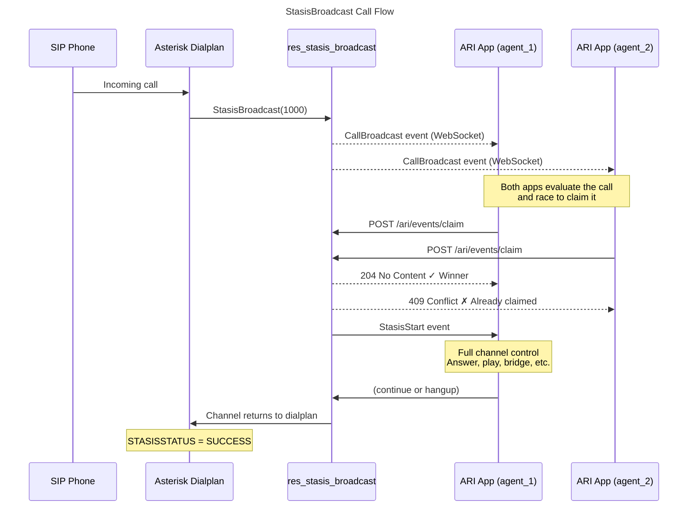

# Introduction to ARI and Broadcast

## Overview

The standard [`Stasis()`](/Latest_API/API_Documentation/Dialplan_Applications/Stasis)
dialplan application delivers a channel to exactly one ARI application — you name the
application in the dialplan and that application receives the channel. This works well
when the routing decision can be made at dialplan time, but falls short in
architectures where several independent ARI applications should compete to handle an
inbound call and the first available application wins.

**StasisBroadcast** fills that gap. The
[`StasisBroadcast()`](/Latest_API/API_Documentation/Dialplan_Applications/StasisBroadcast)
dialplan application broadcasts an incoming channel to every connected ARI application
(or a filtered subset) simultaneously. Each application sees a
[`CallBroadcast`](/Latest_API/API_Documentation/Asterisk_REST_Interface/Asterisk_REST_Data_Models/#callbroadcast)
event and can attempt to claim the channel via a single REST call. The first
application to claim wins; all others receive a `409 Conflict` response. Once claimed,
the channel enters the winning application exactly as if `Stasis(winning_app)` had
been called, and the application receives a standard
[`StasisStart`](/Latest_API/API_Documentation/Asterisk_REST_Interface/Asterisk_REST_Data_Models/#stasisstart)
event.

If no application claims the channel within a configurable timeout, control returns
to the dialplan immediately so that a fallback extension can handle the call.

## Typical Use Cases

* **Distributed inbound routing** — multiple regional or functional ARI applications
  (sales, support, billing) each evaluate the call and the most appropriate one claims
  it without any central broker.
* **High-availability ARI pools** — several identical application instances compete for
  each call; whichever is least loaded or responds fastest handles it.
* **Dynamic hunt groups** — calls fan out to all connected agents; the first to respond
  wins the call.

## Required Modules

Two modules must be loaded for StasisBroadcast to function:

| Module | Role |
|--------|------|
| `res_stasis_broadcast.so` | Core broadcast resource: manages broadcast contexts, dispatches `CallBroadcast` events, and processes claim requests via the ARI REST interface |
| `app_stasis_broadcast.so` | Dialplan application `StasisBroadcast()`: starts the broadcast, waits for a claim, and hands the channel to the winning application |

Both modules have a dependency on `res_stasis.so` (the standard Stasis resource) and
`res_ari.so`, which are loaded automatically.

## How It Works

### Step-by-Step

1. **Broadcast** — The dialplan executes `StasisBroadcast()`. The module creates an
   internal broadcast context for the channel and sends a `CallBroadcast` event
   simultaneously to all connected ARI applications (optionally filtered by a regex
   applied to application names).

2. **Race to claim** — Each ARI application that wants the call sends a
   `POST /ari/events/claim` request. The first to arrive wins; subsequent requests
   receive `409 Conflict`.

3. **Channel handoff** — Asterisk places the channel under Stasis control for the
   winning application. The application receives a `StasisStart` event and has full
   channel control until it issues a `continue` or the channel hangs up.

4. **Dialplan continuation** — After the Stasis session ends, control returns to the
   dialplan. The `STASISSTATUS` channel variable is set to `SUCCESS`, `FAILED`, or
   `TIMEOUT` so the dialplan can branch accordingly.

## Relationship to Stasis()

| Feature | `Stasis()` | `StasisBroadcast()` |
|---------|-----------|---------------------|
| Target application | Named at dialplan time | Determined at claim time |
| Routing logic | In the dialplan | In each ARI application |
| Number of apps notified | One | All (or a filtered subset) |
| Timeout handling | None (blocks until hangup or continue) | Returns to dialplan if unclaimed |
| Multiple competing apps | Not possible | Core feature |

## Next Steps

* [Claiming Broadcast Channels](/Configuration/Interfaces/Asterisk-REST-Interface-ARI/Introduction-to-ARI-and-Broadcast/Claiming-Broadcast-Channels) —
  Full configuration reference, event schemas, and working examples in Python and Node.js,
  including an annotated sample `extensions.conf` covering all common dialplan patterns.
* [`StasisBroadcast()` application reference](/Latest_API/API_Documentation/Dialplan_Applications/StasisBroadcast) —
  Auto-generated parameter documentation built from the Asterisk source.
* [ARI Events — `CallBroadcast`](/Latest_API/API_Documentation/Asterisk_REST_Interface/Asterisk_REST_Data_Models/#callbroadcast) /
  [`CallClaimed`](/Latest_API/API_Documentation/Asterisk_REST_Interface/Asterisk_REST_Data_Models/#callclaimed) —
  Auto-generated data model reference for the two new event types.
* [Events REST API — `POST /events/claim`](/Latest_API/API_Documentation/Asterisk_REST_Interface/Events_REST_API/#claim) —
  Auto-generated REST endpoint reference for the claim operation.
