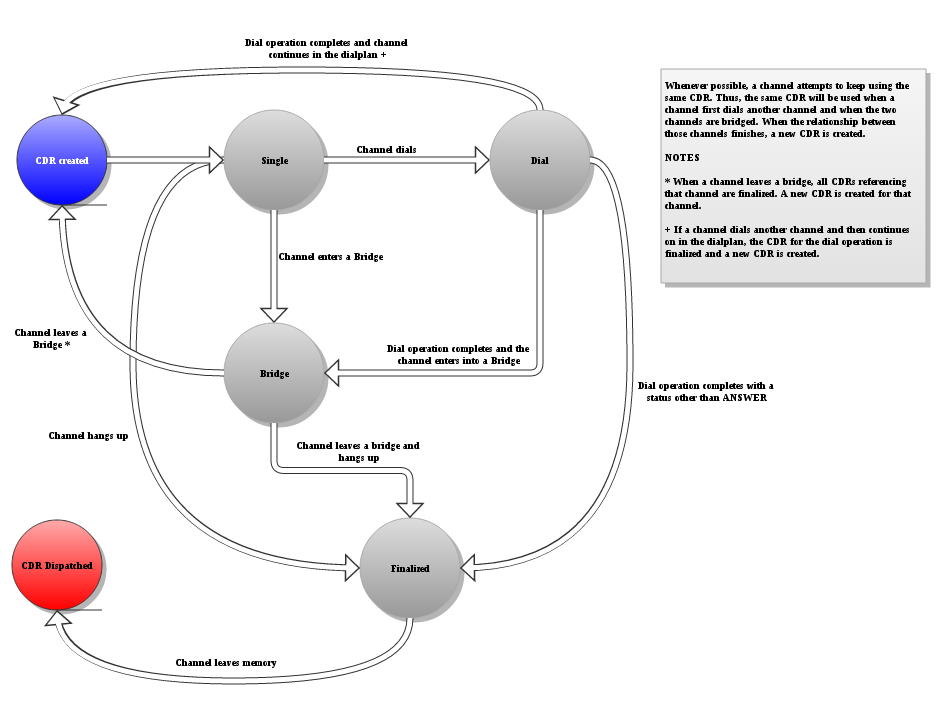

Call Detail Records, or CDRs, have been around in Asterisk for a long, long time. In fact, portions of it were taken from the `Zapata` library, as noted in `cdr.c`:

```
 \*
 \* \note Includes code and algorithms from the Zapata library.
 \*
```

CDRs have always attempted to provide the billing information between two parties involved in a call. While their simplicity has been a big advantage in quickly deploying a billing system, it has also been their largest disadvantage when trying to express complex scenarios. As Asterisk evolved and adapted to more complex scenarios, it became difficult to express the full details of a call within a single CDR. Compounding this problem, the way in which bridging was performed in Asterisk made call scenarios involving more than two parties incredibly difficult to track and coalesce into one or more CDRs. Numerous attempts were made to address the various problems in CDRs with varying degrees of success.

In Asterisk 12, changes in the bridging architecture necessitated a substantial upgrade to CDR behavior. The largest changes were:

* Individual components in Asterisk no longer modify CDRs directly. CDRs are produced based on the state of the channels and bridges within Asterisk. As a result, there is a much greater degree of consistency in CDRs throughout Asterisk, regardless of the application channels happen to be executing in.
* The behavior of CDRs between multiple parties is now defined.
* Depending on how channels are dialed and bridged, multiple CDRs will be created for a given call. Post-processing of these records **will** be required to determine the overall statistics of the call.

It is important to note that in Asterisk 1.8, Channel Event Logging (CEL) was introduced as an alternative to CDRs. Unlike CDRs, where a relatively few records are produced for a call, CEL provides a sequence of events regarding the state of channels within Asterisk. CELs provide substantially more information about what is occurring to the channels involved in a call, thus allowing an Asterisk user to construct their own billing system by handling the events as they choose. While CEL will never supplant CDRs, they are an option if CDRs do not provide the billing information you need or in the format you require. While improvements have been made and some complex scenarios defined in this specification, the fact that CEL can provide a more robust billing system is still true as of Asterisk 12.

Asterisk Users moving from Asterisk 11 and earlier to later versions are highly encouraged to read this specification carefully.

## Scope

This CDR specification applies to Asterisk 12 and later. It does not cover CDRs in prior versions of Asterisk.

Note that this does not include a comprehensive analysis as to how CDRs can be produced in all call scenarios in Asterisk. It defines the behavior for common scenarios, but certain scenarios are deliberately left unspecified. The behavior of CDRs in said scenarios is **undefined and is not a bug.**

It is known that the behavior of CDRs will not allow all applications to capture the billing requirements for their systems. If CDRs cannot meet the requirements of your application, [Channel Event Logging](/Configuration/Reporting/Channel-Event-Logging-CEL) (CEL) provides call information at a much finer granularity, allowing complex billing systems to be constructed. Please see the [Asterisk CEL Specification](/Configuration/Reporting/Channel-Event-Logging-CEL/CEL-Specification) for more information on CEL.

## Terminology

| Term | Definition |
| --- | --- |
| CDR | Call Detail Record. The thing that this document is attempting to describe. |
| CEL | Channel Event Logging. An alternative way to get billing information from Asterisk, that is significantly more flexible and powerful than CDRs but requires the billing logic to be completely implemented by the user. |
| Party A | A CDR always involves two parties. One party is always chosen as the 'owner' of the CDR. The CDR reflects the view of the call from that party. |
| Party B | A CDR always involves two parties. Party B is the target of the call. |
| Stasis | Stasis is the internal message bus in Asterisk that conveys state to the CDR engine. |
| Unanswered | A CDR is unanswered if its disposition indicates neither ANSWERED or CONGESTION. |

## CDR Overview

A CDR is a record of communication between one or two parties. As such, a single CDR always addresses the communication between two parties: a Party A and a Party B. The CDR reflects the view of the call from the perspective of Party A, while Party B is the party that Party A is communicating with. Each CDR includes the following times:

* Start time - the time at which the CDR was created for Party A
* Answer time - the time at which Party A and Party B could begin communicating
* End time - the time at which Party A and Party B could no longer communicate

From these times, two durations are computed:

* Duration - the End time minus the Start time.
* Billsec - the End time minus the Answer time. (Whether or not you actually bill for this period of time is up to you)

A single CDR only tracks information about a single path of communication between two endpoints. In many scenarios, there will be multiple paths of communication between multiple parties, even in a single "call". Each path of communication results in a new CDR, each representing the communication between two endpoints. All of the CDRs involved are associated by virtue of a special linked identifier field, `linkedid`. The CDRs themselves, however, typically do **not** aggregate the time between records. It is up to billing systems to determine which CDRs should be used for their billing records, and add up the times/durations themselves.

## Semantics and Syntax

### Basic CDR Lifetime

Fundamentally, a CDR represents a path of communication between a channel and Asterisk or between two channels communicating through Asterisk. Those relationships can be broken down into the following states:

* Single - a channel is executing dialplan in Asterisk or otherwise has no relationship with any other channel. This is the default state of a CDR.
* Dial - a channel is involved in a dial operation - either as a caller or as the callee. If they are the caller, they are automatically the Party A in the CDR. If they are the callee, they are automatically the Party B if there is a caller. If there is no caller - as is the case in channel origination - they are the Party A and there is no Party B.
* Bridge - two channels share a bridge in which they can potentially talk to each other.
* Finalized - the channel and Asterisk can no longer communicate or the relationship between the two channels has been broken. At this point, the last state of the channels involved is locked in the CDR.
* Dispatched - the CDR has been written to the backend storages.

When possible, Asterisk attempts to reuse a CDR. Thus a single CDR can transition through all of the above states. However, once a relationship is established between a Party A and a Party B, the CDR **cannot** be reused. The CDR will be finalized when the relationship between channels is broken and a new CDR created for any channel that is not hung up.



When a channel is created, a CDR is created for that channel. The channel is automatically the Party A of that CDR. The CDR is considered to be in the **Single** state while the channel executes dialplan or is waiting to be associated with another channel.

If a channel dials another channel, the CDR for that channel is transitioned to the **Dial** state. If the dial operation completes successfully and the channels are bridged together, the CDR transitions to the **Bridged** state. If the dial operation fails, the CDR transitions to the **Finalized** state. If the caller continues on in the dialplan, a new CDR is generated for them.

While the channels are bridged together, the CDR remains in the **Bridged** state. Operations that restrict media flow, such as call hold, are not reflected in CDRs. When the bridge is broken - either because one of the parties hangs up or a party is transferred - the CDR transitions to the **Finalized** state and any non-hungup channels have a new CDR created for them.

When a channel hangs up, all CDRs associated with it are implicitly finalized. When all CDRs for a channel are finalized, the CDRs are **Dispatched** to the backends for storage.

### Detailed Semantics

#### CDR Lifetime

##### Creation

A CDR record is created in any one of the following situations:

* Whenever a channel is created.
* Whenever a channel leaves a bridge and is not hung up.
* When a CDR is forked from a prior record.
* When a channel enters a multi-party bridge.
* When a channel [dials more than one channel](#dialing-parties).

When it is created, a CDR inherits the `uniqueid` and `linkedid` from its Party A channel, and a new `sequence` number is generated. When created as a result of a dial operation, the channel acting as the caller is always the Party A.

##### Dialing Parties

When a channel is known to dial other channels, a CDR is created for each dial attempt. The dial status is recorded for each dial attempt as a [CDR Disposition](#dispositions). Note that not all dial attempts may be dispatched depending on the CDR configuration. The caller is always the Party A in the created CDRs.

##### Bridging

If a channel is bridged with another channel, the following procedure is performed:

* The CDR is marked as having entered a bridge. If there is no other channel in the bridge, the CDR waits for another channel to join.
* For each pairing of channels, the channels are compared to determine which is the Party A channel and which is the Party B channel. (See [Choosing the Party A channel](#choosing-the-party-a-channel)).
	+ If the channel entering the bridge is the Party A, the CDR has a Party B, and the channel it is bridged with is the Party B, the CDR continues.
	+ If the channel entering the bridge is the Party A, the CDR has a Party B, and the channel is not already the Party B, the current CDR is finalized and a new CDR is created for the relationship between the two parties. Note that the original CDR will be re-activated if the existing Party B enters the bridge.
	+ If the channel entering the bridge is the Party A, the CDR has no Party B, then the channel it is bridged with becomes the Party B.
	+ If the channel entering the bridge is the Party B, the other channel has a CDR with no Party B, this channel becomes the Party B and the existing CDR is finalized.
	+ If the channel entering the bridge is the Party B, the other channel has a CDR with a Party B, and this channel is that CDR's Party B, then the existing CDR is finalized and the other channel's CDR activated.
	+ If the channel entering the bridge is the Party B, the other channel has a CDR with a Party B, and this channel is not that CDR's Party B, then the existing CDR is finalized and a new CDR is created for that other channel with this channel as the Party B.
* If a third party joins the bridge with Party A and Party B, the process [Choosing the Party A channel](#choosing-the-party-a-channel) is repeated for each pairing of channels. Thus, in a three-way call there will be three CDR records; in a four-way call there will be six records, etc.


!!! tip 
    This feels complex, but there's really two rules going on here:
    
    1. Keep using the existing CDR for a channel as long as possible
    2. Make CDRs for all pairings of channels in a bridge

##### Finalization

A CDR is finalized in one of the following scenarios:

* If in a dial, the dial operation completes with a status other than ANSWER
* If in a bridge, either party A or party B leaves the bridge
* Either channel in a CDR hangs up
* The CDR is forked and the forking operation instructs that the CDR should be finalized

When a CDR is finalized, no further modifications can be made to the CDR by the user or Asterisk.

If a Party A channel in a CDR is not hung up but the CDR is finalized - such as when the channel leaves a bridge of its Party B hangs up - a new CDR is made for that channel and the process in [CDR Creation](#creation) is begun again. Note that if the Party B in a CDR continues on in the the dialplan and/or is bridged with a new party, it may become Party A for a new CDR.

If at any point the Party A channel for a CDR is hung up, all CDR records for that Party A are [dispatched](#dispatch).

##### Dispatch

When a CDR is dispatched, all CDRs associated with the channel are committed to permanent storage. The CDRs at this point are removed from memory.

#### Choosing the Party A channel

Asterisk does not have the concept of "internal" versus "external" devices. As such, what constitutes the Party A channel is highly dependent on a particular system configuration which is outside the control of the CDR system. As such, choosing a Party A uses the following rules:

1. If the channel was dialed (but not originated), the channel is always Party B.
2. If one of the two channels has the `party_a` flag set, then that channel is chosen as the Party A.
3. If neither or both channels have the `party_A` flag, the channel with the oldest creation time is chosen as the Party A.

The `party_A` flag may be set using the [CDR function](/latest_api/API_Documentation/Dialplan_Functions/CDR).

#### LinkedID Propagation

When two channels are bridged, the `linkedid` property for the channels is updated. The channel with the oldest `linkedid` "wins", and the other channel's `linkedid` is replaced. This creates an association between the channels that lasts even if the bridge is broken at a latter time.

Note that dialed channels automatically receive the `linkedid` of the calling channel.


## Fields

### Standard Fields

| Field | Type | Description | Access |
| --- | --- | --- | --- |
| accountcode | String (20) | An account code associated with the Party A channel | r/w |
| src | String (80) | The Caller ID Number | r |
| dst | String (80) | The destination extension | r |
| dcontext | String (80) | The destination context | r |
| clid | String (80) | The Caller ID with text | r |
| channel | String (80) | The name of the Party A channel | r |
| dstchannel | String (80) | The name of the Party B channel | r |
| lastapp | String (80) | The last application the Party A channel executed | r |
| lastdata | String (80) | The application data for the last application the Party A channel executed | r |
| start | Date/time | The time the CDR was created | r |
| answer | Date/time | The time when Party A was answered, or when the bridge between Party A and Party B was created | r |
| end | Date/time | The time when the CDR was finished. This occurs when either party hangs up, or when the bridge between the parties is broken | r |
| duration | Integer | The time in seconds from start until end | r |
| billsec | Integer | The time in seconds from answer until end | r |
| disposition | Enum | The final known disposition of the CDR record. See [CDR dispositions](#dispositions) for possible values | r |
| amaflags | Enum | A flag specified on the Party A channel. See AMA records for possible values | r/w |
| userfield | String (255) | A user defined field set on the channels. If set on both the Party A and Party B channel, the userfields of both are concatenated and separated by a `;` | r/w |
| uniqueid | String (32) | A unique identifier for the Party A channel | r |
| linkedid | String (32) | A unique identifier that unites multiple CDR records. See [linkedid propagation](#linkedid-propagation) for more details | r |
| peeraccount | String (80) | The account code of the Party B channel | r/w |
| sequence | Integer | A numeric value that, combined with uniqueid and linkedid, can be used to uniquely identify a single CDR record | r |

Any of the values may be accessed using the [CDR function](/latest_api/API_Documentation/Dialplan_Functions/CDR). Any value that is read/write may be modified using this same function. CDR field values cannot be modified once the CDR is finalized.

#### Dispositions

Dispositions represent the final state of the call from the perspective of Party A.

| Value | Description | [Hangup Cause Mapping](/Configuration/Miscellaneous/Hangup-Cause-Mappings) | Dial Status Mapping |
| --- | --- | --- | --- |
| NO ANSWER | The channel was never answered. This is the default disposition for an unanswered channel. | Any not explicitly listed | CANCEL<br/>NOANSWER |
| CONGESTION | The channel dialed something that was congested. | `AST_CAUSE_CONGESTION` | CONGESTION |
| FAILED | The channel attempted to dial but the call failed.<br/>NOTE: The `congestion` setting in `cdr.conf` can result in the `AST_CAUSE_CONGESTION` hang up cause or the CONGESTION dial status to map to this disposition.| `AST_CAUSE_CONGESTION`<br/>`AST_CAUSE_NO_ROUTE_DESTINATION`<br/>`AST_CAUSE_UNREGISTERED` | CONGESTION<br/>FAILED |
| BUSY | The channel attempted to dial but the remote party was busy. | `AST_CAUSE_BUSY` | BUSY |
| ANSWERED | The channel was answered. When the channel is answered, the hangup cause no longer changes the disposition. | Any not explicitly listed | ANSWER |


#### AMA Flags

AMA Flags are set on a channel and are conveyed in the CDR. They inform billing systems how to treat the particular CDR. Asterisk provides no additional semantics regarding these flags - they are present simply to help external systems classify CDRs.

* OMIT
* BILLING
* DOCUMENTATION

### User Defined Fields

Any CDR record may have user defined fields associated with it. Fields can be added to either the Party A or Party B channel. Note that not all CDR backends support user defined fields; in those cases the user field is simply dropped when the CDR is dispatched to the backend.

If a Party A channel and a Party B channel both contain a field with the same key, only the Party A channel's field will be written to the CDR.

User defined CDR fields are created using the [CDR function](/latest_api/API_Documentation/Dialplan_Functions/CDR), and read using the same function.

## Scenarios

!!! note "Scenario Caveats"
    The following scenarios show examples of CDRs created in common use cases. If a particular scenario is not shown below, the CDRs created during the scenario should still match the behavior described previously. Some applications, however, may have undefined behavior as their use is not common or the mechanism by which they manipulate channels does not allow for the capturing of the channel state.  
  
    Undefined behavior means that the behavior of CDRs in those cases is unsupported and will not be addressed as a bug.


### Unanswered "Inbound" Call

!!! tip
    Unanswered calls may not always be logged to CDR backends if the configuration has explicitly disabled unanswered calls.

Alice calls into Asterisk at extension 500 using a SIP phone and, during dialplan execution of a NoOp(), hangs up.

| clid | src | dst | dcontext | channel | dstchannel | lastapp | lastdata | start | answer | end | duration | billsec | disposition | amaflags | accountcode | peeraccount | uniqueid | userfield | sequence | linkedid |
| --- | --- | --- | --- | --- | --- | --- | --- | --- | --- | --- | --- | --- | --- | --- | --- | --- | --- | --- | --- | --- |
| "Alice <100>" | 100 | 500 | default | SIP/alice-00000000 |   | NoOp |   | 2013-03-04 13:11:18 |   | 2013-03-04 13:11:20 | 2 | 0 | NO ANSWER | DOCUMENTATION | 100 |   | Asterisk-01-1362424276.2 |   | 34 | Asterisk-01-1362424276.2 |

### Unanswered "Outbound" Call

Asterisk creates a call file to dial Alice and playback tt-monkeys to her. Alice, anticipating the screeching of howler monkeys, never picks up the phone.

| clid | src | dst | dcontext | channel | dstchannel | lastapp | lastdata | start | answer | end | duration | billsec | disposition | amaflags | accountcode | peeraccount | uniqueid | userfield | sequence | linkedid |
| --- | --- | --- | --- | --- | --- | --- | --- | --- | --- | --- | --- | --- | --- | --- | --- | --- | --- | --- | --- | --- |
|   |   | s | default | SIP/alice-00000000 |   | AppDial | SIP/Alice | 2013-03-04 13:11:18 |   | 2013-03-04 13:11:20 | 2 | 0 | NO ANSWER | DOCUMENTATION |   |   | Asterisk-01-1362424276.2 |   | 4 | Asterisk-01-1362424276.2 |

### Single Party

Alice calls into Asterisk's VoiceMailMain application. This implicitly Answers the channel. She checks her voicemail for awhile, then hangs up.

| clid | src | dst | dcontext | channel | dstchannel | lastapp | lastdata | start | answer | end | duration | billsec | disposition | amaflags | accountcode | peeraccount | uniqueid | userfield | sequence | linkedid |
| --- | --- | --- | --- | --- | --- | --- | --- | --- | --- | --- | --- | --- | --- | --- | --- | --- | --- | --- | --- | --- |
| "Alice <100>" | 100 | 8500 | default | SIP/alice-00000000 |   | Hangup |   | 2013-03-04 13:11:18 | 2013-03-04 13:11:20 | 2013-03-04 13:12:18 | 60 | 58 | ANSWERED | DOCUMENTATION | 100 |   | Asterisk-01-1362424276.2 |   | 112 | Asterisk-01-1362424276.2 |

### Basic Two Party Calls

Two party calls can be initiated in a variety of ways. Several of the more common ways are illustrated here.

#### Basic Call

Alice calls into Asterisk, which dials Bob. Bob Answers, and a bridge is formed between Alice and Bob. Alice and Bob talk for awhile, then Bob hangs up. This breaks the bridge between Alice and Bob, and Alice is hung up on as well.


| clid | src | dst | dcontext | channel | dstchannel | lastapp | lastdata | start | answer | end | duration | billsec | disposition | amaflags | accountcode | peeraccount | uniqueid | userfield | sequence | linkedid |
| --- | --- | --- | --- | --- | --- | --- | --- | --- | --- | --- | --- | --- | --- | --- | --- | --- | --- | --- | --- | --- |
| "Alice <100>" | 100 | 200 | default | SIP/alice-00000000 | SIP/bob-00000001 | Dial | SIP/bob,,Tt | 2013-03-04 13:11:18 | 2013-03-04 13:11:26 | 2013-03-04 13:13:18 | 120 | 112 | ANSWERED | DOCUMENTATION |   |   | Asterisk-01-1362424276.2 |   | 12 | Asterisk-01-1362424276.2 |

#### Unanswered Dial

Alice calls into Asterisk, which dials Bob. Bob refuses to pick up his phone, and the call eventually times out.


| clid | src | dst | dcontext | channel | dstchannel | lastapp | lastdata | start | answer | end | duration | billsec | disposition | amaflags | accountcode | peeraccount | uniqueid | userfield | sequence | linkedid |
| --- | --- | --- | --- | --- | --- | --- | --- | --- | --- | --- | --- | --- | --- | --- | --- | --- | --- | --- | --- | --- |
| "Alice <100>" | 100 | 200 | default | SIP/alice-00000000 | SIP/bob-00000001 | Dial | SIP/bob,10,Tt | 2013-03-04 13:11:18 |   | 2013-03-04 13:11:28 | 10 | 0 | NO ANSWER | DOCUMENTATION |   |   | Asterisk-01-1362424276.2 |   | 1 | Asterisk-01-1362424276.2 |

#### Parallel Dial

Alice calls into Asterisk, which dials Bob's SIP desk phone as well as his IAX2 soft phone. Both ring for awhile, and Bob eventually presses the Answer button on his IAX2 soft phone.


| clid | src | dst | dcontext | channel | dstchannel | lastapp | lastdata | start | answer | end | duration | billsec | disposition | amaflags | accountcode | peeraccount | uniqueid | userfield | sequence | linkedid |
| --- | --- | --- | --- | --- | --- | --- | --- | --- | --- | --- | --- | --- | --- | --- | --- | --- | --- | --- | --- | --- |
| "Alice <100>" | 100 | 200 | default | SIP/alice-00000000 | SIP/bob-00000001 | Dial | SIP/bob&IAX2/bob,,Tt | 2013-03-04 13:11:18 |   | 2013-03-04 13:11:28 | 10 | 0 | NO ANSWER | DOCUMENTATION |   |   | Asterisk-01-1362424276.2 |   | 12 | Asterisk-01-1362424276.2 |
| "Alice <100>" | 100 | 200 | default | SIP/alice-00000000 | IAX2/bob-00000000 | Dial | SIP/bob&IAX2/bob,,Tt | 2013-03-04 13:11:18 | 2013-03-04 13:11:28 | 2013-03-04 13:12:28 | 70 | 60 | ANSWERED | DOCUMENTATION |   |   | Asterisk-01-1362424276.2 |   | 13 | Asterisk-01-1362424276.2 |

#### Call Forward

Alice calls into Asterisk, which dials Bob's SIP desk phone. Bob is on vacation, and the SIP phone returns a "302" and redirects Asterisk to dial his SIP mobile.

### Transfers

Transfers create multiple CDRs. In general, a CDR is created for each path of communication between two endpoints. Note that Asterisk does **not** attempt to compute the total duration or billing time of any of the various channels involved - it is up to the businesses consuming CDRs to know whether or not the amount of time they want to bill a party includes the transfer, the time spent dialing another party, consultation time, etc.

#### Blind Transfer

Alice calls into Asterisk, which dials Bob's SIP phone. Bob answers, and Alice and Bob talk for awhile. Eventually, Bob decides to send Alice off to Charlie, and he blind transfers Alice to Charlie's extension. Asterisk dials Charlie's SIP phone, and Charlie answers. Alice and Charlie talk for awhile until Alice decides to hang up.


| clid | src | dst | dcontext | channel | dstchannel | lastapp | lastdata | start | answer | end | duration | billsec | disposition | amaflags | accountcode | peeraccount | uniqueid | userfield | sequence | linkedid |
| --- | --- | --- | --- | --- | --- | --- | --- | --- | --- | --- | --- | --- | --- | --- | --- | --- | --- | --- | --- | --- |
| "Alice <100>" | 100 | 200 | default | SIP/alice-00000000 | SIP/bob-00000001 | Dial | SIP/bob,,Tt | 2013-03-04 13:11:18 | 2013-03-04 13:11:28 | 2013-03-04 13:11:48 | 30 | 20 | ANSWERED | DOCUMENTATION |   |   | Asterisk-01-1362424276.2 |   | 101 | Asterisk-01-1362424276.2 |
| "Alice <100>" | 100 | 300 | default | SIP/alice-00000000 | SIP/charlie-00000002 | Dial | SIP/charlie,,Tt | 2013-03-04 13:11:48 | 2013-03-04 13:11:53 | 2013-03-04 13:12:53 | 65 | 60 | ANSWERED | DOCUMENTATION |   |   | Asterisk-01-1362424276.2 |   | 102 | Asterisk-01-1362424276.2 |

#### Core Attended Transfer to Channel

Alice calls into Asterisk, which dials Bob's SIP phone. Bob answers, and Alice and Bob talk for awhile. Eventually, Bob decides to send Alice off to Charlie, and he initiates an attended transfer. Alice is put on hold, and Bob dials Charlie's extension. Asterisk dials Charlie's SIP phone, and Charlie answers. Bob and Charlie talk for a bit, and Charlie agrees to talk to Alice. Bob completes the attended transfer, Alice is taken off hold, and Alice and Charlie are bridged. Alice talks to Charlie for awhile, then hangs up.


| clid | src | dst | dcontext | channel | dstchannel | lastapp | lastdata | start | answer | end | duration | billsec | disposition | amaflags | accountcode | peeraccount | uniqueid | userfield | sequence | linkedid |
| --- | --- | --- | --- | --- | --- | --- | --- | --- | --- | --- | --- | --- | --- | --- | --- | --- | --- | --- | --- | --- |
| "Alice <100>" | 100 | 200 | default | SIP/alice-00000000 | SIP/bob-00000001 | Dial | SIP/bob,,Tt | 2013-03-04 13:11:18 | 2013-03-04 13:11:28 | 2013-03-04 13:12:18 | 60 | 50 | ANSWERED | DOCUMENTATION |   |   | Asterisk-01-1362424276.2 |   | 101 | Asterisk-01-1362424276.2 |
| "Bob <200>" | 200 | 300 | default | SIP/bob-00000001 | SIP/charlie-00000002 | Dial | SIP/charlie,,Tt | 2013-03-04 13:11:48 | 2013-03-04 13:11:53 | 2013-03-04 13:12:18 | 30 | 26 | ANSWERED | DOCUMENTATION |   |   | Asterisk-01-1362424280.1 |   | 102 | Asterisk-01-1362424276.2 |
| "Alice <100>" | 100 | 300 | default | SIP/alice-00000000 | SIP/charlie-00000002 | Dial | SIP/bob,,Tt | 2013-03-04 13:12:18 | 2013-03-04 13:12:18 | 2013-03-04 13:12:53 | 45 | 45 | ANSWERED | DOCUMENTATION |   |   | Asterisk-01-1362424276.2 |   | 103 | Asterisk-01-1362424276.2 |


!!! note
    In the example above, note the following:
    
    * Hold time is not reflected in CDRs.
    * When Bob dials Charlie, he becomes the Party A channel. However, the `linkedid` from Alice 'wins', and so the CDR reflects the `linkedid` from Alice's CDR.
    * Alice and Charlie are bridged automatically by the attended transfer, so their start and answer times are identical.
    * The billsec/duration of Alice and Charlie are reflective of their portion of the call, and do not include the times from Alice and Bob.

#### Core Attended Transfer to Application

Alice calls into Asterisk, which dials Bob's SIP phone. Bob answers, and Alice and Bob talk for awhile. Eventually, Bob decides to send Alice off into Charlie's voicemail mailbox, and he initiates an attended transfer. Alice is put on hold, and Bob dials an extension that calls into VoiceMail. Bob enters in the Charlie's voicemail mailbox number, then completes the attended transfer to put Alice into the voicemail mailbox. Alice records some voicemail, then hangs up.

| clid | src | dst | dcontext | channel | dstchannel | lastapp | lastdata | start | answer | end | duration | billsec | disposition | amaflags | accountcode | peeraccount | uniqueid | userfield | sequence | linkedid |
| --- | --- | --- | --- | --- | --- | --- | --- | --- | --- | --- | --- | --- | --- | --- | --- | --- | --- | --- | --- | --- |
| "Alice <100>" | 100 | 200 | default | SIP/alice-00000000 | SIP/bob-00000001 | Dial | SIP/bob,,Tt | 2013-03-04 13:11:18 | 2013-03-04 13:11:28 | 2013-03-04 13:12:18 | 60 | 50 | ANSWERED | DOCUMENTATION |   |   | Asterisk-01-1362424276.2 |   | 101 | Asterisk-01-1362424276.2 |
| "Bob <200>" | 200 | 8500 | default | SIP/bob-00000001 |   | VoiceMail | 300 | 2013-03-04 13:11:48 | 2013-03-04 13:11:49 | 2013-03-04 13:12:18 | 30 | 29 | ANSWERED | DOCUMENTATION |   |   | Asterisk-01-1362424280.1 |   | 102 | Asterisk-01-1362424276.2 |
| "Alice <100>" | 100 | 8500 | default | SIP/alice-00000000 |   | VoiceMail | 300 | 2013-03-04 13:12:18 | 2013-03-04 13:12:18 | 2013-03-04 13:13:18 | 60 | 60 | ANSWERED | DOCUMENTATION |   |   | Asterisk-01-1362424276.2 |   | 103 | Asterisk-01-1362424276.2 |

#### SIP Protocol Attended Transfer

In a SIP protocol attended transfer, two independent channels make up the transferer. As the two channels are independent of each other, correlation of the two channels cannot be done by `linkedid` / `uniqueid` / `sequence` numbers. The records generally have to be correlated using other properties, such as the prefix of the channel names and/or the `accountcode` settings.

| clid | src | dst | dcontext | channel | dstchannel | lastapp | lastdata | start | answer | end | duration | billsec | disposition | amaflags | accountcode | peeraccount | uniqueid | userfield | sequence | linkedid |
| --- | --- | --- | --- | --- | --- | --- | --- | --- | --- | --- | --- | --- | --- | --- | --- | --- | --- | --- | --- | --- |
| "Alice <100>" | 100 | 200 | default | SIP/alice-00000000 | SIP/bob-00000001 | Dial | SIP/bob,,Tt | 2013-03-04 13:11:18 | 2013-03-04 13:11:28 | 2013-04-13:12:08 | 50 | 40 | ANSWERED | DOCUMENTATION | Alice | Bob | Asterisk-01-13624276.2 |  | 101 | Asterisk-01-13624276.2 |
| "Bob <200>" | 200 | 300 | default | SIP/bob-00000002 | SIP/charlie-00000003 | Dial | SIP/charlie,,Tt | 2013-03-04 13:11:48 | 2013-03-04 13:11:58 | 2013-03-04 13:12:08 | 20 | 10 | ANSWERED | DOCUMENTATION | Bob | Charlie | Asterisk-01-136242428.3 |  | 102 | Asterisk-01-136242428.3 |
| "Alice <100>" | 100 | 300 | default | SIP/alice-00000000 | SIP/charlie-00000003 | Dial | SIP/bob,,Tt | 2013-03-04 13:12:08 | 2013-03-04 13:12:08 | 2013-03-04 13:13:08 | 60 | 60 | ANSWERED | DOCUMENTATION | Alice | Charlie | Asterisk-01-13624276.2 |  | 103 | Asterisk-01-13624276.2 |

#### Blonde Transfer

Alice calls into Asterisk, which dials Bob's SIP phone. Bob answers, and Alice and Bob talk for awhile. Eventually, Bob decides to send Alice off to Charlie, and he initiates an attended transfer. Alice is put on hold, and Bob dials Charlie's extension. Asterisk dials Charlie's SIP phone, but before Charlie answers Bob hangs up. Asterisk recognizes that this is a blonde transfer, takes Alice off hold, and ties Charlie's ringing phone to Alice. Charlie answers, Alice talks to Charlie for awhile, then hangs up.


| clid | src | dst | dcontext | channel | dstchannel | lastapp | lastdata | start | answer | end | duration | billsec | disposition | amaflags | accountcode | peeraccount | uniqueid | userfield | sequence | linkedid |
| --- | --- | --- | --- | --- | --- | --- | --- | --- | --- | --- | --- | --- | --- | --- | --- | --- | --- | --- | --- | --- |
| "Alice <100>" | 100 | 200 | default | SIP/alice-00000000 | SIP/bob-00000001 | Dial | SIP/bob,,Tt | 2013-03-04 13:11:18 | 2013-03-04 13:11:28 | 2013-03-04 13:12:18 | 60 | 50 | ANSWERED | DOCUMENTATION |   |   | Asterisk-01-1362424276.2 |   | 101 | Asterisk-01-1362424276.2 |
| "Bob <200>" | 200 | 300 | default | SIP/bob-00000001 | SIP/charlie-00000002 | Dial | SIP/charlie,,Tt | 2013-03-04 13:11:48 |   | 2013-03-04 13:11:50 | 2 | 0 | NO ANSWER | DOCUMENTATION |   |   | Asterisk-01-1362424280.1 |   | 102 | Asterisk-01-1362424276.2 |
| "Alice <100>" | 100 | 300 | default | SIP/alice-00000000 | SIP/charlie-00000002 | Dial | SIP/charlie,,Tt | 2013-03-04 13:11:50 | 2013-03-04 13:11:55 | 2013-03-04 13:12:30 | 40 | 35 | ANSWERED | DOCUMENTATION |   |   | Asterisk-01-1362424276.2 |   | 103 | Asterisk-01-1362424276.2 |

#### Three Way Call

Alice calls into Asterisk, which dials Bob's SIP phone. Bob answers, and Alice and Bob talk for awhile. Eventually, Bob decides to bring Charlie into the mix. He puts Alice on hold and dials Charlie's extension. Asterisk dials Charlie's SIP phone, and Charlie answers. Bob and Charlie talk for awhile, and Bob then finishes the three-way call by finalizing the attempt. Alice is taken off hold, and Alice, Bob, and Charlie can all talk. Eventually, Bob hangs up, and all parties are ejected and hung up on.

| clid | src | dst | dcontext | channel | dstchannel | lastapp | lastdata | start | answer | end | duration | billsec | disposition | amaflags | accountcode | peeraccount | uniqueid | userfield | sequence | linkedid |
| --- | --- | --- | --- | --- | --- | --- | --- | --- | --- | --- | --- | --- | --- | --- | --- | --- | --- | --- | --- | --- |
| "Alice <100>" | 100 | 200 | default | SIP/alice-00000000 | SIP/bob-00000001 | Dial | SIP/bob,,Tt | 2013-03-04 13:11:18 | 2013-03-04 13:11:28 | 2013-03-04 13:13:18 | 120 | 110 | ANSWERED | DOCUMENTATION |   |   | Asterisk-01-1362424276.2 |   | 101 | Asterisk-01-1362424276.2 |
| "Bob <200>" | 200 | 300 | default | SIP/bob-00000001 | SIP/charlie-00000002 | Dial | SIP/charlie,,Tt | 2013-03-04 13:11:48 | 2013-03-04 13:11:53 | 2013-03-04 13:12:08 | 20 | 15 | ANSWERED | DOCUMENTATION |   |   | Asterisk-01-1362424280.1 |   | 102 | Asterisk-01-1362424276.2 |
| "Alice <100>" | 100 | 300 | default | SIP/alice-00000000 | SIP/charlie-00000002 | Dial | SIP/bob,,Tt | 2013-03-04 13:12:08 | 2013-03-04 13:12:08 | 2013-03-04 13:13:18 | 70 | 70 | ANSWERED | DOCUMENTATION |   |   | Asterisk-01-1362424276.2 |   | 103 | Asterisk-01-1362424276.2 |
| "Bob <200>" | 200 | 300 | default | SIP/bob-00000001 | SIP/charlie-00000002 | Dial | SIP/charlie,,Tt | 2013-03-04 13:12:08 | 2013-03-04 13:12:08 | 2013-03-04 13:13:18 | 70 | 70 | ANSWERED | DOCUMENTATION |   |   | Asterisk-01-1362424280.1 |   | 104 | Asterisk-01-1362424276.2 |


!!! note
    In the example above, note the following:
    
    * The consultation between Bob and Charlie is treated as a separate conversation from the conversation between all three parties. Thus, there are two CDRs between Bob and Charlie.
    * Because the path of communication never was broken between Alice and Bob (despite Alice being put on hold), there is only one CDR for Alice to Bob.

#### SIP Attended Transfer

Alice calls into Asterisk, which dials Bob's SIP phone. Bob answers, and Alice and Bob talk for awhile. Eventually, Alice decides to transfer Bob to Charlie, and performs an attended transfer using her SIP phone. Bob is put on hold. Alice and Charlie talk for awhile, and then Alice finishes the attended transfer. Bob is taken off hold, and bridged with Charlie. Alice is hung up.

| clid | src | dst | dcontext | channel | dstchannel | lastapp | lastdata | start | answer | end | duration | billsec | disposition | amaflags | accountcode | peeraccount | uniqueid | userfield | sequence | linkedid |
| --- | --- | --- | --- | --- | --- | --- | --- | --- | --- | --- | --- | --- | --- | --- | --- | --- | --- | --- | --- | --- |
| "Alice <100>" | 100 | 200 | default | SIP/alice-00000000 | SIP/bob-00000001 | Dial | SIP/bob | 2013-03-04 13:11:18 | 2013-03-04 13:11:28 | 2013-03-04 13:12:18 | 60 | 50 | ANSWERED | DOCUMENTATION |   |   | Asterisk-01-1362424276.2 |   | 101 | Asterisk-01-1362424276.2 |
| "Bob <200>" | 200 | 300 | default | SIP/bob-00000002 | SIP/charlie-00000003 | Dial | SIP/charlie | 2013-03-04 13:11:48 | 2013-03-04 13:11:53 | 2013-03-04 13:12:08 | 20 | 15 | ANSWERED | DOCUMENTATION |   |   | Asterisk-01-1362424280.1 |   | 102 | Asterisk-01-1362424276.2 |
| "Alice <100>" | 100 | 200 | default | SIP/alice-00000000 | SIP/charlie-00000003 | Dial | SIP/bob | 2013-03-04 13:12:18 | 2013-03-04 13:12:18 | 2013-03-04 13:12:28 | 10 | 10 | ANSWERED | DOCUMENTATION |   |   | Asterisk-01-1362424276.2 |   | 103 | Asterisk-01-1362424276.2 |


!!! note
    The important point to note here is that a SIP attended transfer uses two channels to communicate with Bob - `SIP/bob-00000001` and `SIP/bob-00000002`. The CDR records are associated by virtue of the `linkedid` field.

### Local Channels

Local channels are a special Asterisk construct that create a path of communication between two bridges or a bridge and an application. A Local channel always consists of two channels with the same name prefix - the first of the Local channel pair is delineated with a `;1`; the second is delineated with a `;2`. Local channels have two different modes in Asterisk:

* They can exist permanently. In that case, the Local channel pair appears as two separate channels. From the perspective of CDRs, they are treated as such with an implicit bridge between the channels. CDRs with a permanent Local channel pair will share the same `linkedid`.
* They can optimize. A Local channel optimization occurs when a pair of Local channels exist between two bridges and the Local channel has been configured to optimize. If that situation occurs, the Local channel will cause the two bridges to merge into a single merge, and the Local channel will disappear.

Each situation and how it appears in CDRs is explored further below.

#### Non-optimizing Local Channels

##### Local channel to an application

An external application [Originates](/latest_api/API_Documentation/AMI_Actions/Originate) a Local channel. The first half of the Local channel Dials Alice over a SIP channel. The second half of the Local channel is placed into her VoiceMail account. Alice listens to her VoiceMail through the Local channel, then hangs up.

| clid | src | dst | dcontext | channel | dstchannel | lastapp | lastdata | start | answer | end | duration | billsec | disposition | amaflags | accountcode | peeraccount | uniqueid | userfield | sequence | linkedid |
| --- | --- | --- | --- | --- | --- | --- | --- | --- | --- | --- | --- | --- | --- | --- | --- | --- | --- | --- | --- | --- |
| "" | dial\_alice | 100 | default | Local/dial\_alice@default-00000001;1 | SIP/alice-00000002 | Dial | SIP/alice,,tT | 2013-03-04 13:11:18 | 2013-03-04 13:11:28 | 2013-03-04 13:12:18 | 60 | 50 | ANSWERED | DOCUMENTATION |   |   | Asterisk-01-1362424290.1 |   | 101 | Asterisk-01-1362424290.1 |
| "" | voicemail |   | default | Local/dial\_alice@default-00000001;2 |   | VoiceMailMain | 100 | 2013-03-04 13:11:28 | 2013-03-04 13:11:28 | 2013-03-04 13:12:18 | 50 | 50 | ANSWERED | DOCUMENTATION |   |   | Asterisk-01-1362424290.1 |   | 102 | Asterisk-01-1362424290.1 |

##### Local channel between bridges

An external application [Originates](/latest_api/API_Documentation/AMI_Actions/Originate) a Local channel. The first half of the Local channel Dials Alice over a SIP channel; Alice answers. This triggers the second half of the Local channel, which Dials Bob. Bob Answers, and Alice and Bob talk. Alice hangs up, the Local channels are hung up, and Bob is hung up on.

| clid | src | dst | dcontext | channel | dstchannel | lastapp | lastdata | start | answer | end | duration | billsec | disposition | amaflags | accountcode | peeraccount | uniqueid | userfield | sequence | linkedid |
| --- | --- | --- | --- | --- | --- | --- | --- | --- | --- | --- | --- | --- | --- | --- | --- | --- | --- | --- | --- | --- |
| "" | dial\_alice | 100 | default | Local/dial\_alice@default-00000001;1 | SIP/alice-00000002 | Dial | SIP/alice,,tT | 2013-03-04 13:11:18 | 2013-03-04 13:11:28 | 2013-03-04 13:12:18 | 60 | 50 | ANSWERED | DOCUMENTATION |   |   | Asterisk-01-1362424290.1 |   | 101 | Asterisk-01-1362424290.1 |
| "" | dial\_bob | 200 | default | Local/dial\_alice@default-00000001;2 | SIP/bob-00000003 | Dial | SIP/bob,,tT | 2013-03-04 13:11:28 | 2013-03-04 13:11:38 | 2013-03-04 13:12:18 | 50 | 40 | ANSWERED | DOCUMENTATION |   |   | Asterisk-01-1362424290.1 |   | 102 | Asterisk-01-1362424290.1 |

#### Local Channel Optimization

When a Local channel optimization occurs, the CDR records associated with the Local channel are finalized. New CDR records are generated for the channels in the merged bridge, per the rules outlined in [CDR Bridging](#bridging). That is, new CDRs are generated from each pair of channels that result from the merging of the bridges.


!!! warning
    CDR properties set on optimized Local channels are **not** propagated to other channels. Setting CDR information on optimizing Local channels will cause that information to be lost.
    In prior versions of Asterisk it was sometimes necessary to set CDR information on Local channels - with the addition of [Pre-Dial handlers](/Configuration/Dialplan/Subroutines/Pre-Dial-Handlers), it is always possible to set CDR information on the appropriate channel at the time of creation.

### Call Hold

Call Hold is a state of the media between two or more channels, and not a change in the actual bridging of those channels. As such, Call Hold is **not** reflected in CDRs. Channels may be put on hold, taken off hold, put on hold again, forgotten about, found again, taken off hold, etc. without affecting CDRs at all.

### Call Park

Call Park is different from Call Hold. Whereas Call Hold is a change of media state, Call Park implies that the channel has been moved into a state where it can be retrieved by any other channel. As such, calls in Park receive their own CDR.

Alice calls into Asterisk and Bob answers. Alice says she wants to talk to Charlie, but Bob isn't sure Charlie wants to talk to Alice so he blind transfers her into Park. Alice sits, waiting in her parking slot, listening to serenading robots while Bob asks if Charlie wants to talk to Alice. Charlie says sure, so he picks Alice up out of Park and they talk for awhile before Alice hangs up.

| clid | src | dst | dcontext | channel | dstchannel | lastapp | lastdata | start | answer | end | duration | billsec | disposition | amaflags | accountcode | peeraccount | uniqueid | userfield | sequence | linkedid |
| --- | --- | --- | --- | --- | --- | --- | --- | --- | --- | --- | --- | --- | --- | --- | --- | --- | --- | --- | --- | --- |
| "Alice <100>" | 100 | 200 | default | SIP/alice-00000000 | SIP/bob-00000001 | Dial | SIP/bob,,Tt | 2013-03-04 13:11:18 | 2013-03-04 13:11:28 | 2013-03-04 13:11:38 | 20 | 10 | ANSWERED | DOCUMENTATION |   |   | Asterisk-01-1362424276.2 |   | 101 | Asterisk-01-1362424276.2 |
| "Alice <100>" | 100 | 700 | default | SIP/alice-00000000 |   | Park | 60000,default,200,1 | 2013-03-04 13:11:38 | 2013-03-04 13:11:38 | 2013-03-04 13:12:38 | 60 | 60 | ANSWERED | DOCUMENTATION |   |   | Asterisk-01-1362424276.2 |   | 102 | Asterisk-01-1362424276.2 |
| "Alice <100>" | 100 | 300 | default | SIP/alice-00000000 | SIP/charlie-00000002 | Park | 60000,default,200,1 | 2013-03-04 13:12:38 | 2013-03-04 13:12:38 | 2013-03-04 13:13:38 | 60 | 60 | ANSWERED | DOCUMENTATION |   |   | Asterisk-01-1362424276.2 |   | 103 | Asterisk-01-1362424276.2 |

### Call Queues

#### Call Queue - Example 1

Alice calls into Asterisk and enters [Queue](/latest_api/API_Documentation/Dialplan_Applications/Queue) without being Answered. She waits in the queue for a period of time. At some point in time, she enters into the head of the queue and the queue performs a ring-all on the members of the queue. There are two queue members - Bob and Charlie. Bob is out to lunch, so his queue member is paused and it returns a Busy indication. Charlie, on the other hand, is not busy and answers. Alice and Charlie talk for awhile, and eventually Alice hangs up.

| clid | src | dst | dcontext | channel | dstchannel | lastapp | lastdata | start | answer | end | duration | billsec | disposition | amaflags | accountcode | peeraccount | uniqueid | userfield | sequence | linkedid |
| --- | --- | --- | --- | --- | --- | --- | --- | --- | --- | --- | --- | --- | --- | --- | --- | --- | --- | --- | --- | --- |
| "Alice <100>" | 100 | 800 | default | SIP/alice-00000000 | SIP/bob-00000001 | Queue | complaints | 2013-03-04 13:11:18 |   | 2013-03-04 13:14:18 | 180 | 0 | BUSY | DOCUMENTATION |   |   | Asterisk-01-1362424276.2 |   | 101 | Asterisk-01-1362424276.2 |
| "Alice <100>" | 100 | 800 | default | SIP/alice-00000000 | SIP/charlie-00000002 | Queue | complaints | 2013-03-04 13:11:18 | 2013-03-04 13:12:18 | 2013-03-04 13:14:18 | 180 | 120 | ANSWERED | DOCUMENTATION |   |   | Asterisk-01-1362424276.2 |   | 102 | Asterisk-01-1362424276.2 |

#### Call Queue - Example 2

Alice calls into Asterisk and enters Queue without being Answered. She waits in the queue for a period of time. At some point in time, she enters into the head of the queue and the queue performs a round-robin strategy ring on the members of the queue. Bob is rung first, but being lazy, he ignores his phone. After some time of ringing, it times out and goes on to Charlie. When Charlie's SIP phone rings, he immediately answers. Alice and Charlie talk for some period of time, and eventually Alice hangs up.

| clid | src | dst | dcontext | channel | dstchannel | lastapp | lastdata | start | answer | end | duration | billsec | disposition | amaflags | accountcode | peeraccount | uniqueid | userfield | sequence | linkedid |
| --- | --- | --- | --- | --- | --- | --- | --- | --- | --- | --- | --- | --- | --- | --- | --- | --- | --- | --- | --- | --- |
| "Alice <100>" | 100 | 800 | default | SIP/alice-00000000 | SIP/bob-00000001 | Queue | complaints | 2013-03-04 13:11:18 |   | 2013-03-04 13:14:18 | 180 | 0 | NO ANSWER | DOCUMENTATION |   |   | Asterisk-01-1362424276.2 |   | 101 | Asterisk-01-1362424276.2 |
| "Alice <100>" | 100 | 800 | default | SIP/alice-00000000 | SIP/charlie-00000002 | Queue | complaints | 2013-03-04 13:11:18 | 2013-03-04 13:12:38 | 2013-03-04 13:14:18 | 180 | 100 | ANSWERED | DOCUMENTATION |   |   | Asterisk-01-1362424276.2 |   | 102 | Asterisk-01-1362424276.2 |

### Conference Call

Alice calls into Asterisk and joins a ConfBridge conference. Bob does a bit later as well. Finally, Charlie joins the Conference. After talking for awhile, Bob realizes he's late for lunch and hangs up. Alice and Charlie talk for a bit longer, then finally Alice hangs up. Charlie stays in the conference for another second before he hangs up as well.

| clid | src | dst | dcontext | channel | dstchannel | lastapp | lastdata | start | answer | end | duration | billsec | disposition | amaflags | accountcode | peeraccount | uniqueid | userfield | sequence | linkedid |
| --- | --- | --- | --- | --- | --- | --- | --- | --- | --- | --- | --- | --- | --- | --- | --- | --- | --- | --- | --- | --- |
| "Alice <100>" | 100 | 1000 | default | SIP/alice-00000000 | SIP/bob-00000001 | ConfBridge | 1000,public\_bridge,public\_user,public\_menu | 2013-03-04 13:11:18 | 2013-03-04 13:11:28 | 2013-03-04 13:14:18 | 180 | 170 | ANSWERED | DOCUMENTATION |   |   | Asterisk-01-1362424276.2 |   | 1 | Asterisk-01-1362424276.2 |
| "Bob <200>" | 200 | 1000 | default | SIP/bob-00000001 | SIP/charlie-00000002 | ConfBridge | 1000,public\_bridge,public\_user,public\_menu | 2013-03-04 13:11:28 | 2013-03-04 13:12:18 | 2013-03-04 13:14:18 | 170 | 120 | ANSWERED | DOCUMENTATION |   |   | Asterisk-01-1362424280.1 |   | 2 | Asterisk-01-1362424276.2 |
| "Alice <100>" | 100 | 1000 | default | SIP/alice-00000000 | SIP/charlie-00000002 | ConfBridge | 1000,public\_bridge,public\_user,public\_menu | 2013-03-04 13:11:18 | 2013-03-04 13:12:18 | 2013-03-04 13:15:18 | 240 | 180 | ANSWERED | DOCUMENTATION |   |   | Asterisk-01-1362424276.2 |   | 3 | Asterisk-01-1362424276.2 |

### A Complex Example

Alice calls into Asterisk and Dials Bob. Bob answers, and he and Alice talk for awhile. Bob realizes that what Alice really needs is to talk to Sales, so he blind transfers Alice off to the Sales Queue. As Alice is heading off to the Sales Queue, Bob realizes that he should talk with Charlie about Alice, so he Dials Charlies and he and Charlie talk for awhile. Alice enters into the Sales Queue, where she waits for a bit while agents David and Frank are dialed using Local channels to SIP devices. Alice is eventually Answered by David, a sales agent. David and Alice talk for a bit, but David isn't able to sell her on their new fantastic product, so he puts Alice on hold for a bit and calls Ellen from engineering. Ellen agrees to be on the call, and Alice, David, and Ellen are put into a three-way call. Around this time, Charlie decides that he should talk to Alice as well. He transfers himself to the Sales bridge, hanging up on Bob in the process. This turns the Sales bridge into a four-way call. The four parties talk for awhile, and eventually Alice is sold on the new whiz-bang product, so she hangs up. Ellen realizes she isn't need any more either, and hangs up as well. Charlie and David talk about the weather for awhile, and then Charlie hangs up, hanging up David as well.

* Alice calls into Asterisk and Dials Bob. Bob and Alice talk for awhile.

| clid | src | dst | dcontext | channel | dstchannel | lastapp | lastdata | start | answer | end | duration | billsec | disposition | amaflags | accountcode | peeraccount | uniqueid | userfield | sequence | linkedid |
| --- | --- | --- | --- | --- | --- | --- | --- | --- | --- | --- | --- | --- | --- | --- | --- | --- | --- | --- | --- | --- |
| "Alice <100>" | 100 | 200 | default | SIP/alice-00000000 | SIP/bob-00000001 | Dial | SIP/bob,,Tt | 2013-03-04 13:00:00 | 2013-03-04 13:00:05 | 2013-03-04 13:01:00 | 60 | 55 | ANSWERED | DOCUMENTATION |   |   | Asterisk-01-1362424276.2 |   | 1 | Asterisk-01-1362424276.2 |

* Bob realizes Alice wants to talk to Sales, so he blind transfers her off to the Sales Queue. Alice enters into the Sales Queue, where she waits for a bit while agents David and Frank are dialed using Local channels to SIP devices. Alice is eventually Answered by David, a sales agent.


| clid | src | dst | dcontext | channel | dstchannel | lastapp | lastdata | start | answer | end | duration | billsec | disposition | amaflags | accountcode | peeraccount | uniqueid | userfield | sequence | linkedid |
| --- | --- | --- | --- | --- | --- | --- | --- | --- | --- | --- | --- | --- | --- | --- | --- | --- | --- | --- | --- | --- |
| "Alice <100>" | 100 | 700 | default | SIP/alice-00000000 | Local/member1@default-00000001;1 | Queue | sales | 2013-03-04 13:01:00 |   | 2013-03-04 13:02:00 | 60 | 0 | NO ANSWER | DOCUMENTATION |   |   | Asterisk-01-1362424276.2 |   | 2 | Asterisk-01-1362424276.2 |
|   | 700 | member1 | default | Local/member1@default-00000001;2 | SIP/frank-00000002 | Dial | SIP/frank | 2013-03-04 13:01:50 |   | 2013-03-04 13:02:00 | 10 | 0 | NO ANSWER | DOCUMENTATION |   |   | Asterisk-01-1362424280.1 |   | 3 | Asterisk-01-1362424276.2 |
| "Alice <100>" | 100 | 700 | default | SIP/alice-00000000 | Local/member2@default-00000002;1 | Queue | sales | 2013-03-04 13:01:00 | 2013-03-04 13:02:00 | 2013-03-04 13:05:00 | 240 | 180 | ANSWERED | DOCUMENTATION |   |   | Asterisk-01-1362424276.2 |   | 4 | Asterisk-01-1362424276.2 |
|   | 700 | member2 | default | Local/member2@default-00000002;2 | SIP/david-00000003 | Dial | SIP/david | 2013-03-04 13:02:00 | 2013-03-04 13:02:05 | 2013-03-04 13:06:00 | 240 | 235 | ANSWERED | DOCUMENTATION |   |   | Asterisk-01-1362424280.3 |   | 5 | Asterisk-01-1362424276.2 |


!!! note
    Note that with non-optimizing Local channels, the duration of the Alice to the Local channel (which in turns passes media to/from David) may not reflect the length of time that the Local channel to David is in the bridge. As we'll see, additional channels joining the bridge will change that CDR's durations.


* Meanwhile, Bob calls Charlie.

| clid | src | dst | dcontext | channel | dstchannel | lastapp | lastdata | start | answer | end | duration | billsec | disposition | amaflags | accountcode | peeraccount | uniqueid | userfield | sequence | linkedid |
| --- | --- | --- | --- | --- | --- | --- | --- | --- | --- | --- | --- | --- | --- | --- | --- | --- | --- | --- | --- | --- |
| "Bob <200>" | 200 | 300 | default | SIP/bob-00000004 | SIP/charlie-00000005 | Dial | SIP/charlie,,Tt | 2013-03-04 13:01:10 | 2013-03-04 13:01:20 | 2013-03-04 13:03:20 | 130 | 120 | ANSWERED | DOCUMENTATION |   |   | Asterisk-01-1362424277.1 |   | 6 | Asterisk-01-1362424277.1 |

* David and Alice talk for a bit, but David isn't able to sell her on their new fantastic product, so he puts Alice on hold for a bit and calls Ellen from engineering. Ellen agrees to be on the call, and Alice, David, and Ellen are put into a three-way call.

| clid | src | dst | dcontext | channel | dstchannel | lastapp | lastdata | start | answer | end | duration | billsec | disposition | amaflags | accountcode | peeraccount | uniqueid | userfield | sequence | linkedid |
| --- | --- | --- | --- | --- | --- | --- | --- | --- | --- | --- | --- | --- | --- | --- | --- | --- | --- | --- | --- | --- |
| "David <900>" | 900 | 901 | default | SIP/david-00000003 | SIP/ellen-00000006 | Dial | SIP/ellen,,Tt | 2013-03-04 13:02:30 | 2013-03-04 13:02:40 | 2013-03-04 13:03:00 | 30 | 20 | ANSWERED | DOCUMENTATION |   |   | Asterisk-01-1362424300.1 |   | 7 | Asterisk-01-1362424276.2 |
| "Alice <100>" | 100 | 700 | default | SIP/alice-00000000 | SIP/ellen-00000006 | Queue | sales | 2013-03-04 13:03:00 | 2013-03-04 13:03:00 | 2013-03-04 13:05:00 | 120 | 120 | ANSWERED | DOCUMENTATION |   |   | Asterisk-01-1362424276.2 |   | 8 | Asterisk-01-1362424276.2 |
|   | 700 | member2 | default | Local/member2@default-00000002;2 | SIP/ellen-00000006 | Dial | SIP/david | 2013-03-04 13:03:00 | 2013-03-04 13:03:00 | 2013-03-04 13:05:00 | 120 | 120 | ANSWERED | DOCUMENTATION |   |   | Asterisk-01-1362424280.3 |   | 9 | Asterisk-01-1362424276.2 |

!!! note
    During the consultation period, David's SIP channel directly Dials Ellen's SIP device. However, when Ellen joins the bridge with David, it is the Local channel to David that is in the bridge, not David's SIP channel. Thus, the CDR reflects the Local channel to Ellen's SIP channel.


* Around this time, Charlie decides that he should talk to Alice as well. He transfers himself to the Sales bridge, hanging up on Bob in the process. This turns the Sales bridge into a four-way call. The four parties talk for awhile, and eventually Alice is sold on the new whiz-bang product, so she hangs up. Ellen realizes she isn't need any more either, and hangs up as well. Charlie and David talk about the weather for awhile, and then Charlie hangs up, hanging up David as well.

| clid | src | dst | dcontext | channel | dstchannel | lastapp | lastdata | start | answer | end | duration | billsec | disposition | amaflags | accountcode | peeraccount | uniqueid | userfield | sequence | linkedid |
| --- | --- | --- | --- | --- | --- | --- | --- | --- | --- | --- | --- | --- | --- | --- | --- | --- | --- | --- | --- | --- |
| "Alice <100>" | 100 | 700 | default | SIP/alice-00000000 | SIP/charlie-00000005 | Queue | sales | 2013-03-04 13:03:20 | 2013-03-04 13:03:20 | 2013-03-04 13:05:00 | 100 | 100 | ANSWERED | DOCUMENTATION |   |   | Asterisk-01-1362424276.2 |   | 10 | Asterisk-01-1362424276.2 |
| "Charlie <300>" | 300 | 701 | default | SIP/charlie-00000005 | Local/member2@default-00000002;2 | Bridge | SIP/alice-00000000 | 2013-03-04 13:03:20 | 2013-03-04 13:03:20 | 2013-03-04 13:06:00 | 160 | 160 | ANSWERED | DOCUMENTATION |   |   | Asterisk-01-1362424278.1 |   | 11 | Asterisk-01-1362424276.2 |
| "Charlie <300>" | 300 | 701 | default | SIP/charlie-00000005 | SIP/ellen-00000006 | Bridge | SIP/alice-00000000 | 2013-03-04 13:03:20 | 2013-03-4 13:03:20 | 2013-03-04 13:05:05 | 105 | 105 | ANSWERED | DOCUMENTATION |   |   | Asterisk-01-1362424278.1 |   | 12 | Asterisk-01-1362424276.2 |

!!! note 
    Because Charlie's channel is older then either the Local channel to David's SIP channel or Ellen's SIP channel, Charlie is chosen as Party A for those CDRs. Alice, on the other hand, is older than Charlie, so she is Party A for that CDR. Because Alice is the oldest channel, her `linkedid` is propagated to all CDRs in the bridge. However, the CDR between Charlie and Bob is not affected, as Bob is the Party A in that CDR and the CDR would already have been dispatched by the time Charlie joined this bridge.


## Asterisk CDR APIs

The following details high level APIs that Asterisk provides for manipulating CDRs.

!!! note 
    These still describe applications/functions available in Asterisk 11. When documentation has been updated for these applications/functions for Asterisk 12, the links will be updated appropriately.

### Applications

#### [NoCDR](/latest_api/API_Documentation/Dialplan_Applications/NoCDR)

When this application is executed on a channel, the channel is no longer considered for CDRs. Any previous CDRs involving the channel will continue to be updated.

!!! warning
    This application is deprecated. It is now recommended to use the [CDR_PROP](/latest_api/API_Documentation/Dialplan_Functions/CDR_PROP) function instead.

#### [ForkCDR](/latest_api/API_Documentation/Dialplan_Applications/ForkCDR)

ForkCDR now does significantly less than it used to. The application will finalize the current CDR and create a new CDR for the party A channel. The new CDR record may or may not inherit properties of the previously finalized CDR, based on parameters passed to the application.

#### [ResetCDR](/latest_api/API_Documentation/Dialplan_Applications/ResetCDR)

ResetCDR has two purposes:

1. It resets the start time/answer time for the current CDR. If the channel is answered, the start time and answer time will reflect when ResetCDR was called on the channel.
2. Alternatively, it simply enables CDRs on a channel that previously had NoCDR executed on it.

### Functions

#### [CDR](/latest_api/API_Documentation/Dialplan_Functions/CDR)

Retrieve or modify a field in a CDR record.

#### [CDR\_PROP](/latest_api/API_Documentation/Dialplan_Functions/CDR_PROP)

Modify a fundamental property on a CDR record.

### Example: Setting the called party as Party A of the CDR

```
[default]
exten => 100,1,NoOp()
 same =>     n,Dial(SIP/bob,,b(default^callee_handler^1))
 same =>     n,Hangup()

exten => callee_handler,1,NoOp()
 same =>                n,Set(CDR(party_A)=true)
 same =>                n,Return()
```

## Configuration

The following parameters can be configured for the CDR engine. Additional CDR backends may have their own configuration settings that are outside the scope of this specification.

### General Settings

The following settings must appear in the context `general`.

| Name | Type | Description |
| --- | --- | --- |
| enable | Boolean | Enable/disable the CDR engine |
| batch | Boolean | Dispatch CDRs in batches. |
| unanswered | Boolean | Dispatch unanswered CDRs. See the definition of Unanswered in [Terminology](#terminology) for more information. |
| congestion | Boolean | Treat congestion calls as failed calls |
| endbeforehexten | Boolean | Finalize CDRs before the `h` extension or hangup handlers are executed |
| initiatedseconds | Boolean | Count microseconds for the purposes of the `billsec` field |
| size | Integer | The number of records to buffer before initiating a batch |
| time | Integer | The time, in seconds, before initiating a batch |
| scheduleronly | Boolean | Deprecated. See `usethreadpool` instead. |
| usethreadpool | Boolean | For any CDRs that are dispatched, use a thread pool thread to perform the dispatching. This prevents the CDR taskprocessor thread from being blocked by any CDR backends. |
| safeshutdown | Boolean | Block Asterisk shutdown on dispatching of CDRs |

