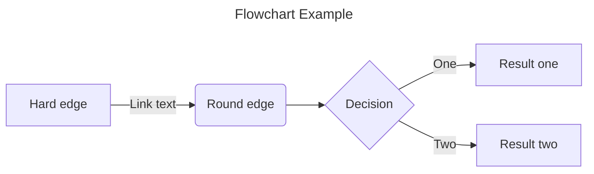

# Contributing to the Documentation

## How to Make Changes

The source for this documentation website is hosted in the [Asterisk Documentation](https://github.com/asterisk/documentation) GitHub repository.  To make changes, follow these basic steps...

* Fork the repository into your own GitHub account.
* Clone your fork to your local development environment.
* Make changes to the markup documents in the ./docs folder.
* Build the site locally and review your changes.
* Commit your changes.
* Push your changes to your fork.
* Create a pull request.

## Get the repository

All changes need to go through the GitHub Pull Request process.  To make this easier, you should install the [GitHub CLI "gh"](https://cli.github.com) tool.  Most distributions have it available as the "gh" package.  Once the tool is installed, fork and clone the asterisk/documentation repo.  Since "documentation" is a common name, you'll probably want to name your fork "asterisk-documentation".

```sh
$ gh repo fork asterisk/documentation --default-branch-only --fork-name asterisk-documentation --clone
...
$ cd asterisk-documentation
$ git remote -v
origin	https://github.com/<username>/asterisk-documentation.git (fetch)
origin	https://github.com/<username>/asterisk-documentation.git (push)
upstream	https://github.com/asterisk/documentation.git (fetch)
upstream	https://github.com/asterisk/documentation.git (push)
```

When everything finishes, create a new branch from the `main` branch in which to do your work.  Never do your work in the `main` branch itself!

```sh
$ git checkout -b main-my-work
```

You're ready to go!

## Site Organization

* [About the Project](/About-the-Project) - Any general information about the project. Licensing, History, What is Asterisk?
* [Asterisk Community](/Asterisk-Community) - Anything falling under community. The places we meet, our code of conduct, community services.
* [Fundamentals](/Fundamentals) - Basic, key and core concepts of Asterisk. Some of the most important foundational things to know about Asterisk.
* [Getting Started](/Getting-Started) - Information relevant to completely new users, information on installation and how to get rolling into configuration and the rest of the documentation.
* [Configuration](/Configuration) - How everything is configured. Where are the files? How do I use them? How do I program dialplan? How do I use the APIs?
* [Deployment](/Deployment) - Examples, tutorials, how-tos and recommendations for specific use-cases or scenarios of deployment. How do I deal with Asterisk in a NATed environment? How do I build a simple PBX?
* [Operation](/Operation) - Details concerning Asterisk's operation. That is, starting and stopping the Asterisk daemon, command line operation and other non-configuration tasks.
* [Development](/Development) - All information regarding the development of Asterisk itself.
* [Latest API](/Latest_API) - The auto-generated API documentation for the latest Asterisk release.
* Asterisk XX Documentation - The auto-generated API documentation for all current Asterisk releases.  Changes to these pages MUST be done in the Asterisk source file that they were generated from.  See [Dynamic Documentation](#dynamic-documentation) below.
* [Asterisk Test Suite Documentation](/Test-Suite-Documentation) - Documentation for the test suite! Primarily for developers.
* [Historical Documentation](/Historical-Documentation) - Documentation that is no longer current but kept for historical purposes.for the test suite! Primarily for developers.

Each section and sub-section resides in its own directory under the `./docs/` directory in the repository.

Do NOT create new top-level pages/sections without consulting with the Asterisk development team first.

## Page/Section Operations

### Adding a new page

First, determine if a new page is really needed.

* Have you searched the website to see if it exists already?
* Is there already *some* content that you could use to build on?
* Is there related content which should be consolidated with your new content?

/// warning
Directory and file names are used to create the left sidebar on the rendered site and become the URL for that content.  Take this into account when naming new content!
///

A single new page must be named using Title Case with spaces replaced by dashes and must have an `.md` file suffix.  Example: `My-New-Page.md`.  Only characters in the set `[A-Za-z0-9_.-]` are allowed.  By default the page title in the left sidebar is derived from the file name with the dashes converted to spaces and the `.md` suffix removed.  The file should be placed in the directory for the section or sub-section it belongs to.  For example:

```
documentation/
  docs/
    Configuration/
      My-New-Page.md
```

If you anticipate adding supporting images or other artifacts, create a directory with the name of your page and place the content in a file named `index.md` in that directory. You can then place your supporting artifacts next to the `index.md` file.  For example:

```
documentation
  docs/
    Configuration/
      My-New-Page/
        index.md
        image1.png
        image2.png
```

When rendered, the index will only show "My New Page" under "Configuration" and when clicked on, will automatically display the contents of `index.md`.

### Adding a new section

Adding a new section is as simple as adding a new directory to the repo filesystem. The same naming rules apply as for pages with the exception of adding the `.md` suffix. You should also add an `index.md` page that describes describe the section.  You can then add your additional pages as above.

### Page ordering

The default page ordering in the left sidebar will be as it is ordered in the filesystem.  If you want to customize the ordering for a section, add a `.pages` YAML file to the section's directory that lists the directory contents in the order it should be displayed on the rendered website.  For example:

```yaml title="Sample .pages file"
nav:
  - Page-1.md
  - Section-2
  - Page-3.md
```

Each entry must be a name as it appears in the filesystem.  Only list what you want to appear in the left sidebar.  Don't list supporting files like images.

/// note
The plugin that handles the .pages files has an annoying habit of automatically expanding the first item in the nav list which can be very confusing to the user. So, if the first entry is a directory and you don't want it automatically expanded, make the `index.md` file the first entry.  It won't show up in the sidebar but it'll keep the first section from auto-expanding.

```yaml title="Sample .pages file"
nav:
  - index.md  # Keeps Section-1 from auto-expanding
  - Section-1
  - Page-2.md
```

///

### Deleting, renaming or moving pages or sections

If you delete, rename or move pages or sections, any links to those pages will return a 404 "Not found".  That's usually not a good idea.  If you are deleting old content, move that page to the Historical Documentation section and create a [redirect](#redirects) for that page.  If you are replacing with updated content or renaming a page, you don't need to move the original to Historical Documentation but you do need to create a redirect.  See [Redirects](#redirects) below.

You'll also need to search the full docs directory for any internal links to the moved content and update them accordingly.  You could use something like `grep -r --include='*.md' "Moved_Page"` to search.

### Redirects

If you've moved a page, you should create a redirect for it so any links from outside to the original location will still work.  Redirects are listed in the top-level `mkdocs.yml` file in the `plugins.redirects.redirect_maps` section.  Follow the same pattern as the existing entries.

Redirects should also be used to fix broken links caused by the previous documentation site migration. If you run across a link in the wild that results in a "404", find the correct page and create a redirect from the old to the new.

## Creating page content

All content is created as markdown and rendered to HTML using the [MkDocs](https://www.mkdocs.org) project.  The docs are written in standard markdown, not GitHub Flavored markdown but there are lots of extensions available.  See [Markdown extensions](#markdown-extensions) below.

Much of the feature set available to content authors is actually used to create this page.  Browse the source to see how this page was created. [Contributing-to-the-Documentation.md](https://github.com/asterisk/documentation/blob/main/docs/Contributing-to-the-Documentation.md)

### Front matter

Many of the pages converted from the old Confluence wiki have "front matter" at the top of the markdown file.  For instance:

```yaml
---
title: Asterisk Community Services
pageid: 24838288
---
```

Although supported, there's no longer any need to specify front matter except for specific circumstances noted below.

/// warning
If there's a front-matter fragment at the top of the file and it contains a "title" entry, it will override the top-level header as the page name in the left sidebar.  For this reason, if you're editing a page that has front-matter that specifies a "title", it's a good idea to make sure the page has a top-level header with the correct title and just remove the front-matter altogether.  See [Headings](#headings) below for more info.
///

### Headings

All headings MUST use the hash-sign header format and there MUST be only one top-level (`#`) header.  For example:

```markdown title="Good"
# Header level 1
## Header level 2
```

```markdown title="BAD - Multiple top-level headers"
# Header level 1
## Header level 2
# Another level 1
```

```markdown title="BAD - Old style headers"
Header level 1
==============
Header level 2
-----------------
Another level 1
==============
```

```markdown title="BAD - Front-matter title overrides top-level header"
---
title: Original Page Title
---
# New Page Title
## Header level 2
```

The top-level header will override the file name as the page title in the left sidebar.  The URL will still reference that actual file name and if the page is listed in a `.pages` file it must also be referenced by the actual file name.

Nothing says you _have_ to have a top-level header but it is good practice and you should include it unless you have a good reason not to.  It should always be Title Case.  The lower level headers have no case restrictions.  Use whatever looks best.

### The Table of Contents

The table of contents that appears on the right side of pages is automatically generated from the headers present in the page and an HTML "anchor" is created for each.  The anchor is created by converting the header text to all lower case, converting spaces to dashes (`-`) and removing any characters not in the set `[a-z0-9-]`.  The anchor for this section would be `the-table-of-contents`

If, for some reason, you need to hide the ToC for a page, you can do it in the front-matter. For example:

```yaml
---
hide:
  - toc
---
```

This is really the only valid use of front-matter now.

### Linking

#### Linking to your supporting artifacts

If you have supporting artifacts you need to link to or embed in your page and those artifacts are in the same directory as your page, the syntax is simple:

```markdown title="Example linking to a supporting document"
[Sample Configuration](sample_config.conf)
```

```markdown title="Embed a supporting image"

```

#### Linking to another section in your document

Each header defined in your page is automatically assigned an "anchor" reference consisting of the header text converted to lower case with spaces replaced by dashes.  For instance the anchor for this section would be `linking-to-another-section-in-your-document`.  If you wanted to create a link to this section in another place in your document, you'd reference it as follows:

```markdown title="Example link to a local anchor"
[Linking to another section in your document](#linking-to-another-section-in-your-document)
```

The leading `#` in the URL is the standard way to referenece anchors in a document.

#### Linking to other content on the Documentation website

If the content is in the same directory or in a directory below the current directory you can use relative link.

```markdown title="Example relative links"
[Some Page](Some_Page)
[Some Other Page](Some_Subsection/Some_Other_Page)
```

To link to other content on the website, use an absolute URL.

```markdown title="Linking to other website content"
[Configuring Alternate Channel Storage Backends](/Configuration/Core-Configuration/Alternate-Channel-Storage-Backends)
```

The mkdocs documentation actually discourages using absolute links and would rather you use a relative link like `../../../Configuration/Core-Configuration/Alternate-Channel-Storage-Backends`.  This is to accomodate sites where the documentation isn't hosted at the root of the website.  The Asterisk documentation _is_ at the root level so relative links just make things difficult for us.  Always use absolute links.

Don't forget, you can link directly to a specific section in any page by using the heading's anchor...

```markdown title="Exmaple link to a specific section in a page"
[POC Conclusions](/Configuration/Core-Configuration/Alternate-Channel-Storage-Backends/#poc-conclusions)
```

/// warning
Do NOT include the `.md` suffix of pages you link to.  If that page maintainer decides to add supporting artifacts and changes the page to a directory with an `index.md` file in it, your link may break.  When in doubt about what link to use, you can get it by simply hovering over the link to the page you want in the live site and noting the URL.
///

### Comments

Although not usually needed, you can add comments to markdown files that won't be rendered on the website.  For instance, it could be useful to explain why you formatted something the way you did so future maintainers don't accidentally undo it.  The format is the same as it is for HTML:

```title="Example comment in markdown"
<!-- Some comment that won't appear on the rendered website -->
```

```
<!--title="Example multi-line comment in markdown"
   Some comment
   that won't appear on the rendered website
-->
```

### Standard markdown text formatting

All standard markdown formatting syntax.  A good guide for basic syntax is [Markdown Guide](https://www.markdownguide.org/basic-syntax).  Just don't use the "Alternate Syntax" for headings and use "fenced code blocks" (see below) instead of indented code blocks.

### Markdown extensions

Most extensions from the [PyMdown](https://facelessuser.github.io/pymdown-extensions/#extensions) plugin are available.  The most useful include SuperFences (which handles code blocks) and Blocks (which handles admonitions). To see the list of extensions that are currently enabled for this site, see the "markdown_extensions" section at the bottom of the site's [mkdocs.yml](https://github.com/asterisk/documentation/blob/main/mkdocs.yml) file.

Most of the extensions provided by [Material for MkDocs](https://squidfunk.github.io/mkdocs-material/reference/) are also enabled except those only available to paying sponsors and a few that don't make sense in this environment.  Many of these are actually implemented using PyMdown.

/// warning | Extension Preference
If the same extension is available in both PyMdown and Material for MkDocs, ALWAYS use the PyMdown version/syntax!
///

#### Code blocks

Speaking of code blocks, you should always create "fenced" code blocks using the 'three-backtick' (\`\`\`) technique which can include syntax a highlighting hint and a title (among other things).  For example:

````
```python title="A Sample Sample Python Function" linenums="10"
    def SomeFunc(arg1):
        print("hi")
```
````

would produce:

```python title="A Sample Python Function" linenums="10"
    def SomeFunc(arg1):
        print("hi")
```

You can also nest code blocks.  This was required to show the example for the syntax above as well as the note below.  Here's the example for above:

`````
````
```python title="A Sample Sample Python Function"
    def SomeFunc(arg1):
        print("hi")
```
````
`````

That needed 3 levels of nesting to render properly :).

/// note
Use "ini" as the syntax highlighting hint for Asterisk config files.  For example:

````
```ini title="Sample extensions.conf file"
[default]

exten = _X.,1,NoOp(nothing)
```
````

```ini title="Sample extensions.conf file"
[default]

exten = _X.,1,NoOp(nothing)
```

///

#### Admonitions

Available admonitions include "note", "attention", "caution", "danger", "error", "tip", "hint", "warning" and "details".

Examples:

```title="Example Note"
/// note | This Is A Note
Take note of this.
///
```
/// note | This Is A Note
Take note of this.
///

And yes, you can nest them...

```title="Example Note with Warning"
/// note | This Is A Note
Take note of this.
////  warning | But be warned about this!
Pay attention
////
///
```

/// note | This Is A Note
Take note of this.
///  warning | But be warned about this!
Pay attention
///
///

/// danger | Danger! (this is a *real* admonition, not an example)
Most of the pages that were converted from the old Confluence wiki use the `!!!` admonition style.  For example:

```
!!! tip
    The `-R` option will also attach a remote console - however, it will attempt to automatically
    reconnect to Asterisk if for some reason the connection is broken. This is particularly useful
    if your remote console restarts Asterisk.

[//]: # (end-tip)
```

That style is only supported for backwards compatibility and must not be used in new content.  If you are editing a page with old style admonitions, you MUST convert them ALL to the new style.  Mixing old and new styles will most probably cause the page not to be rendered correctly.

///

#### Details

"details" is a special type of admonition whose content is initially collapsed.

```title="Example Details"
/// details | Summary
These details are initially collapsed.
///
```

/// details | Summary
These details are initially collapsed.
///

You can set the type to change the icon and color if needed:

```title="Example Details"
/// details | Summary
    type: warning
These details are initially collapsed.
///
```

/// details | Summary
    type: warning
These details are initially collapsed.
///

/// danger | Danger! (another *real* admonition, not an example)
Don't over-use admonitions (like I did in this page :smile: )!  It can be very distracting.
///

#### Snippets

Another extension you might find useful is [Snippets](https://facelessuser.github.io/pymdown-extensions/extensions/snippets/).  This extension allows you to include other files (or parts of other files) in your document.  A good use case would be explaining sections of a sample config file.

```
docs/
   Configuration/
      My-New-Feature/
         index.md
         sample_config.conf
```

In your index.md file you could not only have a link to the entire sample_config.conf file, but you could also include sections of that file in your markdown file:

```` title="Include lines 5-10 from sample_config.conf in a code block"
```ini title="Example configuration"
;--8<-- "Configuration/My-New-Feature/sample_config.conf:5:10"
```
````

Snippets are implemented as a pre-processor so you must always specify the path to the file to be included relative to the top-level docs directory.  The file contents are included verbatim and can contain any valid markdown.  

#### Emojis

Yes you can use emojis like `:smile:` but don't over do it.

#### Tables

Tables are fully supported.  See the syntax in [Markdown Guide](https://www.markdownguide.org/extended-syntax/#tables).

#### Diagrams and Graphs

When the documentation site was hosted in a Confluence Wiki, the mechanism for creating diagrams was a Gliffy Confluence macro which allowed you to design diagrams in-line.  You'll still see files in this repo with a `.gliffy.xml` file extension which contained the source for the diagram and a file with the `.png` extension right next to it with the rendered result.  Although the `.png` files are still rendered correctly, the `.gliffy.xml` files are simply ignored.  Since Gliffy is a Confluence-specific tool, we needed another way to create diagrams.  This turned out to be [Mermaid](https://mermaid.js.org).

You can use Mermaid to create over 20 types of diagrams and charts.  There's no in-line visual editor to create the diagrams but the syntax is pretty simple.  Here's a short example:

```` title="Mermaid Flowchart Example"
---
title: Flowchart Example
---
flowchart LR
    A[Hard edge] -->|Link text| B(Round edge)
    B --> C{Decision}
    C -->|One| D[Result one]
    C -->|Two| E[Result two]
````



Mermaid itself is a Javascript library but the [mkdocs-mermaid2-plugin](https://github.com/fralau/mkdocs-mermaid2-plugin) takes care of all of the plumbing so all you have to do is describe the diagram you want.  Visit the [Mermaid Diagram Syntax](https://mermaid.js.org/intro/syntax-reference.html) page to see all the different types of diagrams you can create and how to create them.

Mermaid does have an [on-line playground](https://www.mermaidchart.com/app/dashboard) to help design diagrams and while the basic version is free, you do have to register to use it.  Since you already have a GitHub account (or you wouldn't be here), you can use that to register with.  You can then just copy the generated code and paste it into your page.  Please don't export diagrams to images.  That makes it impossible to edit them later.


### HTML in markdown

For very rare cases where the markdown syntax already described above doesn't cover a case you absolutely need, you can embed _some_ HTML directly into your markdown.  The only case that comes to mind is forcing a line break.

```html title="Example HTML in markdown"
this is<br>
a broken<br>
line
```

this is<br>
a broken<br>
line

This can be useful to force wrap the text in table cells.

```title="Example line breaks in a table"
| Column 1 | Column 2<br>(optional) |
| ----------| ----------|
| cell 1 |  For instance:<br>abc = ABC |
```

| Column 1 | Column 2<br>(optional) |
| ----------| ----------|
| cell 1 |  For instance:<br>abc = ABC |

## Building the documentation locally

Once you've made your updates, you'll want to test it locally to make sure everything renders properly.

### Set up the environment

You've already cloned your fork of the documentation repo at this point but to set it up for building the documentation perform the following steps:

```sh
# Install python3-virtualenv
$ sudo (apt | dnf | yum) install python3-virtualenv
$ cd asterisk-documentation
$ python3 -m venv --system-site-packages --symlinks .venv
$ source .venv/bin/activate
$ pip install -r requirements.txt
```

### Build the web site

To build only the static documentation without any of the API documentation for the branches simlpy run `make`:

```sh
$ make
```

This will take about 30 seconds.

### Start up a web server.

The rendered website will be located in the `./temp/site` directory.  You can use the web server software of your choice to serve it but it's much simpler to use the mkdocs built-in webserver:

```sh
$ make serve
```

By default the server is started on port 8000 but you can supply different arguments to the server by adding a SERVE_OPTS variable to the command line:

```sh
$ make SERVE_OPTS='-a 0.0.0.0:8080' serve
```

Run `mkdocs serve --help` to see the options you can set.

/// note
You can't browse the site using `file://` URLS without a web server.  MkDocs generates `index.html` files assuming a web server's rules will automatically use them as the default page for directories. 
///

### Save often-used variables in Makefile.inc

The main Makefile automatically includes the `Makefile.inc` file if it exists.  You can use this to define variables like SERVE_OPTS so you don't have to specify them on the command line every time.  This file is ignored by git so don't check it in.

## Dynamic Documentation

The dynamic documentation includes the pages generated from Asterisk itself and includes:

* AGI Commands
* AMI Actions
* AMI Events
* Asterisk REST Interface
* Dialplan Applications
* Dialplan Functions
* Module Configuration

These will be rendered under the "Asterisk XX Documentation/API Documentation" directories where "XX" is the branch name.

The publish process gets this information directly from the Asterisk CreateDocs job (which runs nightly) and generates markdown which MkDocs will then use to render the site.  For this reason, all changes to the dynamic documentation need to be made in the Asterisk source code itself.

The AGI, AMI, Dialplan and Module documentation comes from the XML documentation embedded in the provider modules and generated by CreateDocs running `xmldoc dump` from the Asterisk CLI.

The Asterisk REST Interface documentation comes from the markdown files generated by CreateDocs running `make ari-stubs`.

The nightly documentation "publish" performs the following steps:

* Retrieves the XML and ARI markdown from the latest Asterisk CreateDocs workflow run for each branch.
* Runs `utils/astxml2markdown.py` on the retrieved XML and places the resulting markdown in the `temp/build-<branch>` directory.
* Places the retrieved ARI markdown in the `temp/build-<branch>` directory.
* Builds the website.

#### Build the static documentation plus the dynamic API documentation for one or more branches.

/// note
In order to build the dynamic documentation, you'll need to have the [GitHub CLI "gh"](https://cli.github.com) tool installed to retrieve the source files from the Asterisk nightly job that creates them.
///

/// attention
It can take 5 minutes or more to build the dynamic documentation _for each branch_ so don't do this unless you're sure you need to.  HINT: You probably don't need to.
///

If you do need to generate the dynamic documentation, run `make` with a `BRANCHES` variable set to a comma-separated list of branches you want to build.

```sh
$ make BRANCHES=21,22
```

#### Test changes you've made to Asterisk source files

Let's say you have actually made changes to the documentation contained in the Asterisk source files and want to see how it will be rendered.  Instead of the documentation build process getting the Asterisk sources from the latest CreateDocs workflows, you can export the documentation and then tell the documentation build process where to get the files.

The XML documentation for AGI, AMI, Dialplan and Module configuration has to be generated from a _running_ asterisk instance so build and start it.  Then from the Asterisk CLI run `xmldoc dump /tmp/asterisk-<branch>-documentation.xml`.

The markdown for ARI resources and events is generated by running `make ari-stubs` in your Asterisk source directory.  Asterisk doesn't need to be built or run for this.

Once you've done both, create a new file in your documentation directory named `Makefile.<branch>.inc`.  These files are already ignored by git so don't check them in.

```makefile title="Sample Makefile.22.inc file"
# If you want to use a local XML file to generate the
# AGI, AMI, Dialplan and Module_Configuration documentation,
# specify it here.
ASTERISK_XML_FILE := /tmp/asterisk-22-documentation.xml
#
# If you want to use local markdown files for the ARI
# documentation, specify a path to a directory containing
# the markdown generated by "make ari-stubs".
ASTERISK_ARI_DIR := /usr/src/asterisk/asterisk/doc/rest-api
#
# If you want to use local XML but skip processing ARI
# altogether, set this variable to "yes".
#SKIP_ARI := no

# If either ASTERISK_XML_FILE or ASTERISK_ARI_DIR are not set,
# that documentation source will be downloaded from the
# CreateDocs job.
```

Now run `make`:

```shell
$ make BRANCHES=22
```

The main Makefile will automatically include the Makefile.<branch>.inc file for any branch listed in BRANCHES.  It doesn't make sense to build more than one branch in this situation but you could if you wanted to.  You'll have to make sure there's a `Makefile.<branch>.inc` file for each branch you want to build and that the paths in each file are adjusted to that branch's Asterisk files.
