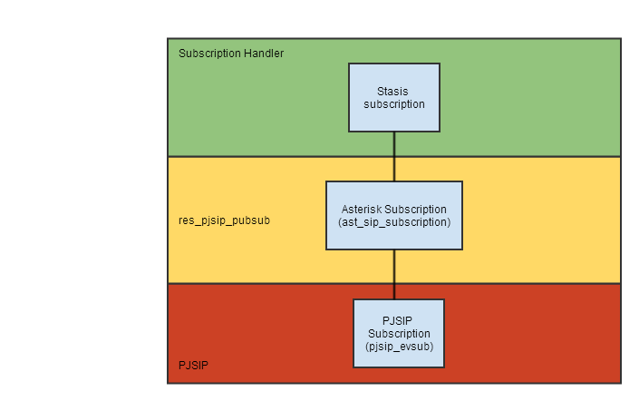

As explained on the parent page, the current pubsub API in res_pjsip_pubsub does not abstract away the underlying PJSIP implementation. This page details the current problems and how they should be fixed.

Tweaks to `ast_sip_subscription`
================================

`ast_sip_subscription` currently assumes that all subscriptions align with an actual SUBSCRIBE dialog within PJSIP, like the following:



With RLS, `ast_sip_subscription` needs to be able to form a tree of subscriptions, with a "real" list subscription at the root of the tree and "virtual" leaf subscriptions, like the following:


Subscription handlers may no longer be able to directly send NOTIFYs on one of their `ast_sip_subscriptions` because the subscription does not directly correlate to a real SIP subscription. This means that anything the subscription handlers were doing previously where they would reach across the `res_pjsip_pubsub` layer into PJSIP will no longer be valid.

Internal changes
================

There will be many internal changes that get made as part of RLS work, but the only change that needs to be made is to alter the `ast_sip_subscription` structure so it may more easily conform to the drawing above.

The following will need to be removed from the `ast_list_subscription` structure:


---

  
  


```

struct ast_sip_subscription {
 pjsip_evsub \*evsub;
};

```


With the division between real and virtual subscriptions, it makes no sense for virtual subscriptions to have a pointer to a `pjsip_evsub`. Instead, having a pointer to the parent subscription makes much more sense. Real subscriptions should still have a pointer to the PJSIP subscription, though. A union works well for this. Given the tree-like structure of `ast_sip_subscription`, appropriate fields need to be added to support this. As a final change, since users of the pubsub API will need access to the data, the name of the subscribed resource will need to be added to the structure.


---

  
  


```

 enum sip_subscription_type {
 SIP_SUBSCRIPTION_REAL,
 SIP_SUBSCRIPTION_VIRTUAL,
}; 
 
struct ast_sip_subscription {
 /\*! Name of the subscribed resource \*/
 const char \*resource;
 /\*! Indicator if subscription is real or virtual \*/
 enum sip_subscription_type type;
 union {
 /\*! Real subscriptions point to a PJSIP subscription \*/
 pjsip_evsub \*evsub;
 /\*! Virtual subscriptions point to a parent Asterisk subscription \*/
 struct ast_sip_subscription \*parent;
 };
 /\*! List of child subscriptions \*/
 AST_LIST_HEAD(,ast_sip_subscription) children;
}; 

```


General API changes
===================

The biggest removals from the API are the following:


---

  
  


```

pjsip_evsub \*ast_sip_subscription_get_evsub(struct ast_sip_subscription \*sub);
pjsip_dialog \*ast_sip_subscription_get_dlg(struct ast_sip_subscription \*sub);

```


Those two functions assume that the subscription has a corresponding PJSIP subscription. However, users of the pubsub API can no longer make such an assumption since the subscription they interact with may be virtual. The main uses of these two functions by subscription handlers were as follows:

* Getting the `pjsip_evsub` in order to transmit a NOTIFY request.
* Getting the `pjsip_evsub` in order to accept an inbound SUBSCRIBE request.
* Getting the `pjsip_evsub` to get the current subscription state.
* Getting the `pjsip_evsub` to terminate a subscription on an inbound SUBSCRIBE request.
* Getting the `pjsip_dialog` to get local and remote information.

In order to satisfy previously-required functionality, new calls will be added to the pubsub API to replace the old functionality. Each of these API calls, when initially written, will propagate up the tree of subscriptions, resulting in similar operations to what were previously being done.


---

  
  


```

/\*! Notify a SIP subscription of a state change.
 \* This will create a SIP NOTIFY request, send the notify_data to
 \* a body generator, and then send the NOTIFY request out.
 \*/
int ast_sip_subscription_notify(struct ast_sip_subscription \*sub, void \*notify_data);
 
/\*! Reject an incoming SIP SUBSCRIBE request.
 \* This will send the specified response to the SUBSCRIBE. If a
 \* NULL reason is specified, then default reason text will be used.
 \*/
void ast_sip_subscription_reject(struct ast_sip_subscription \*sub, int response, const char \*reason);
 
/\*! Accept an incoming SIP SUBSCRIBE request with a 200 OK. \*/
void ast_sip_subscription_accept(struct ast_sip_subscription \*sub);
 
/\*! Retrieve the local URI for this subscription \*/
void ast_sip_subscription_get_local_uri(struct ast_sip_subscription \*sub, char \*buf, size_t size);
 
/\*! Retrive the remote URI for this subscription \*/
void ast_sip_subscription_get_remote_uri(struct ast_sip_subscription \*sub, char \*buf, size_t size);
 
/\*! Terminate an active SIP subscription. \*/
void ast_sip_subscription_terminate(struct ast_sip_subscripiton \*sub);
 


```


You'll notice that there is no function to get the current subscription state. This is because state can be determined by the core pubsub API in most cases or can be determined based on the operation being performed. For instance, if `ast_sip_subscription_terminate` is called by a notifier, then the pubsub core will rightly set the subscription state as "terminated".

Subscriber-side API additions will be required in addition, but those changes are being saved for the larger-scale [Outbound Subscriptions](/Development/Roadmap/Asterisk-13-Projects/Resource-List-Subscriptions) task to be accomplished later.

Changes to notifier usage
=========================

The `ast_sip_subscription_handler` structure will also need to be altered to rid itself of PJSIP-specific structures. Specifically, the following callbacks will need to be altered:


---

  
  


```

struct ast_sip_subscription_handler {
 struct ast_sip_subscription \*(\*new_subscribe)(struct ast_sip_endpoint \*endpoint,
 pjsip_rx_data \*rdata);
 void (\*resubscribe)(struct ast_sip_subscription \*sub,
 pjsip_rx_data \*rdata, struct ast_sip_subscription_response_data \*response_data);
 void (\*subscription_terminated)(struct ast_sip_subscription \*sub, pjsip_rx_data \*rdata);
 void (\*notify_response)(struct ast_sip_subscription \*sub, pjsip_rx_data \*rdata);
};

```


All of these currently contain a `pjsip_rx_data` structure as a parameter. A notifier no longer can can operate on a `pjsip_rx_data` structure since the subscription as a whole may not pertain to the list member that the notifier is handling. In practice, a notifier should never need an entire SIP request to operate on; they care about the resource that is being subscribed to. Given that notifiers will not be directly responding to SIP requests, it means that the API can be made easier to use for notifiers. Also, since edits are being made in this area, a long-standing personal desire to separate subscribers and notifiers can be done here.


---

  
  


```

enum ast_sip_subscription_notify_reason {
 /\*! Initial NOTIFY for subscription \*/
 AST_SIP_SUBSCRIPTION_NOTIFY_REASON_STARTED,
 /\*! Subscription has been renewed \*/
 AST_SIP_SUBSCRIPTION_NOTIFY_REASON_RENEWED,
 /\*! Subscription is being terminated \*/
 AST_SIP_SUBSCRIPTION_NOTIFY_REASON_TERMINATED,
 /\*! Other unspecified reason \*/
 AST_SIP_SUBSCRIPTION_NOTIFY_REASON_OTHER
};
 
struct ast_sip_subscription_notifier {
 /\*! Return the response code for the incoming SUBSCRIBE request \*/
 int (\*new_subscribe)(struct ast_sip_endpoint \*endpoint, const char \*resource);
 /\*! Subscription is in need of a NOTIFY \*/
 void (notify_required)(struct ast_sip_subscription \*sub, enum ast_sip_subscription_notify_reason reason);
};
 
/\*! Get the name of a subscribed resource \*/
const char \*ast_sip_subscription_get_resource_name(struct ast_sip_subscription \*sub);

```


The biggest change is the one being made to the `new_subscribe` callback. Previously, this callback required the notifier to respond to the SIP SUBSCRIBE, then create an `ast_sip_subscription` structure, send an initial NOTIFY request, and then return the created `ast_sip_subscription`. The callback has been simplified greatly. Now, the notifier returns a response code for the pubsub core to send in response to the SUBSCRIBE request. If the response is a 200-class response, then the pubsub core will create the `ast_sip_subscription` itself, then immediately call back into the notifier with the `notify_required` callback in order to send the initial NOTIFY. At first, this appears to give a disadvantage over the previous version since the notifier will not have access to the `ast_sip_subscription` structure in the `new_subscribe` callback. However, since the `notify_required` callback is guranteed to be immediately called into with `AST_SIP_SUBSCRIPTION_NOTIFY_REASON_STARTED` as the reason, the notifier can use that opportunity to do anything that requires the subscription, such as setting up the underlying stasis subscription or adding datastores.

The `notify_required` callback tells the notifier that it needs to generate a NOTIFY. The reason lets the notifier know why the NOTIFY is needed. Because one of the reasons is `AST_SIP_SUBSCRIPTION_NOTIFY_REASON_TERMINATED` there is no reason to have a separate `subscription_terminated` callback for notifiers.

Note that the old `notify_response` callback is completely gone now. Notifiers do not have any need to know what the response to their NOTIFY was. The pubsub core can handle off-nominal paths, to include asking the notifier to try sending again or terminating the subscription.

Changes to subscriber usage
===========================

More in-depth subscriber usage changes may happen at a later date; however, a prerequisite is to make sure that inadequate subscriber callbacks in the `ast_sip_subscription_handler` structure are abstracted. The old subscriber-specific callbacks need to be converted not to use PJSIP-specific structures. Here are the parts that need conversion:


---

  
  


```

struct ast_sip_subscription \*ast_sip_create_subscription(const struct ast_sip_subscription_handler \*handler,
 enum ast_sip_subscription_role role, struct ast_sip_endpoint \*endpoint, pjsip_rx_data \*rdata);
 
struct ast_sip_subscription_handler {
 void (\*subscription_terminated)(struct ast_sip_subscription \*sub, pjsip_rx_data \*rdata);
 void (\*notify_request)(struct ast_sip_subscription \*sub,
 pjsip_rx_data \*rdata, struct ast_sip_subscription_response_data \*response_data);
 int (\*refresh_subscription)(struct ast_sip_subscription \*sub);
}

```


Here is the revised version:


---

  
  


```

/\*! Create a new outbound SIP subscription to the requested resource at the requested endpoint. \*/
struct ast_sip_subscription \*ast_sip_create_subscription(const struct ast_sip_subscriber \*subscriber,
 struct ast_sip_endpoint \*endpoint, const char \*resource);
 
struct ast_sip_subscriber {
 /\*! A NOTIFY has been received with the attached body. \*/
 void (\*state_change)(struct ast_sip_subscription \*sub, const char \*body, enum pjsip_evsub_state state);
}

```


`ast_sip_create_subscription` is now only used by subscribers; notifiers have no need to create subscriptions themselves. As such, in addition to creating the `ast_sip_subscription` structure, it will also send out the initial SUBSCRIBE request to the specified resource at the specified endpoint.

As was noted with notifiers earlier, `ast_sip_subscription_handler` is being replaced by separate notifier and subscriber structures. The subscriber structure has a few major changes. `refresh_subscription` has been removed since the pubsub core will handle it. `notify_request` has been altered to be `state_change` now. Instead of being given the entire NOTIFY request, the subscriber is given the relevant body from the NOTIFY request as well as the subscription state. If the state is `PJSIP_EVSUB_STATE_TERMINATED` then the subscriber can know that the subscription has been terminated. Because of this, there is no need for a `subscription_terminated` callback.

Changes to publish handler usage
================================

Publisher changes are similar to notifier changes. Here are the areas where publication handling needs to be altered:


---

  
  


```

struct ast_sip_publication_handler {
 struct ast_sip_publication \*(\*new_publication)(struct ast_sip_endpoint \*endpoint, pjsip_rx_data \*rdata);
 int (\*publish_refresh)(struct ast_sip_publication \*pub, pjsip_rx_data \*rdata);
 void (\*publish_termination)(struct ast_sip_publication \*pub, pjsip_rx_data \*rdata);
};
 
struct ast_sip_publication \*ast_sip_create_publication(struct ast_sip_endpoint \*endpoint, pjsip_rx_data \*rdata);

```


Here is the revised edition:


---

  
  


```

enum ast_sip_publish_state {
 /\*! Publication has just been initialized \*/
 AST_SIP_PUBLISH_STATE_INITIALIZED,
 /\*! Publication is currently active \*/
 AST_SIP_PUBLISH_STATE_ACTIVE,
 /\*! Publication has been terminated \*/
 AST_SIP_PUBLISH_STATE_TERMINATED,
}; 
 
struct ast_sip_publication_handler {
 /\*! New publication has arrived. Return appropriate SIP response code \*/
 int (\*new_publication)(struct ast_sip_endpoint \*endpoint, const char \*resource);
 /\*! Published resource has changed states. Use the state parameter to determine if publication is terminated. \*/
 int (\*publication_state_change)(struct ast_sip_publication \*pub, const char \*body, enum ast_sip_publish_state state);
};
 
const char \*ast_sip_publish_get_resource(struct ast_sip_publication \*pub);

```


Like with the notifier, the `new_publication` callback is being simplified just to be an indicator if the PUBLISH should be accepted or not. The pubsub core will take care of creating the publication and will then immediately call into the `publication_state_change` callback to relay the actual PUBLISH body to the handler. `publish_refresh` and `publish_termination` are not needed since the `publication_state_change` covers their functionality.

