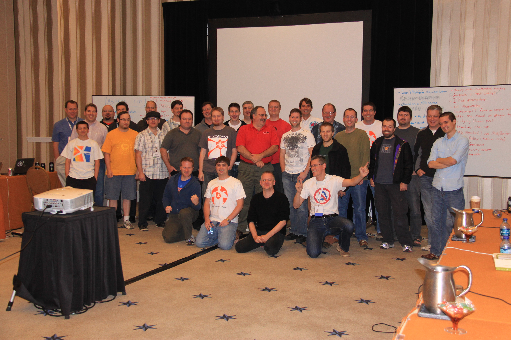
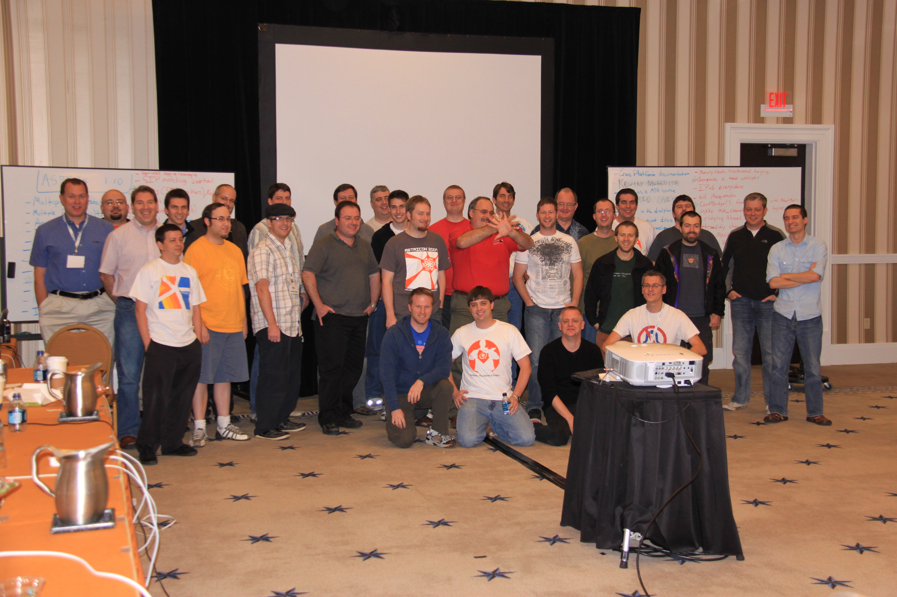
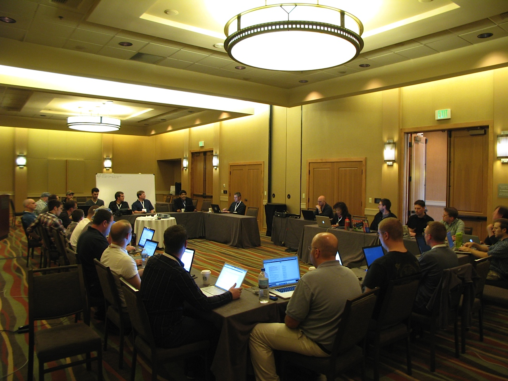

Introduction
============

AstriDevCon 2011 was held on Monday, October 24th. It was held on the day prior to AstriCon at the same location. A group of active development community members met and discussed a number of topics, including:

* Review of AstriDevCon 2011 (Asterisk)

Developers Present
==================

* Eric Klein: Humbug Telecom
* Dunling Li: BTS
* Chris Maj: Penguin PBX Solutions
* Shaun Ruffell: Digium
* Bryan Johns: Digium
* Mark Murawski: Intellasoft
* Kevin Fleming: Digium
* Byron Clark: Jive Communications
* Jamuel Starkey: Headland Communications
* unknown user: LeifMadsen Enterprises, Inc / Digium
* Matt Riddell: Asterisk Daily News
* Nir Simionovich: Greenfield Technologies / Humbug Telecom
* unknown user: Digium
* Clod Patry: ConnectIT Networks
* Jason Parker: Digium
* David Vossel: Digium
* Matt Jordan: Digium
* Ben Klang: Mojo Lingo / Adhearsion
* Brad Watkins: Compuware
* Abel Camarillo: Neuroservices Communications
* Nicolas Bouliane: Avencall
* Xavier Carcelle: Avencall
* David Deaton: Digium
* Mathieu De Bellefeuille: Nisse
* Alex Balashov: Evariste Systems
* Joel Schuweiler : Digium
* Shawn McCord: Cycore Systems
* Klaus Darilion: ipcom.at

AstriDevCon 2010 Results
========================

The following sections are a list of ideas that have been discussed at AstriDevCon. They are listed in a priority order where a lower number is a higher weight. P0 priority are for projects that are near completion and need the original developer to push through to the end. Other priority issues from P1 and higher are ranked by the participants at AstriDevCon.

(P0)
----

P0 are committed projects that are going to get done.

* [T.38 Gateway](/T.38-Gateway) (Digium)
* Performance of State Change Processing (Stefan Schmidt)
	+ (work is already being done on this front)
* SIP path support (Olle)
	+ (first generation of code exists, needs more work, simple patch, going to get it done, needs an extra field in astdb; helps when there are 2 or more load balancing proxies in front of asterisk, when you'd like the call to be able to get back to Asterisk; see <https://reviewboard.asterisk.org/r/991/>)
	+ <https://github.com/asterisk/asterisk/issues/view.php?id=18223>
	+ **Review 2011**: No change since 2010
* Group variables (Kobaz)
	+ (on review board, in progress)
	+ **Review 2011**: Code written and then re-written this year, tested in production for a year. Feels good code wise. Some suggestions on reviewboard and should be converted to ao2.
		- Goal to commit for Asterisk 11
		- <http://reviewboard.asterisk.org/r/464>
		- <https://github.com/asterisk/asterisk/issues/jira/browse/ASTERISK-15439>
* Pre-Dial (Kobaz) [Finished, Committed](/Finished--Committed)
	+ (I think it's done. Been in production for 12+months with no hiccups. Needs review!)
	+ **Review 2011**: Very happy with the way it is. Uploaded latest diff against trunk.
		- Goal to commit for Asterisk 11
		- <https://reviewboard.asterisk.org/r/1229/>
		- <https://github.com/asterisk/asterisk/issues/jira/browse/ASTERISK-19548>
* Hangup Handlers (Kobaz) [Finished, Committed](/Finished--Committed)
	+ (Needs to be updated to use the same gosub parse/exec as PreDial uses)
	+ **Review 2011**:
		- Goal to commit for Asterisk 11
		- <https://reviewboard.asterisk.org/r/1230>
* Distributed extension state using SIP (Olle)
	+ (resources in place, doing it, 1.4 done before Christmas, project pinana)
	+ **Review 2011**: No changes known. Idle.
* Manager event docs (Paul Belanger)
	+ **Review 2011**: Code was created and working, but did not pass code review. Talked about it again a couple of months ago, and some work done.
		- About a day or two to get the framework completed
		- Then just need to insert the documentation into the code and then it could be completed.
* Cross-platform documentation (Ben Klang)
	+ (caveats for using Asterisk on operating system xyz; pull a PDF of the Wiki documentation into the source, don't forget to include basic installation information, and do it all in .txt - Ben)
	+ **Review 2011**: Documentation updated for Solaris. Is on the wiki, and just needs to be put into a better location. Leif will help restructure part of the wiki to make the Linux and Solaris documentation (and other operating systems) a better format.
* Fix libs to optionally init OpenSSL (Digium)
	+ (or use existing tools; sort of a bug)
	+ **Review 2011**: Code on reviewboard, need to confirm that the code solves the problem, confirmed it doesn't cause harm
		- Testing required on multiple platforms and libraries
* Make ast_channel an opaque type (Digium)
	+ **Review 2011**: Large project and has not been started. Should not be on P0.

(P1)
----

P1 is the highest priority.

* Who hung up? (there's a branch, shouldn't take too much time - Olle)
	+ **Review 2011**: Jason Parker thinks something like that may have been committed a few months ago by Jeffrey C. Ollie. Will need to review to see if anything has actually been done there.
		- Kobaz has a 2-3 line code change that simply adds events to Softhangup() and Hangup()
		- On a failed call, there is no access to the causecodes – would be powerful if we had access to it
			* Would need to develop some code that created a generic layer to convert between channel drivers (each does it different)
			* Need to investigate if there are any CEL events already created that will give some of that information
* [Codecs (SILK, OPUS), Media Negotiation](/Development/Roadmap/Asterisk-10-Projects/Media-Overhaul) (Digium)
	+ **Review 2011**: Every version of Asterisk had a fixed bitfield, and we needed to be conscious about adding new codecs (limited). Project was to remove that limitation. Reworked how media formats are represented in Asterisk. Integration of codecs like SILK and CELT. Helps with better support for video as well.
		- Framework in place
		- Need to now start using the framework to help add functionality to Asterisk
		- For Asterisk 11, would be nice to add re-invite support so that clients and re-negotiate resolutions (for video). End-to-end negotiation. Framework in place to do that, just need to add the functionality.
* RTCP (Olle)
	+ Pinefrog; Work to be done - Ported to trunk, added to CEL
	+ **Review 2011**: Idle
* Conferencing that supports a new magic media (Digium)
	+ **Review 2011**: Completed and in Asterisk 10. Updated ConfBridge() application which was pretty much re-written. Now supports high resolution codecs and voice activity video switching within ConfBridge().
	+ higher sampling rates
	+ **Review 2011**: Part of the codec negotiation framworks.

(P2)
----

* Async DNS (TCP DNS and use a good resolver)
	+ **Review 2011**: No change known.
* Named ACLs (deluxepine)
	+ **Review 2011**: Idle
* [SIP Security Events](/SIP-Security-Events)
	+ **Review 2011**: Additional work was updated and put into Asterisk 10. Only reported manager authentication events prior to Asterisk 10.
		- Prior to Asterisk 10 relaxed policy a bit and added chan_sip security events (only for inbound registration).
		- Additional work needed throughout Asterisk to add more events.
		- Added to Asterisk 10. Reference: <https://github.com/asterisk/asterisk/issues/jira/browse/ASTERISK-18264>
* Light weight means of holding NAT open in SIP (less complex than current qualify, Consider it done)
	+ **Review 2011**: No change.
* IPv6 for the restivus (IAX, Jabber/XMPP/Gtalk, Manager, etc.)
	+ **Review 2011**: No change.
* ConfBridge feature complete with MeetMe
	+ **Review 2011**: Not entirely true, but very close.
* Support sound file containers (matroska)
	+ **Review 2011**: Suggestion to have (media) files used by Asterisk not just headerless files, so you could actually do things properly, like storing G729 that contains silent suppression information.
		- No change in Asterisk, but has been getting worked on for Asterisk SCF. Very complicated. Matroska is just a framework. Once stable for Asterisk SCF, we can consider building it for Asterisk as well.
* RTMP client channel driver
	+ **Review 2011**: No change.

(P3)
----

* Unique identifier for filtering log data to a call
	+ (finishing what was already begun w/ Clod's project, CLI filtering; should take a look at what Stephan from Unlimitel.ca's created)
	+ **Review 2011**: Claude's patch was only for CLI filtering.
		- Discussion about in the logger.conf to change the configuration so that the 'core set verbose 5' (or debug, etc) that it does not affect all the configuration files when you just want to change the verbosity on the console. (<https://github.com/asterisk/asterisk/issues/jira/browse/ASTERISK-18352>)
		- Configuration could be under a header, and then create your own filters for channels, and what verbosity,debug,etc. is output to a log file and console per file
		- **Take Away**: Need to have a discussion of what people would want and need (requirements gathering), and then we can investigate how difficult it would be to implement, and what the order of implementation.

(P4, Simon's features)
----------------------

* Multiple SIP Sockets
	+ (Listen on multiple ports or on multiple interfaces, but not all; also set binding for RTP)...alternate idea / solution would be to make Asterisk capable of loading multiple SIP profiles, it might be easier
	+ **Review 2011**: No change.
* Multiple DNS results
	+ (need to be able to traverse a list of DNS results, rather than just getting back one result)
	+ **Review 2011**: Some work has been done, but chan_sip (or others) has not been enhanced to take advantage of that.
* ICE-lite
	+ (no code, responding correctly to ICE connectivity checks (STUN multiplexed on the RTP port) and understanding the SDP); it makes NAT traversal work for clients that do ICE; also addressed lightweight NAT refresh)
	+ **Review 2011**: No change or progress. No one has tried to work on it. Appears to be very little deployment.

(P5)
----

* AstDB replacement SQLite
	+ **Review 2011**: Have initial support implemented for Asterisk 10. Backend is being used. Terry is continuing to work on additional functionality in trunk.
* SIP identity
	+ (on reviewboard; needs to be forward ported; important for organizations w/ federated identities; a requirement for DTLS SRTP; not widely deployed)
	+ **Review 2011**: No change.\

(P6)
----

* Structured identifiers for errors
	+ (tag an error message with a unique string, specific to the error message and where it came from; should be alphanumeric to keep them short)
	+ **Review 2011**: No change. Nice to have feature, but someone needs to take it on as a personal project. Essentially building a knowledge base. Would have to research what a code would look like, then pick 10, start with those, and continue to expand over time.
* AMI SetVar, Context limits
	+ (there's code already...Olle has it)
	+ **Review 2011**: Idle.
* AMI filters on demand
	+ **Review 2011**: Created by Kobaz and is part of Asterisk 10. Allows you to add filters per session and not globally.
* DTLS SRTP
	+ (not likely to be widely deployed in the next 12 months)
	+ **Review 2011**: No progress has been made. Only one library has it, and is not very mature. Not really up to the Asterisk project to solve the problem. Future consideration.

(P7, not kobaz)
---------------

* Write a Specification for AMI (not kobaz)
	+ **Review 2011**: Goes hand-in-hand with the event documentation. Make it so that we do no break AMI versions – no changes within the same version. We can do this since we do have the ability to version the AMI commands.
* Multiple TLS server certs
	+ (1 socket, requires support by OpenSSL; simpler to implement than multiple SIP profiles; don't know if any clients use it yet; needs more research)
	+ **Review 2011**: Currently no SIP end points that support the mechanism, and some discussion on SIP lists say that an RFC should be written. Not very difficult to do on the server side of things. Could be done between Asterisk to Asterisk since we'd implement both the client and the server.

(P8, nice to have)
------------------

* Make resource modules that talk to DBs attempt reconnects
	+ **Review 2011**: Added reconnect support to res_config_postgres by Kobaz. Already part of res_odbc. Other native drivers should have it added. Could abstract the reconnection support so that we don't duplicate code. Some work done, more work still possible.
* Apple's new file streaming format, derived from .m3u
	+ **Review 2011**: No changes known.
* Make MixMonitor and Monitor feature compatible
	+ **Review 2011**: Done in Asterisk 10 (per David Vossel)
		- Some discussion should be done to move res_monitor to 'extended' or 'deprecated' support level. MixMonitor() likely is now feature complete for Monitor(), especially since MixMonitor() has been implemented in a more friendly manner (in terms of I/O and threading).

(P?, Research Required)
-----------------------

* New app_queue (as if? no, seriously? talking about this scares Russell)
	+ **Review 2011**: Suggested by Kevin that we could have a single box that handles no media, and just does the signalling. Since the agents can be distributed with distributed device state, all registrations would be remote from the queue server. There needs to be an atomic server that would handle the decision making.
		- Gregory (irroot) – additional skills based routing code and features.
* Identify and fix all bugs in AMI
	+ **Review 2011**: In progress.
* Broadsoft or Dialog Info shared line appearance (SLA) support
	+ (Tabled for later discussion)
	+ **Review 2011**: Licensing issues. Code written using documentation that is marked as confidential. No situation change. Unable to merge code.
* LDAP from within the dialplan
	+ (we may already have it, needs research to see if the realtime driver does what's desired - Leif)
	+ **Review 2011**: Yes you can already do this using dialplan functions. REALTIME_FIELD and REALTIME_HASH, etc..
* Device state normalization
	+ **Review 2011**: Unknown what this means. Could be different channel drivers report different types of information. No change.
* Anything DB over HTTP(s) with failover handling
	+ **Review 2011**: Unknown what this is.
* Use a channel as a MoH Source
	+ **Review 2011**: Still a neat idea.
* Kill Masquerades
	+ **Review 2011**: With fire! (Kevin)
* Bridging thread pool
	+ **Review 2011**: If you have 200 calls up, you have 200 threads up just polling, when you could just have 10 that each handle 20 bridges, and then you reduce context switching. (That's the idea.) Code not likely flexible enough to do this. Could be done... (Kevin)
* Threadify chan_sip
	+ **Review 2011**: This would cause an entire re-write on chan_sip, so this is not possible unless a new channel driver were written.
* Export ISDN ROSE information up to Asterisk channels
	+ **Review 2011**: Not much was really discussed on this as there has not been much requirement for it.

AstriDevCon 2011 Ideas
======================

Brainstorm (will move after)
----------------------------

* SIP path support
	+ Brought up again this year and there are several developers interested in implementing this.
	+ Alex Balashov, Klaus Darilion
	+ This is more doable this year now that we have a different internal DB backend (sqlite3)
	+ Terry Wilson is working on implementing realtime support using the internal DB
* Add new pages for how to become a contributing member of the community to the Asterisk wiki page
* More efficient RTP port allocation
* Convert sample configuration files into XML-like documentation into the same format as other documentation in source
	+ provide simplified set of configuration files for users to start with
	+ allows exportation of all known options into a wiki (and other formats)
* Provide functionality to help avoid breaking working configurations:
	+ reload last known good configuration
	+ on dialplan reload, load configuration into separate memory space, verify configuration is ok, and only then overwrite what is currently in memory
	+ Per Kobaz
		- resuming from a fresh start (syntax errors, etc., load previous)
			* If the current running asterisk is healthy but config files on disk have errors, a fresh start of asterisk will be broken in some fashion. We should have a capability to load the 'last known good configuration' for extensions, ael, and etc. on a fresh start
		- hot reload (realtime DB down, and not losing data currently in memory)
			* A module should not replace in-memory configuration unless the load is successful
		- atomic commits across modules
			* This is not trivial. Modules should refuse to load new configuration unless all other modules have successfully loaded theirs.
* Allow Originate() dialplan application and CLI originate command to pass variables to the channel
* Update modules that require app_macro to not require it; prefer app_stack (GoSub)

(P0)
----

P0 are issues that are near completion.

(P1)
----

P1 is the highest priority.

(P2)
----

(P3)
----

(P4)
----

(P5)
----

(P6)
----

(P7)
----

(P8, Nice To Have)
------------------

(P?, Research Required)
-----------------------

Testing Framework Ideas
=======================

We discussed the automated testing that has been built for Asterisk and discussed ideas for future improvements.

* Add Adhearsion
	+ **Review 2011**: A good way to make sure we don't break AGI and AMI. Uses starpy right now; good to have another interface in testing.
* Media Analysis (Quality)
* TestServer / TestClient
* Emulate phone-specific behavior
* Test ${RESULT} vars
* Check memory usage (for leaks)
	+ **Review 2011**: Work currently in progress. Using the things Asterisk already has and building that out into the testsuite. Being worked on my Matt Jordan.
* Custom statistics over time
* Automated load tests
* Valgrind integration
* Tone generation and analysis
* Broken dial strings
* Bad options to applications
* Make tests more generic so they can be toggled to run across multiple channels, or channel types, more easily
* Try to access features that are disallowed
* Test calls between versions of Asterisk
* Randomize call length and application during load testing - "Fuzzing"
* Automated crash analysis (generate backtraces and logs, etc)
	+ **Review 2011**: In progress.
* Testing against a SIP Proxy
* Non-root isolated test suite
* RFC4475 and RFC5118 tests (SIP Torture tests)
* More chan_sip parsing unit tests
* SDP testing multiple media streaming
* protos SIP tester
	+ **Review 2011**: Not too hard to add in; especially when we switch testing to once a day, and not once per commit
* TAHI SIP tester for IPv6
* test SSL / TLS SIP connectivity
* Sound file I/O
* Manager events for scenarios
* Basic calls with all channel types
* Connected party ID
* Tonezone tests
* Language tests

Release Policy Discussion
=========================

2010
----

We discussed Asterisk release policy. Specifically, we were considering the current policy that excludes features from a release branch. After a bit of discussion, it was decided that no changes to policy would be made. We did agree that a new self contained module that was not compiled by default would be fine, but that it would be rare that it would provide benefit, since most projects are modifications of existing code.

2011
----

No change in policy.

Photos of attendees
===================

We rock.

2010
----

      

2011
----

        

