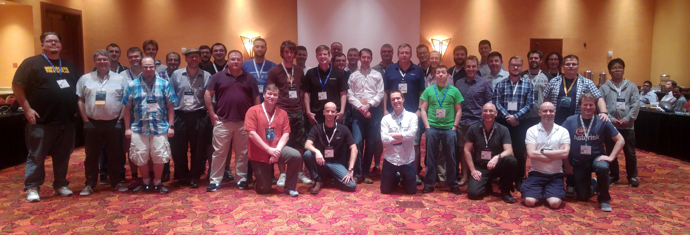

Overview
========

AstriDevCon was held on  at the Renaissance Phoenix Glendale Hotel and Spa in Glendale, AZ. There were approximately ~50 attendees on average throughout the day. Lunch was provided by e4strategies.com.

Link to [panoramic view of the room](http://sphereshare.net/#!/s/d07e8e3ef0332ab8737854fd0ec4cd74) at the time.

Attendees
---------

* Nicolas Bouliane | Jive
* David Duffett - UK - DIgium
* Sean Pimental - US - Digium
* Alex Goodman - Axia Technology partners
* John Harden - Axia Technology partners
* Brad Watkins - Axia Technology partners
* David Al-khadhairi - USAN
* Daniel Collins - USAN
* Hideyuki Yamashita - NTT Japan
* Luca Pradovera - Mojolingo
* Evan McGee - Ringplus
* Matt Riddell - Create Offshore Company, Panama
* Sebastien - Proformatique/XiVO
* Torrey Searle - Voxbone
* Vincent Morsiani - Voxbone
* Denis Guse, TU Berlin - Germany
* Lorenzo - Loway
* Tony Rusell - South Africa
* Dan Jenkins - NimbleApe, UK
* Eric Klein - Greenfield Technologies
* Nir - Greenfield Technologies
* Sean McCord - CyCore
* Ludovic Gasc - Eyepea, Belgium
* Sylvain Boily - Proformatique / XiVO
* Kyle Kurz - Digium
* Nicoloas Bouliane - Jive
* Michael Walton - FarSouth Networks, South Africa
* Bryan Walters - Sangoma
* James Finstrom - Sangoma
* Jason Parker - Sangoma
* Andew Nagy - Sangoma
* Corey McFadden - Voneto
* Jared Smith - Capital One Bank
* Malcolm Davenport - Digium
* Scott Griepentrog - Digium
* Joshua Colp - Digium
* Rusty Newton - Digium
* Matt Jordan - Digium
* Matt Fredrickson - Digium
* George Joseph - Digium
* Mark Michelson - Digium

Notes and highlights
====================

Morning Session
---------------

Introductions. See attendees list.

Show of hands - how many are new AstriDevCon attendees?: ~8, hooray!

What happened to Matt Jordan?

* Matt Fredrickson - new Digium Asterisk project manager
* Matt Jordan now Digium CTO
* Matt F has a long history with Digium(since 2001), has worked with Asterisk, zaptel/DAHDI, libpri, Digium board products, wrote ss7 stack, WebRTC technologies, and more!

George Joseph hired at Digium. (from the Asterisk community woo!)

Contributions:

* >1k commits to Ast 14
* Approximately 91 individual contributors for Asterisk 14!
* Top contributors:(will grab from Matt F's slides)

What's new with Asterisk 14? (will post Matt F's slides and link to CHANGES on wiki)

SIPit testing results and observations

* Video testing found a regression in payload negotiation which has now been [fixed].
* Video testing also determined our lack of timestamp passthrough for video frames was problematic, it has also now been [fixed].
* DNS testing confirmed that our new DNS implementation conforms to the standard and works as it should. A minor bug was found and [fixed].
* Opportunistic SDES-SRTP support was tested and confirms to the new draft RFC for doing it. We do not yet support it for DTLS-SRTP, though.
* Dual stack and TLS testing found an issue where the Contact port was being rewritten when it should not. It has now been [fixed].
* Dual stack support is lacking and a change to substantially improve it (by making it automatic) is up for [review]. This change was tested substantially at SIPit.
* Over all core functionality did not see any regressions, but did uncover problems with other implementations.
* Fuzz testing also showed how tolerant PJSIP is to invalid data. Throughout the event traffic was received and did not result in any crashes or incorrect behavior.
* [STIR](https://tools.ietf.org/html/draft-ietf-stir-rfc4474bis-13) was an RFC that was heavily discussed at SIPit. It is worth watching.

Show of hands - how many are using chan_sip with 13? (~60% of attendees)

Attendees gave some reasons why they or their customers haven't moved from chan_sip to chan_pjsip

* Bugs (pjsip) holding some users back from moving completely.
* Complexity of configuration (pjsip).
* Familiarity with chan_sip, reluctance to use new stuff.
* Lack of complete feature parity. Or specific features missing.

Digium has released codec_opus! Digium implemented a codec_opus as a binary with anonymous stats reporting as a conservative measure for legal protection. Digium didn't write the opus code from scratch, the SDK was used. If community members are aware of specific pitfalls from their own interop testing with opus, they should report the issues and Digium can address it.

Q: What's the deal with the anonymous channel usage reporting in codec_opus?  
A: <http://blogs.digium.com/2016/09/30/opus-in-asterisk/>

10:15AM (BREAK)

### Building the Agenda

We will have presentations and discussion led by:

Dennis Guse - Binaural Audio  
Sylvain and Sebastien - XiVO and ARI  
Nicolas Bouliane - Scaling Asterisk

Then, topics we'll try to get to:

* Scaling ARI
* migration to PJSIP
* ARI and using dialplan less
* When should we deprecate or remove chan_sip
* Recording to remote dest
* Relaxing JIRA rules for feature requests
* Video transcoding
* ZRTP
* RTCP feedback for Opus to swap between wide and narrowband modes as call conditions change
* ASR/TTS
* Should we enforce tests on all contributions?
* Endpoints with multiple contacts, how to call a specific contract via pattern?
* ICE negotiation on systems with a lot of interfaces is problematic

### Discussion items

| Time | Item | Who | Notes |
| --- | --- | --- | --- |
| 30 min | Overview of Asterisk 14 | Matthew Fredrickson |  |
| 45 min | Binaural Audio Changes | Dennis Guse |  |
| 1 hr | Lunch | Everyone! |  |
| 45 min | XiVO and ARI | Sylvain and Sebastien |  |
| 30 min | [Scaling Asterisk Horizontally](NicoAstriDevCon.pdf) | Nicolas Bouliane |  |
| Until | Open discussion items | Everyone! |  |

### Dennis Guse - Binaural Audio (STEAK)

Note that the demo system for STEAK will be shut down by the end of the year.

STEAK project home: <http://steakconferencing.de/>

Pages from the project site were used as slides during the presentation. It covers most of the information presented.

Code: <https://github.com/steakconferencing>

Some Q&A with Dennis:

**Q**: **Do conference members get a static position, how and when does it change?**

**A**: Each participants of a conference call is assigned to one static position. If a participants leaves the conference, his position will be reused for the next participant to be joining. Thus, if he dials in immediately again, then he will get his original position. If he dials in after another participant joins, he will get assigned to another position.

**Q**: **Are they all on the same plane?**

**A**: From a technical perspective no. However, a listener might be able the difference (angle) of two participants if those are positioned to close to each other. A high resolution is achieved in front of the listener (1-2°) while only a lower resolution is achieved on either side of the head (up to 30° only). So from a listener perspective yes if enough participants join a conference.

**Q**: **What is theoretical maximum of participants?**

**A**: Basically only limited by processing power: rendering up to 100 _actively speaking_ participants requires 20ms on _one_ core of an Intel i7 for 48kHz. Required processing power increases if longer HRTF are used (currently 960 samples@48kHz) while it can be reduced by using a lower sampling rate.

Afternoon Session
-----------------

12:30PM (After lunch)

### Sylvain and Sebastien - XiVO and ARI

Slides: <http://fr.slideshare.net/SylvainBoily2/ari-xivo-astricon2016>

Wants to see in ARI:

* Bridge variables
* Get or set multiple variables on a channel
* list global variables
* MOH events and possbility to list MOH classes
* In-memory database
* External bus

Problems ran into:

* No variable on channel event hangup
* Suggest maintaining a cache for channel variables
* "allocation failed"
* Event on channel originate?
* Convert channel to stasis to use in a stasis bridge
* Setting variable on non-stasis chan (they wrote a patch)

Things loved about ARI:

* Easy to test
* Documentation! Swagger

Q: From Sylvain and Sebastien, who is the maintainer of python-ari? How can they help?  
A: Matt J says, no one at the moment, Digium devs moved towards Node.js. Sylvain and Sebastien said they would be interested in maintaining python-ari.

George Joseph asked the presenters to share a list of things to do in AJAM vs ARI. They said they could share.

Sean McCord - ARI playbacks fail silently (if file doesn't exist), Josh had a comment on this, but it didn't get noted.

1:00PM

### Nicolas Bouliane - Scaling Asterisk Horizontally

Slides: <NicoAstriDevCon.pdf>

Q: Torrey Searle - What is the motivation to move from Cassandra to ISPD?  
A: Timing/delay with endpoint registration between machines and lack of control over cache in Asterisk.

Q: Sean McCord - Why are you having registrations go directly to Asterisk?  
A:  They don't. Registrations go through BGW first. (kamailio, etc)

Q: Matt Jordan - How many people in the room have had to tackle a similar problem?  
 A: ~4-5 people. (show of hands)

Sean McCord - Says res_pjsip makes this so much easier by utilizing AORs.

Q: Is ISPD like RabbitMQ ?  
A: No, and not open source yet

Q: What is the gain on efficiency?  
A:They didn't have a big focus on efficiency; mainly on destroy the association between endpoint and Asterisk system. Abstracting out to dealing with pools of resources.

1:45PM

### Open Discussion Topics

#### ARI issues:

Scaling ARI

* Two aspects
	+ Proxying http requests/responses
	+ Proxying async events on the individual websockets to instances of Asterisk.
* Suggestion to add an identifier to each ARI websocket event that identifies the instance of Asterisk generating the event. We need unique identifier for the node/system/Asterisk instance.
* Matt Jordan says we already have unique identifiers that may be usable for what we need.

How can I use ARI and not require dialplan?

* Should web developers have to write \*any\* dialplan?
* Dialplan provides separation of duties/concerns which is a security benefit.
* [pbx_ari.so?](http://pbx_ari.so)
* Use dialplan as a fast filter for bad actors and unwanted traffic?
* DON'T DEPRECATE THE DIALPLAN

Swagger version and ARI

* How do we move towards a new version of Swagger?
* Swagger is now [OAI](https://openapis.org/specification) - and OAI is supposed to be stabilizing and less volatile in regards to changes.
* Jared suggests moving to [newer OAI](https://openapis.org/specification).
* Probably wait for Ast 15 to make any big breaking changes

 Can we record to a remote destination?

* Maybe?
* Show of hands , how many doing speech recognition in core business? About ~8 hands out of attending.
* Something to work on.

3:10PM

#### Media issues:

Discussion about ZRTP

* ZRTP not popular, TLS is the way to go

ICE negotation on systems with lots of interfaces is problematic

* Problem: Limited number of candidates allowed with Asterisk RTP/ICE code
* Problem: Limiting the number of candidates potentially can increase the speed of a connection being established.

RTCP feedback for Opus to swap between wide and narrow-band modes as call conditions change

* RTCP support is minimal, but availability of the messages is better due to stasis.
* Consensus - worth improving for a variety of reasons.

#### Policies and procedures:

Relaxing JIRA rules... feature requests and trying to get more people involved

* Talk on the lists about building working groups for triaging/handling feature requests to track on JIRA.

Should we enforce a requirement for tests on all relevant contributions?

* No consensus, but leaning towards no. We don't want to scare away too many people. Perhaps we should be more lenient up front to help people come into the community and then enforce more as people participate regularly.

#### SIP issues:

Should we deprecate chan_sip?

* Benefit to security to deprecate it sooner rather than later. As chan_sip ages without attention, it will become a security risk.
* Large portion of community still reliant on chan_sip.. a lot of pain to move too soon.
* A lot of reasons not to deprecate anytime soon, and a lot of reasons to deprecate it sooner rather than later.
* We are on the path..chan_sip was already moved to extended support in 12.
* Matt F doesn't want to nail down a specific time yet.

Making migration easier from chan_sip to chan_pjsip

* There are current tools available. Python script for migration and pjsip config wizard.
* Patches accepted! Discuss on the lists if you come up with ideas.

#### ASR/TTS:

* AGI or AMI is the only way to integrate - 1024 byte limitation in AGI for request size (so large grammars are not possible)
* MRCP a good place to start.
* Supporting audio streams to external destinations is worthwhile and useful to many.
* Throw out dialplan apps (because they're insane)

### Closing

Everyone's work is appreciated! Thanks for coming!

Before closing, Matt Jordan offered the support of our core developers to help those interested in merging their patches during the conference. Show of hands for who would be interested -

* Michael Walton
* Nicolas Boulian
* Ludovic Gasc
* Torrey Searle
* Etienne Lessard
