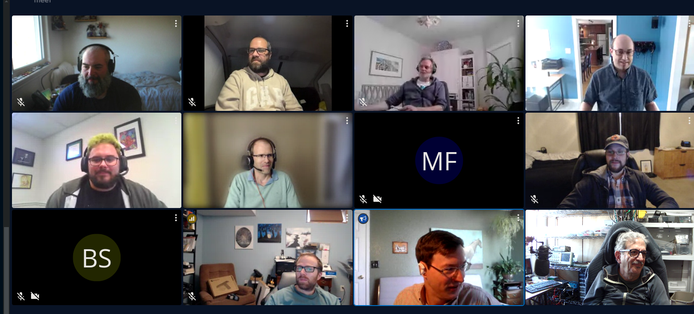

# AstriDevCon 2024 December

Sangoma invites developers who are interested in the future of Asterisk to join us at AstriDevCon.

## Event day schedule

AstriDevCon is a mix of open and focused discussion all on topics within the realm of Asterisk development, primarily regarding current concerns that Asterisk faces and how to improve Asterisk for the future. You can also attend remotely via Sangoma Meet.

In the future, registrations to attend will likely be removed and anyone can drop in or out of the meeting as needed.

Below you can find a breakdown of everything that happened during AstriDevCon:

* Introductions
* Build agenda with the attendees
* Josh's [State of the Project presentation](https://docs.google.com/presentation/d/1eKcb2mSIDZ-dy-F7f8yNjr8iliREN9mDrGMhnSBJFI0/edit?usp=sharing)
* CommUnity is a commercial GUI on top of Asterisk
* Michael Cargile's [VICIdial voice detection](https://github.com/vicimikec/AEAP-SSL-Tunnel) presentation
	+ ws to wss python proxy is open source
	+ Transport websocket for TLS AEAP sets it to null
	+ Websocket back from Google - needs better Asterisk documentation
	+ Whisper server side of things - not sure if it will be open source yet
	+ AEAP documentation could be better. Current resources include:
		- https://docs.asterisk.org/Latest_API/API_Documentation/Module_Configuration/res_aeap/
		- https://docs.asterisk.org/Configuration/Interfaces/Asterisk-External-Application-Protocol-AEAP/
* Mark Murawski's Progress Timeout talk
	+ Carrier takes long time to respond, ringing times out, don't want to wait that long for progress
		- There should be a fix for this already in newer versions of Asterisk
* Mark Murawksi's logging updates
	+ Need better logging around Dial for Progress, AMI events too
	* Pass in a channel, get a token back to read, has a description and other channel details
	* Can get manager events too
	* This could be turned on or off to essentially make it a NoOp if not wanted
	* Have it work with multiple IPs
	* Have to start with a small implementation, like a macro wrapper to enable in logger.conf entry
* Chris Maj an Henning's packing for Debian discussion
	+ Multiple Asterisk releases makes it difficult
	+ Policy issues related to security
	+ Different branches - LTS should be focus
	+ Kamailio maintains some infrastructure for it
	+ Target Asterisk 22 for Debian 13
	+ George brought up redhat distros too
	+ One repo to cover enterprise Linux, Rocky Linux, etc.
	+ Not really many optimizations needed during compilation
	+ Licensing issues during compilation
	+ Bundling issues during compilation because downloads not available during build and versioning issues like pjproject
* [VICIdial patches](https://build.opensuse.org/project/show/home:vicidial:asterisk-18)
* Lorne asked about knowing a contact before dialing
	+ FreePBX uses single endpoint for multiple registrations
	+ You can query for all contacts and build a dial string from that
	+ PJSIP_CONTACTS is a helper function
	+ PJSIP_AOR, PJSIP_CONTACT can help
		- Only problem is that you have to know something about it first, such as if it's a paging contact, phone, etc.
	+ Need to be able to distinguish between contacts
		- Use header parameters because you can get the URI
	+ Ability to get a user agent from Asterisk CLI
		- Mark Murawski has a patch he is going to put up for review
* George Joseph's GitHub update
	+ Seems to work ok 95% of the time
	+ The other 5% has some problems
	+ Go back to when a PR is created, add a comment about the Fixes line
	+ If you update the commit message, you have to update the PR description, etc.
	+ If someone posted feedback, you address it, then push it back up for review, the PR is still in changes requested state
		- Click resolve all conversations
		- Click button next to person to re-request review
		- Click button at bottom to dismiss existing review to get back to the "needs review" state
* George Joseph's alternate locking and storage for channels
	+ Deadlocks from channels and containers in channels.c that contains all the containers
	+ Protected by mutex locks, not read write
	+ Case-insensitive matching on channel names, dialplan allows channel name or unique ID but doesn't know which, we have to scan the whole channels table
		- Lock channels container, lock and unlock every channel
		- Taxing and problematic for deadlocks
	+ Alternate ways to lock channels and their container
		- Using SQL data storage showed some significant improvements
		- Chaning container to read write lock

## Photos

## Recording

The conference was recorded this year, but the file got corrupted. We are looking into better ways to do the recording for future events so that we have a more reliable way to provide one for you.

## Previous AstriDevCon events

See the below sections for notes and content from previous AstriDevCon events.

* [AstriDevCon 2024](/Development/Roadmap/AstriDevCon-2024)
* [AstriDevCon 2022](/Development/Roadmap/AstriDevCon-2022)
* [AstriDevCon 2021](/Development/Roadmap/AstriDevCon-2021)
* [AstriDevCon 2020](/Development/Roadmap/AstriDevCon-2020)
* [AstriDevCon 2019](/Development/Roadmap/AstriDevCon-2019)
* [AstriDevCon 2018](/Development/Roadmap/AstriDevCon-2018)
* [AstriDevCon 2017](/Development/Roadmap/AstriDevCon-2017)
* [AstriDevCon 2016](/Development/Roadmap/AstriDevCon-2016)
* [AstriDevCon 2015](/Development/Roadmap/AstriDevCon-2015)
* [AstriDevCon 2014](/Development/Roadmap/AstriDevCon-2014)
* [AstriDevCon 2013](/Development/Roadmap/AstriDevCon-2013)
* [AstriDevCon 2012](/Development/Roadmap/AstriDevCon-2012)
* [AstriDevCon 2011](/Development/Roadmap/AstriDevCon-2011)
* [AstriDevCon 2010](/Development/Roadmap/AstriDevCon-2010)
