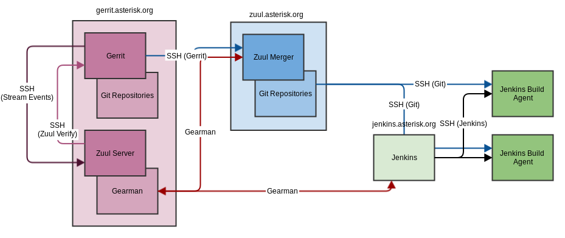

---
search:
  boost: 0.2
title: Continuous Integration
pageid: 32375810
---

Overview
========

For a long time, the Asterisk project has used continuous integration as a means to verify patches made to the project. This page serves to document the infrastructure used to support these activities.

Users who are here as a result of a failed test (typically noted on a code review by the 'zuul' user) should read the section "[What To Do When Your Patch Fails](#fixing_patch)."

On This PageInfrastructure
==============

Gerrit
------

While Gerrit does not actually perform continuous integration, it is the initiator of all CI tasks. [Zuul](#zuul) monitors the Gerrit server's events and, if an event matches a set of criteria, a new CI task is initiated.

Zuul
-----

Zuul consists of two pieces: the Zuul server, which monitors events from Gerrit and acts as the gatekeeper for CI pipelines, and Zuul merger, which merges patchsets in its own Git repos, checks for merge failures, and serves the resulting Git repositories for consumption by Jenkins build agents.

### Zuul Server

The Zuul server monitors events from Gerrit and, if an event matches a configured pipeline's criteria, notifies parties via Gearman of a job that they should execute. In return, parties that execute a job notify the Zuul server via Gearman of that job's success or failure. Zuul continues to hand out CI jobs to various parties, which in turn may spawn many CI tasks themselves. If a job passes or fails, the Zuul server comments on the appropriate review in Gerrit as the 'zuul' user. If the job was 'voting', the 'zuul' user may provide a +1 or -1 vote to the verification of the review.

!!! note 
    The Zuul server actually lives on [gerrit.asterisk.org](https://gerrit.asterisk.org), due to some quirks with its underlying SSH library and to ensure that it has the best connection possible back to the Gerrit instance.

[//]: # (end-note)

### Zuul Merger

The Zuul merger lives on `zuul.asterisk.org`, and handles all merge check jobs issued by the Zuul server via Gearman. This consists of:

1. Checking that multiple patchsets may be merged together to support speculative execution
2. Hosting the merged patchsets in its own Git repository for the Jenkins build agents

Jenkins
-------

 Jenkins lives on `jenkins.asterisk.org` and manages the CI test plans and handles all testing tasks issued by the Zuul server via Gearman. The Jenkins server issues new tasks to an available build agent via SSH. All Jenkins build agents retrieve the specified patchset from the Zuul merger server's Git repositories. The result of an executed task is communicated back to the Zuul server via Gearman, such that the Zuul server can provide verification back to the Gerrit review.

Automated Testing
=================

Any project hosted by Gerrit may have automated testing; however, since you're probably here to read about how the Asterisk project is tested, this page will show what is tested for that project.

Tests run against the Asterisk project occur in **pipelines**: *check*, *gate*, and *periodic*. Each pipeline executes specific jobs at different times during the lifetime of a patch, and test the patch in various ways.

Check Pipeline
--------------

The *check* pipeline is run every time a new patchset is submitted or updated. It executes only on the changes of that patchset, and provides verification that the patch compiles and passes the Asterisk unit tests. The goal of this pipeline is to provide a minimum level of verification for patches as quickly as possible.

Gate Pipeline
-------------

The *gate* pipeline is executed once a patch is ready to be merged, i.e., it has passed the *check* pipeline and has a +2 code review score. This pipeline executes the most important and critical tests on the patch. Currently, those tests include the channel driver tests, ARI tests, and external MWI tests, although additional tests may be added in the future. In addition, the tests from the *check* pipeline are executed again.

Unlike the *check* pipeline, the *gate* pipeline may perform speculative execution on all changes currently ready to be submitted.

Periodic Pipeline
-----------------

The *periodic* pipeline runs the full battery of tests from the Asterisk Test Suite on the proposed changes. This runs nightly.

What To Do When Your Patch Fails
=================================

First, don't panic.

Seriously. Don't panic.

Just because something failed does not mean that your patch is bad, that you are a bad contributor to the project, or that you should give up in despair. Everyone makes mistakes - including the tests run by the CI infrastructure.

1. **Look at the test results.** Any time a test fails, the 'zuul' user will leave a link to the test results as executed by Jenkins. This will always include a console log, and may also include Asterisk Test Suite logs and Asterisk logs if appropriate.
	1. **Discuss test results with developers.** Sometimes it's hard to understand why a patch failed. This is why we have an active developer community! Jump in #asterisk-dev and ask for some assistance understanding why a test failed. Alternatively, if no one is around at that moment in time, send an e-mail to the asterisk-dev mailing list.
	2. **File issues for unstable tests.**If the tests themselves are unstable, please file an issue against the test on the issue tracker.
	3. **Ask for a 'recheck' or 'regate'.** If a test is unstable, commenting on your review with only the word 'recheck' (for the *check* pipeline) or 'regate' (for the *gate* pipeline) will cause the tests to execute again.
2. **Fix any issues found by tests.** If the issues are legitimate, simply fix the issues in your patch and re-submit it to Gerrit. The new patchset will then be re-run through the appropriate tests.
3. **Discuss the test itself.** If a test fails consistently but your patch has changed the behaviour, the resulting change in behaviour should be discussed in #asterisk-dev or the asterisk-dev mailing list. If the change in behaviour was deliberate and noted in the patch, you will need to also update the corresponding failing tests before the patch can be merged.
